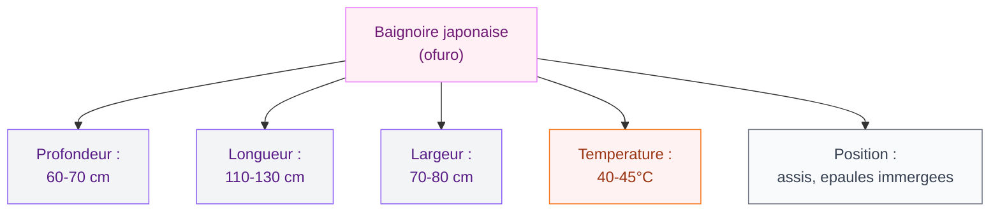

Tu as déjà regardé des photos de salles de bain japonaises en te disant "waouh, c'est tellement serein" ? Moi oui, et depuis que j'ai creusé le sujet, je comprends pourquoi. La baignoire japonaise, ou **ofuro**, c'est pas juste un meuble de salle de bain - c'est une philosophie du soin. Courte, profonde, souvent en bois, elle transforme un simple bain en rituel de bien-être. Et bonne nouvelle : tu peux tout à fait l'adopter dans ta salle de bain française, même si elle n'est pas immense.

## L'ofuro, c'est quoi exactement ?

Le mot "ofuro" (お風呂) désigne la baignoire japonaise traditionnelle. Contrairement à ce qu'on imagine, son format n'est pas là pour économiser de la place - même si c'est un avantage. La vraie différence, c'est son usage : au Japon, on ne se lave PAS dans la baignoire. Tu te douches d'abord, tu te savonnes, tu te rinces bien, et ensuite seulement tu t'immerges dans l'ofuro pour te détendre.

  

L'eau reste propre et à bonne température, souvent partagée par toute la famille dans la journée. C'est pour ça que le bois utilisé, comme le **hinoki** (cyprès japonais) ou le **sugi** (cèdre japonais), dégage un parfum naturel qui intensifie l'expérience sensorielle. L'origine de cette pratique remonte au 6ème siècle, et le concept du "furo" s'est inspiré des onsen, ces sources chaudes naturelles où les Japonais aiment se retrouver.

> [!NOTE]
> L'ofuro s'utilise après la douche, pas pour se laver. Cette règle change tout : l'eau reste propre, tu peux la réutiliser plusieurs fois, et le bain devient un moment de pure détente, pas une corvée.

## Dimensions et format : ce qui change tout

La baignoire japonaise est beaucoup plus profonde qu'une baignoire occidentale classique. Elle mesure généralement **60 à 70 cm de profondeur**, contre 40 à 50 cm pour une baignoire standard. Par contre, elle est plus courte en longueur : autour de **110 à 130 cm**, parfois moins.

  

Tu t'assois dans l'ofuro, les genoux pliés, immergé jusqu'aux épaules. Au début ça surprend, mais une fois que tu t'y habitues, c'est extraordinairement relaxant. L'eau chaude enveloppe tout le corps en même temps, y compris les épaules - ce que n'offre pas une baignoire allongée classique.

## Les matériaux : bois, acrylique ou pierre ?

  

### Le bois hinoki - le summum de l'expérience

C'est le matériau traditionnel et de loin le plus beau. Le hinoki (cyprès japonais) a une couleur claire et dorée, un grain fin, et un parfum légèrement citronné vraiment enivrant. Le sugi (cèdre japonais) est plus abordable, avec une teinte plus chaude et rosée.

Le bois naturel non traité a une propriété intéressante : les huiles naturelles du bois ont un effet antibactérien. Mais attention, un ofuro en bois demande de l'entretien. Tu dois le rincer après chaque usage, le laisser sécher entre les bains, et l'huiler régulièrement pour éviter les fissures.

**Prix :** Un ofuro en bois hinoki artisanal, fabriqué au Japon, ça va chercher entre **2 000 et 8 000 €** selon la taille et l'artisan. La marque Kitoki-Déco propose des modèles authentiques importés directement. C'est un investissement, mais c'est aussi de l'art.

> [!TIP]
> Si tu veux le parfum du hinoki sans le prix, tu peux acheter des petites planches ou des sachets de copeaux de hinoki à mettre dans ton bain ordinaire. C'est 10-20€ et ça donne une vraie idée de l'expérience.

### L'acrylique - la solution pratique

Pour un budget plus accessible, les baignoires japonaises en acrylique ou en résine reproduisent la forme profonde de l'ofuro sans les contraintes du bois. Elles sont faciles à entretenir, résistantes, et disponibles chez des marques comme **Lapeyre** (autour de 400-800€) ou **Leroy Merlin** (350-600€). La marque japonaise Toto propose aussi des modèles haut de gamme en matériaux composites avec des fonctions de maintien de la température.

La forme est là, le rituel peut l'être aussi, mais l'expérience sensorielle reste incomplète sans le bois.

### La pierre et le béton ciré

Pour une salle de bain ultra-design, certains optent pour des ofuro sur mesure en béton ciré ou en pierre naturelle. Le résultat est superbe, mais le coût explose : compte **5 000 à 15 000€** selon la matière et l'artisan. C'est du sur-mesure intégral.

## Installation : ce que tu dois anticiper

L'ofuro est plus haut et plus lourd qu'une baignoire classique. Quelques points à vérifier avant de se lancer :

  

**Le poids.** Un ofuro en bois plein rempli d'eau peut peser plus de 500 kg. Ton plancher doit supporter ça. Dans un appartement au-dessus d'un garage, c'est souvent OK. Dans un appartement avec plancher bois ancien, ça mérite une vérification sérieuse.

**La plomberie.** Le remplissage demande plus d'eau qu'une baignoire standard (entre 200 et 300 litres vs 150 litres en moyenne). Ton chauffe-eau doit suivre. Un chauffe-eau thermodynamique de 200 à 300 litres est conseillé si tu veux te baigner chaud tous les jours.

**La hauteur d'accès.** L'ofuro est plus haut du sol. Pour les enfants ou les personnes moins mobiles, prévois un petit marchepied ou une intégration encastrée dans le plancher (comme dans les vraies salles de bain japonaises, où la baignoire est au ras du sol dans un espace surélevé).

> [!WARNING]
> Ne tente pas d'installer un ofuro en bois toi-même si tu n'as pas d'expérience en plomberie. Les raccords mal posés sur un volume d'eau de 300 litres, c'est un dégât des eaux catastrophique. Passe par un plombier.

## Quel espace prévoir dans ta salle de bain ?

Bonne nouvelle : l'ofuro est plus court qu'une baignoire classique. Une salle de bain de **4 à 5 m²** peut tout à fait accueillir un ofuro + une douche séparée (pour l'étape de lavage, qui se fait avant d'entrer dans la baignoire). C'est même moins encombrant qu'une baignoire de 170 cm.

  

Si tu rénoves ta salle de bain, pense à l'intégration dans le sol à la japonaise : la baignoire est encastrée, le rebord est au niveau du carrelage. Ca demande un carreleur et un plombier qui bossent ensemble, mais le résultat est absolument superbe.

## L'entretien d'un ofuro en bois

C'est le seul vrai point de vigilance. Un ofuro en hinoki ou en sugi sans entretien, c'est du bois qui se fissure, noircit, ou moisit. Voici les gestes à adopter :

**Après chaque bain** : rinçage à l'eau claire, pas de produit chimique. Le bois n'apprécie pas les détergents agressifs.

**Séchage** : laisse la baignoire hors de l'eau entre les bains. Certains modèles ont un système de vidange rapide. D'autres restent remplis en permanence si tu l'utilises tous les jours - l'eau stagne moins si elle reste à température.

**Huile naturelle** : tous les 3 à 6 mois selon l'usage, applique une huile de teck ou d'huile de lin sur le bois pour le nourrir. Ca prend 30 minutes et ca prolonge la vie de ta baignoire de plusieurs décennies.

**Blanchiment naturel** : si du noir apparait (début de moisissure), une solution de vinaigre blanc dilué fonctionne bien. Rince abondamment ensuite.

> [!CAUTION]
> N'utilise jamais de javel ni de produits chlorés sur un ofuro en bois. Ca détruit les huiles naturelles du bois et provoque des fissures irréversibles. Si tu veux désinfecter, l'eau oxygénée diluée est ta meilleure option.

## Les bienfaits du bain japonais

Au-delà de l'esthétique, le rituel ofuro a des effets réels sur le corps et l'esprit. L'immersion dans une eau à 40-45°C pendant 15 à 20 minutes :

- Dilate les vaisseaux sanguins, ce qui améliore la circulation
- Détend les muscles profonds - super efficace après le sport
- Active la transpiration, ce qui aide l'élimination des toxines
- Régule la température corporelle d'une façon qui favorise le sommeil
- Diminue le cortisol (l'hormone du stress) de façon mesurable

Les Japonais ont un espérance de vie parmi les plus élevées au monde, et les chercheurs japonais eux-mêmes étudient le lien entre le bain quotidien et la santé cardiovasculaire. C'est pas une coïncidence.

## Mon verdict : pour qui c'est fait ?

L'ofuro est fait pour toi si :

- Tu prends ton bain comme un moment de recharge, pas juste une hygiène rapide
- Tu as une salle de bain de 4 m² minimum (tu peux caser un ofuro + une cabine de douche)
- Tu es prêt(e) à changer ton rituel de lavage (douche d'abord, bain ensuite)
- Tu veux quelque chose de beau, qui dure, et pas une baignoire standard interchangeable

Si tu rénoves ta salle de bain en ce moment, la baignoire japonaise mérite vraiment une place dans ta réflexion. Et si tu veux explorer d'autres idées pour transformer ta salle de bain en espace de détente, regarde aussi du côté des [matériaux naturels pour la salle de bain](/guides/salle-de-bain/) - le béton ciré, le teck, la pierre... tout un univers à part.

Le prix d'entrée fait peur, mais un ofuro en hinoki bien entretenu, ca dure 30 à 50 ans. Ramené sur la durée, c'est moins cher qu'une baignoire acrylique qu'on change tous les 10 ans. Et surtout, c'est une expérience quotidienne qui transforme vraiment le rapport au corps et au soin.

## Sur le meme theme

- [meuble salle de bain béton ciré](/meuble-salle-de-bain-beton-cire/)
- [entretenir un bain nordique](/comment-entretenir-un-bain-nordique/)
- [baignoire scandinave](/baignoire-scandinave/)
- [salle de bain industrielle](/salle-de-bain-industrielle/)

## FAQ

**Quelle est la différence entre un ofuro et une baignoire normale ?**
L'ofuro est plus profond (60-70 cm vs 40-50 cm) et plus court (110-130 cm). On s'y assoit plutôt qu'on ne s'y allonge. Surtout, il s'utilise après la douche, pour se détendre - pas pour se laver.

**Combien coûte une baignoire japonaise ?**
Entre 350€ pour un modèle acrylique basique, 2 000 à 8 000€ pour un ofuro en bois hinoki artisanal, et jusqu'à 15 000€ pour du sur-mesure en pierre ou béton ciré. L'installation (plombier, carreleur) ajoute 500 à 2 000€ selon la configuration.

**Peut-on installer une baignoire japonaise dans une petite salle de bain ?**
Oui, c'est même un avantage : l'ofuro mesure seulement 110-130 cm de long. Une salle de bain de 4 m² peut accueillir un ofuro et une douche séparée, ce qui est impossible avec une baignoire standard de 170 cm.

**Comment entretenir un ofuro en bois ?**
Rinçage à l'eau claire après chaque bain, séchage entre les utilisations, application d'huile naturelle tous les 3-6 mois. Aucun produit chimique agressif. Avec ces gestes simples, un ofuro en hinoki dure plusieurs décennies.

**Quelle température pour un bain japonais ?**
Entre 40 et 45°C, plus chaude qu'un bain occidental classique. Cette chaleur intense est à la base des bienfaits du rituel : relaxation musculaire, circulation, détente profonde. Commence à 40°C si tu n'es pas habitué(e) à l'eau très chaude.
