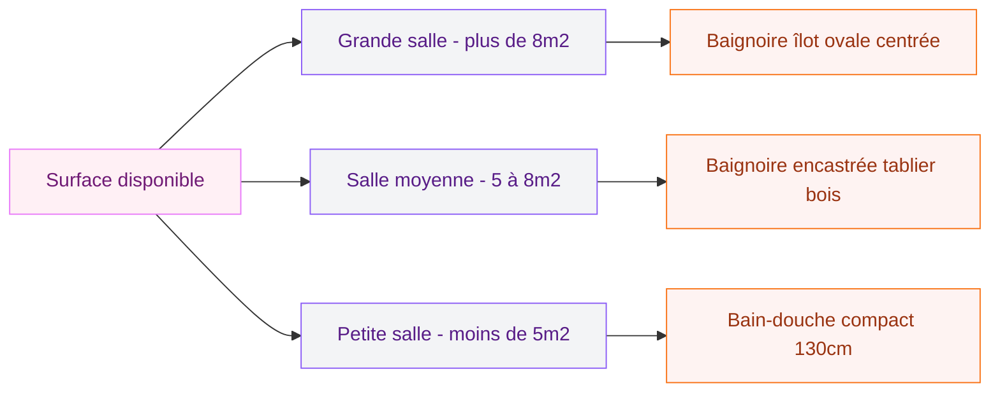

Tu rêves d'une salle de bain qui ressemble à un vrai havre de paix ? Blanc mat, bois clair, plantes vertes et une baignoire posée là comme une sculpture... c'est exactement le style scandinave, et franchement, une fois qu'on y a goûté, on ne peut plus s'en passer.

Dans cet article, je t'explique tout ce qu'il faut savoir pour choisir ta baignoire scandinave : les matières, les formes, les marques à explorer, les prix à prévoir, et comment intégrer tout ça dans ta salle de bain sans faire de faux pas.

## Pourquoi le style scandinave s'impose dans la salle de bain

Le design nordique, c'est bien plus qu'une tendance Instagram. C'est une philosophie de vie qui s'appelle le "hygge" en danois - ce sentiment de confort douillet, de sécurité et de bien-être qu'on cherche à créer chez soi. Et la salle de bain est l'endroit idéal pour l'appliquer.

<div class="my-8">
  
</div>


Dans une salle de bain scandinave, rien n'est superflu. Chaque élément a sa raison d'être. Les lignes sont propres, les couleurs restent dans des tonalités douces (blanc, gris perle, beige sable, bois naturel), et la lumière - qu'elle soit naturelle ou artificielle - joue un rôle central dans l'ambiance.

La baignoire, dans cette philosophie, n'est pas juste un équipement sanitaire. C'est la pièce maîtresse de la pièce, le point focal autour duquel tout s'organise.

> [!NOTE]
> Le style scandinave en déco n'est pas synonyme d'une salle de bain froide ou austère. L'idée, c'est de créer de la chaleur avec peu d'éléments bien choisis : un accessoire en bois, une plante, une bougie.

## Les caractéristiques d'une baignoire de style scandinave


<div class="my-8">
  
</div>

### La forme : épurée et sculpturale

La baignoire scandinave par excellence est la baignoire îlot (ou autoportante). Elle est posée librement dans la pièce, visible de tous côtés, et elle crée immédiatement un effet wow. Sa forme peut être ovale, en amande, ou cylindrique - l'important, c'est que les courbes soient douces et les lignes propres.

Si ta salle de bain est plus petite, une baignoire encastrée aux bords très fins peut tout aussi bien fonctionner dans un esprit nordique. L'astuce, c'est surtout de choisir une finition mate plutôt que brillante.

### La couleur : blanc mat en tête

Le blanc mat reste la référence absolue. Il apporte cette sensation de pureté et de sérénité qui caractérise l'esthétique nordique. Mais tu peux aussi jouer avec :

- Le gris ciment très clair
- Le beige stone mat
- Le noir mat pour une version plus graphique (style "dark nordic")
- Le solid surface brut, légèrement texturé

L'important, c'est d'éviter les finitions trop brillantes ou les couleurs trop saturées qui casseraient l'atmosphère apaisante.

### Les matières : solid surface, acrylique mat, fonte

**Le solid surface** (résine minérale) est le grand favori des bains scandinaves haut de gamme. Il est chaud au toucher, s'entretient facilement, et sa texture légèrement poreuse lui donne un aspect très naturel. La marque RIHO propose par exemple des baignoires îlot en solid surface blanc mat à partir de 1 500 €.

**L'acrylique mat** est une alternative plus accessible qui rend très bien. Bien choisi (épaisseur minimum 3 mm), il offre un bon confort et une belle longévité. Côté prix, tu trouveras des modèles entre 400 € et 900 € chez des marques comme Allibert, Grohe ou Jacob Delafon.

**La fonte émaillée** apporte une touche vintage-nordique très réussie. Elle retient bien la chaleur et dure toute une vie. C'est un investissement (comptez 800 € à 2 500 € pour une baignoire îlot en fonte), mais les marques comme Bette ou Kaldewei proposent de très belles pièces.

> [!TIP]
> Si tu hésites entre solid surface et acrylique, touche les deux avant d'acheter. Le solid surface a une impression nettement plus "solide" et chaud - ça fait vraiment la différence au quotidien.

## Les formes de baignoires scandinaves populaires

```mermaid
flowchart TD
    A["Baignoire scandinave"]
    A --> B["Baignoire îlot"]
    A --> C["Baignoire encastrée"]
    A --> D["Baignoire à poser sur structure"]
    B --> E["Ovale classique"]
    B --> F["Cylindrique"]
    B --> G["Forme amande"]
    C --> H["Bords fins - effet épuré"]
    C --> I["Version alcôve avec tablier bois"]
    D --> J["Sur socle en bois clair"]
    D --> K["Sur pieds de type 'tulipe'"]

<div class="my-8">
  
</div>


    style A fill:#FFF0F5,stroke:#E879F9,color:#701A75
    style B fill:#FFF0F5,stroke:#E879F9,color:#701A75
    style C fill:#F3F4F6,stroke:#8B5CF6,color:#581C87
    style D fill:#F3F4F6,stroke:#8B5CF6,color:#581C87
    style E fill:#F9FAFB,stroke:#6B7280,color:#374151
    style F fill:#F9FAFB,stroke:#6B7280,color:#374151
    style G fill:#F9FAFB,stroke:#6B7280,color:#374151
    style H fill:#F9FAFB,stroke:#6B7280,color:#374151
    style I fill:#FEF3F2,stroke:#F97316,color:#9A3412
    style J fill:#FEF3F2,stroke:#F97316,color:#9A3412
    style K fill:#F9FAFB,stroke:#6B7280,color:#374151
```

## Quelles marques pour une baignoire scandinave ?


<div class="my-8">
  
</div>

### Les marques nordiques authentiques

**RIHO** (marque belgo-néerlandaise) est sans doute la référence la plus connue pour les salles de bain d'inspiration nordique. Leur collection "Oval" en solid surface blanc mat est magnifique, entre 1 200 € et 2 200 € selon le modèle et la taille.

**Nordholm** propose des baignoires en bois massif pour l'extérieur, dans la tradition des bains nordiques finlandais. C'est une autre interprétation du style, plus brute et nature. Les prix démarrent à 1 990 € pour des modèles comme les bains froids "Aegir" ou "Borea".

### Les marques accessibles

**Allibert** propose des baignoires acryliques mate à moins de 500 € qui fonctionnent très bien dans un intérieur nordique. Pas la même noblesse de matière qu'un solid surface, mais largement suffisant pour une belle salle de bain.

**Lapeyre** et **Castorama** ont chacun des lignes de baignoires encastrées ou îlot en acrylique épais qui collent bien à l'esthétique scandinave pour un budget raisonnable (300 € à 700 €).

**Grohe** et **Jacob Delafon** offrent un bon rapport qualité-prix pour des baignoires de milieu de gamme avec une belle finition mate (500 € à 1 200 €).

> [!IMPORTANT]
> Quand tu achètes une baignoire "de style nordique" chez une grande enseigne, vérifie toujours l'épaisseur de l'acrylique (minimum 3 mm), la rigidité du fond, et que la robinetterie que tu as en tête est compatible. Ces détails font beaucoup sur la durabilité.

## Comment intégrer une baignoire scandinave dans ta salle de bain


<div class="my-8">
  
</div>

### L'environnement idéal

Une baignoire scandinave chante vraiment quand elle est entourée des bons éléments :

**Le bois clair** : un meuble vasque en chêne, des planches en teck autour de la baignoire, un tabouret en bois naturel, un porte-serviette en bambou... Le bois apporte la chaleur qui équilibre le blanc.

**Les plantes** : un grand Monstera dans un coin, des eucalyptus accrochés sous la pomme de douche, quelques succulentes sur l'étagère... La végétation est presque obligatoire dans une salle de bain nordique réussie.

**Les textiles doux** : de grosses serviettes en coton éponge blanc ou en lin naturel. Des teintes non-uniformes, des matières qui ont l'air vivantes.

**La robinetterie** : pour rester dans le style, opte pour du laiton brossé, du noir mat ou du chrome poli sobre. Évite le très doré qui ferait trop "baroque". Les marques comme Hansgrohe, Vitra ou Duravit proposent de belles robinetteries compatibles.

### La place de la baignoire dans la pièce

Si tu as la chance d'avoir une grande salle de bain, la baignoire îlot centrée ou légèrement décalée vers une fenêtre est la solution la plus spectaculaire. Si tu peux prendre ton bain en regardant l'extérieur, la magie est totale.

Dans une salle de bain plus modeste (6 à 9 m²), une baignoire encastrée avec un tablier en bois claire ou en béton ciré poli fonctionne très bien. Tu peux même poser dessus un plateau en bois pour un effet "cadre".

Pour les petits espaces, pense aussi à la baignoire compacte ou à la bain-douche : des formats 130 x 70 cm existent, comme chez Jacob Delafon, et ils rentrent dans des petites salles tout en apportant le confort d'un bain.



### Les couleurs des murs et du sol

Pour les murs, le blanc cassé ou le gris très clair sont les bases. Mais tu peux aussi jouer avec une teinte douce : un bleu poudré, un vert sauge très discret, un taupe chaud. La marque [Luxens chez Leroy Merlin](/guides/couleurs/peinture-luxens/) propose des coloris parfaitement dans le ton nordique à des prix accessibles.

Pour le sol, le carrelage en grande dalle mate (format 60x60 ou 80x80) en gris clair ou en travertin est parfait. Tu peux aussi envisager un [carrelage en chevrons pour ta douche italienne](/guides/salle-de-bain/carrelage-douche-italienne/) si ta salle de bain combine les deux.

> [!WARNING]
> Évite le carrelage mosaïque coloré ou les motifs trop chargés sur les murs - cela casse immédiatement l'effet nordique épuré. Si tu veux de la texture, reste sur des formats larges en finition mate avec des joints très fins de la même couleur que le carrelage.

## Comparatif selon ton budget

| Budget | Type | Exemple concret | Prix indicatif |
|--------|------|-----------------|----------------|
| Petit (moins de 600 €) | Acrylique mat encastrée | Allibert Confort, Lapeyre Java | 300 à 550 € |
| Moyen (600 à 1 200 €) | Acrylique épais ou fonte emaïllée encastrée | Jacob Delafon Sofa, Grohe Essence | 700 à 1 100 € |
| Haut de gamme (1 200 € et +) | Solid surface îlot | RIHO Oval, Kaldewei Conoduo | 1 200 à 2 500 € |

## Associations décoratives qui fonctionnent

Pour aller plus loin dans l'univers nordique, pense à ces combinaisons gagnantes :

**Baignoire blanche + meuble vasque béton ciré** : le contraste entre le blanc mat et le béton brossé est superbe. Tu peux découvrir tout ce qu'il y a à savoir sur cette matière dans notre guide sur le [meuble salle de bain béton ciré](/guides/salle-de-bain/meuble-salle-de-bain-beton-cire/).

**Baignoire nordique + touche japonaise** : les deux styles partagent une philosophie du dépouillement et du respect des matières. Si tu aimes aussi l'esthétique du pays du soleil levant, notre article sur la [baignoire japonaise](/guides/salle-de-bain/baignoire-japonaise/) te donnera des idées de combinaisons très réussies.

**Accessoires** : un bac à sels de bain en bois, une bougie sur le rebord, un livre et un verre de vin blanc à portée de main... Le style nordique célèbre le plaisir simple du bain long et sans culpabilité.

> [!TIP]
> Une astuce facile pour donner une ambiance nordique même à une salle de bain ordinaire : remplace tes serviettes par des modèles en lin lavé (marque Maisons du Monde ou Merci Paris), ajoute une petite planche en bois sur la baignoire (style "tablette de bain"), et pose une plante suspendue. En moins de 50 €, l'effet est bluffant.

## Les bains nordiques extérieurs : une tendance qui monte

Au-delà de la salle de bain intérieure, il existe une autre interprétation du bain scandinave : les bains extérieurs en bois massif, directement inspirés des traditions finlandaises et norvégiennes. Des marques comme Njord Sauna proposent des cuves en bois chauffées au bois ou électriquement, à installer dans le jardin.

Le modèle "Njord Aegir" (bain froid) est disponible à partir de 1 990 €, le "Njord Borea" à partir de 2 390 €. C'est un investissement pour créer un espace de bien-être extérieur, mais l'expérience est vraiment à part. Et ça, c'est 100 % scandinave dans l'âme.


## Sur le meme theme

- [salle de bain rustique moderne](/guides/salle-de-bain/salles-de-bains-rustiques-decoration-et-design-modernes/)

## FAQ

**Quelle forme de baignoire choisir pour un style scandinave ?**
La baignoire ovale ou en amande, autoportante, en blanc mat est la forme la plus associée au style nordique. Pour les petites salles de bain, une baignoire encastrée avec tablier en bois clair fonctionne aussi très bien.

**Quelle matière est la meilleure pour une baignoire scandinave ?**
Le solid surface offre la meilleure expérience en termes de chaleur au toucher et d'aspect mat naturel. L'acrylique épais (3 mm minimum) est une bonne alternative pour un budget plus limité.

**Quel prix prévoir pour une baignoire de style nordique ?**
Comptez entre 300 et 600 € pour une version acrylique simple, 700 à 1 200 € pour une version plus qualitative, et 1 200 à 2 500 € pour une baignoire îlot en solid surface de marque (RIHO, Kaldewei).

**Peut-on faire une salle de bain scandinave dans un petit espace ?**
Absolument. Le style nordique se base sur l'épuration - ce qui fonctionne d'autant mieux dans un petit espace. Une baignoire encastrée compacte (130 ou 140 cm), des tons clairs, quelques accessoires en bois et une plante, et l'ambiance est là.

**Quelles couleurs de murs pour une salle de bain scandinave ?**
Blanc cassé, gris très clair, bleu poudré discret ou vert sauge léger. Toujours en finition mate, avec peu ou pas de motifs. Les peintures Luxens de Leroy Merlin ont des coloris très adaptés.

**Comment chauffer une salle de bain scandinave ?**
Un sèche-serviettes électrique au design minimaliste (marques Vola ou Zehnder) en blanc ou en noir mat est parfaitement cohérent avec l'esthétique nordique et pratique au quotidien.
