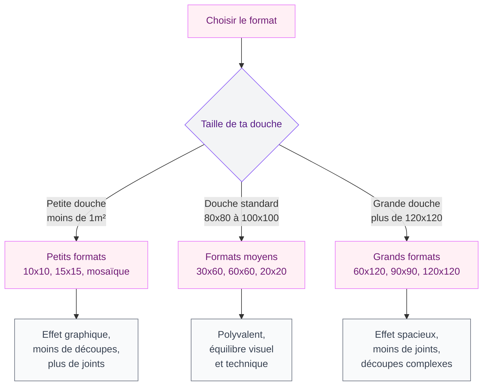
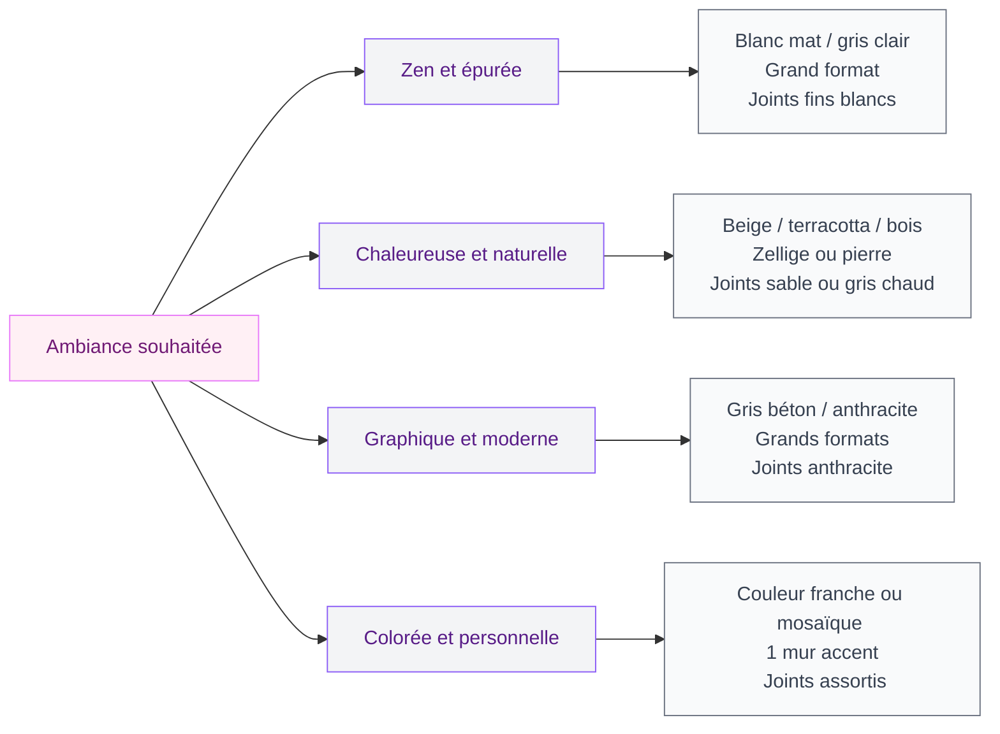

Tu envisages une douche à l'italienne et tu te retrouves perdu face à l'immense choix de carrelages ? Formats XXL, petit zellige, imitation marbre, grès cérame... les options sont tellement nombreuses que ça peut vite devenir un casse-tête. Bonne nouvelle : le carrelage de douche à l'italienne, c'est mon rayon. Je t'explique tout pour choisir juste - et éviter les erreurs qui coûtent cher.

## Pourquoi le carrelage de douche italienne demande une attention particulière

Une douche à l'italienne, c'est un espace sans receveur classique, avec un sol en légère pente qui mène vers le siphon de sol. Ça change tout par rapport à une cabine de douche traditionnelle, parce que les contraintes techniques sont différentes.

Le sol doit obligatoirement être **antidérapant** - et pas seulement un peu. La réglementation définit des indices de glissance : pour une douche, tu vises minimum **R10 pour le sol**, et idéalement R11 si tu as des enfants ou des personnes âgées chez toi. Sur les murs, ce critère disparaît, et tu as beaucoup plus de liberté.

L'autre point important : l'humidité permanente. Toutes les matières ne se valent pas face à l'eau, aux produits de nettoyage et aux variations de température. C'est là que le grès cérame s'impose comme la valeur sûre.

> [!NOTE]
> L'indice R mesure la résistance à la glissance : R9 = intérieur sec, R10 = salle de bain, R11 = douche avec eau permanente. L'indice U concerne l'usure : U3 minimum pour le sol d'une douche domestique, U4 pour les espaces très fréquentés.

## Le grès cérame : le chouchou des douches à l'italienne

Si tu ne retiens qu'une matière pour ta douche à l'italienne, c'est le **grès cérame**. Ce matériau cuit à très haute température absorbe presque zéro eau (moins de 0,5%), résiste aux chocs, aux rayures et aux produits ménagers. Et il existe aujourd'hui dans une variété de finitions et d'imitations vraiment bluffantes.

### Grès cérame émaillé vs grès cérame pleine masse

Le grès cérame **émaillé** a une couche de glaçure en surface qui lui donne sa couleur et sa texture. Il est légèrement moins résistant aux rayures sur la durée, mais offre des options décoratives très larges - imitation bois, pierre, zellige, béton...

Le grès cérame **pleine masse** (ou "full body") a la même teinte sur toute l'épaisseur de la dalle. Avantage : si tu as un éclat ou une rayure, ça se voit beaucoup moins. C'est le choix des pros pour les espaces très fréquentés.

> [!TIP]
> Pour le sol de ta douche, préfère le grès cérame pleine masse avec finition structurée ou mate - les surfaces brillantes sont jolies sur les murs mais glissantes sous les pieds, même avec un bon indice R.

### Et la faïence ?

La faïence est souvent moins chère (5-15€/m² contre 15-40€ pour le grès cérame), mais elle est plus poreuse et moins résistante. Sur les murs d'une douche, ça peut passer si tu optes pour une qualité correcte et que tu entretiens bien les joints. Sur le sol, oublie : trop fragile, trop glissante.

## Les formats : quel effet pour quel espace ?

Le format du carrelage change complètement l'ambiance visuelle de ta douche. C'est souvent là que les gens hésitent le plus, alors voilà un récap concret.

### Les grands formats (60x60 et plus)

Très tendance en ce moment, les carreaux 60x60, 60x120 ou même 90x90 donnent une impression d'espace et de luxe. Moins de joints, donc moins d'entretien - c'est une vraie raison pratique de les choisir. Le revers : les découpes sont plus complexes et les imperfections du sol (qui n'est jamais parfaitement plat) se voient davantage.

Pour le mur de douche, le format 30x90 ou 40x80 en pose verticale donne beaucoup de hauteur et d'élégance. Ikea propose de belles options grès cérame format 45x45 autour de 20€/m², et ça tient vraiment bien dans le temps.

### Les petits formats et la mosaïque

Le carrelage **mosaïque** (2x2 ou 5x5), c'est le choix malin pour le receveur de douche à l'italienne. Pourquoi ? Parce que la multitude de petits carreaux épouse parfaitement la pente du sol, même dans les coins. Et tous ces joints font office d'antidérapant naturel.

Pour les murs, la mosaïque crée un effet très graphique et déco. En verre ou en grès cérame nacré, ça peut être vraiment beau. Côté budget : à partir de 25-30€/m², jusqu'à 80€ pour les références premium.

Le zellige (en grès cérame, pas en terre cuite pure pour la douche) est lui aussi en plein essor. Ses légères irrégularités et son aspect artisanal donnent du caractère à une douche qui sinon peut vite sembler froide. La Redoute Intérieur en vend de très jolies options autour de 35-55€/m².

### Les formats moyens : le choix sûr

Le 30x60 et le 60x60 restent les formats les plus utilisés en douche à l'italienne. Polyvalents, faciles à poser, disponibles dans toutes les gammes de prix et d'aspect. Si tu veux une douche qui fonctionne bien sans prise de tête, c'est ce que je te conseillerais en premier.

> [!WARNING]
> Attention aux très grands formats (90x90 et plus) si ton carreleur n'est pas expérimenté. Ces dalles sont lourdes, se coupent difficilement et nécessitent une dalle parfaitement plane. Un mauvais résultat peut te coûter très cher à refaire.

## Couleurs et ambiances : quelle esthétique pour ta douche ?

Le carrelage, c'est aussi une question de style. Voilà les grandes tendances du moment et ce qu'elles donnent vraiment dans un espace douche.

### Le blanc et les tons clairs : valeur sûre mais pas si basique

Un carrelage blanc ou beige clair dans une douche à l'italienne, c'est intemporel. Ça agrandit visuellement l'espace, ça reflète la lumière, et ça vieillit bien. Pour ne pas tomber dans le médical, joue sur les textures : un blanc mat légèrement structuré (imitation pierre, relief discret) est beaucoup plus chaleureux qu'un blanc brillant lisse.

### Les gris et le béton ciré : le classique urbain

L'imitation béton ciré en carrelage, c'est le trend qui ne se lasse pas. En 60x60 ou grand format, ça donne une douche ultra moderne et sobre. L'avantage du grès cérame façon béton sur le vrai béton ciré ? Zéro entretien, pas de problème d'imperméabilisation, pas de risque de fissures.

### Les couleurs franches : osé mais tellement beau

Vert bouteille, bleu nuit, terracotta... les douches à l'italienne avec une couleur forte sont spectaculaires. Tu peux jouer la carte couleur sur un seul mur et garder les autres neutres, ou faire un sol en mosaïque colorée avec des murs blancs. Ça donne du caractère sans que ce soit oppressant.

La marque Marazzi propose de très beaux grès cérame colorés dans la gamme 20-50€/m², souvent disponibles chez les carreliers spécialisés. Et H&M Home a une petite sélection de carreaux déco pour les murs à prix accessibles.

## Les joints : le détail qui fait tout

On oublie souvent les joints quand on choisit son carrelage, et c'est une erreur. Dans une douche à l'italienne, les joints doivent être **époxy** - pas les joints classiques au ciment. Pourquoi ? Parce qu'un joint époxy est imperméable, antifongique (adieu la moisissure noire...) et résiste aux produits de nettoyage.

La couleur des joints change aussi beaucoup le résultat final :
- Joint assorti au carrelage : effet homogène, l'oeil ne voit pas les joints
- Joint blanc sur carrelage coloré : effet graphique, géométrique
- Joint anthracite sur carrelage blanc : très contemporain
- Joint sable sur carrelage beige/pierre : naturel et chaud

> [!TIP]
> Si tu veux minimiser l'entretien des joints, choisis une couleur de joint proche de celle du carrelage. Un joint blanc sur carrelage blanc se salit visuellement beaucoup plus vite qu'un joint gris clair. Et avec des joints époxy, c'est de toute façon beaucoup plus facile à nettoyer.

## Budget : combien prevoir pour le carrelage d'une douche italienne ?

Voilà une estimation réaliste pour une douche à l'italienne standard (environ 1,20 x 1,20 m, soit 4,5 m² de surfaces totales avec murs à 2m de hauteur).

**Entrée de gamme (300-600€ fourni posé) :**
Grès cérame faïence moyen de gamme, format 30x60 ou 45x45. Du solide mais sans fantaisie. Leroy Merlin ou Castorama ont de bons basiques à 8-15€/m².

**Milieu de gamme (600-1200€ fourni posé) :**
Beau grès cérame avec finition imitant pierre ou béton, format 60x60 ou 30x90. Tu peux viser 20-40€/m² et obtenir quelque chose de très qualitatif. C'est le budget que je recommande pour un bon rapport plaisir/durée de vie.

**Haut de gamme (1200€ et plus) :**
Grands formats 90x90 ou plus, zellige artisanal, pierre naturelle (quartzite, travertin), carreaux de ciment vérifiés compatibles douche... Là tu es sur 40-80€/m² et plus pour les matières premium.

**Important** : le prix du carrelage est une chose, mais la pose représente en général 50-80% du budget total (carreleur, main d'oeuvre, préparation du support, étanchéité). Ne sous-estime pas ce poste.

> [!CAUTION]
> Pour une douche à l'italienne, l'étanchéité sous le carrelage (bande d'étanchéité, primaire d'accrochage, membrane imperméabilisante) est obligatoire et non négociable. Si ton carreleur ne prévoit pas cette étape, change de carreleur. Une douche qui fuit peut causer des dégâts à plusieurs milliers d'euros dans le plancher.

## Les pièges à éviter

**Acheter trop juste en quantité.** Prévois toujours 10% de plus pour les chutes et les cassures pendant la pose. Pour les carreaux originaux ou en série limitée, garde quelques pièces en stock pour les réparations futures.

**Mixer sol et mur sans penser à la glissance.** Un carrelage poli brillant qui fait des merveilles sur ton mur sera dangereux sous tes pieds. Ton carreleur devrait te le dire, mais vérifie toujours l'indice R de ce que tu poses au sol.

**Négliger l'éclairage.** La couleur de ton carrelage changera totalement selon la lumière naturelle ou artificielle de ta salle de bain. Commande des échantillons et regarde-les à différentes heures de la journée dans la pièce avant de commander.

**Oublier les finitions de rive.** Les carreaux en bord de douche ont besoin de carreaux de rive (avec une arête arrondie) ou de profilés métal pour une finition propre. Ça se prévoit en amont, pas le jour de la pose.

Si tu réfléchis à l'ensemble de ta salle de bain et pas seulement à la douche, les choix de matériaux pour [le meuble vasque en béton ciré](/guides/salle-de-bain/meuble-salle-de-bain-beton-cire/) peuvent aussi s'accorder avec ton carrelage douche pour un rendu très cohérent.

## Sur le meme theme

- [receveur pour douche italienne](/guides/salle-de-bain/quel-receveur-pour-douche-italienne/)
- [douche italienne : tout savoir avant de se lancer](/guides/salle-de-bain/douche-italienne/)
- [douche à 1 euro](/guides/salle-de-bain/douche-1-euro/)
- [carrelage métro salle de bain](/guides/salle-de-bain/carrelage-metro-salle-de-bain/)

## Ma checklist avant d'acheter

- Sol : indice R10 minimum, R11 recommandé
- Sol : indice U3 minimum (usage domestique)
- Murs : grès cérame ou faïence qualité correcte
- Joints : époxy obligatoire pour la douche
- Quantité : surface + 10% de sécurité
- Echantillons testés dans les conditions réelles de lumière
- Budget étanchéité inclus dans le devis carreleur

Tu as maintenant toutes les clés pour choisir ton carrelage de douche à l'italienne avec confiance. Et si tu hésites encore, retiens ce point clé : un beau grès cérame 60x60 mat avec des joints époxy assortis, c'est le combo qui ne déçoit jamais.
