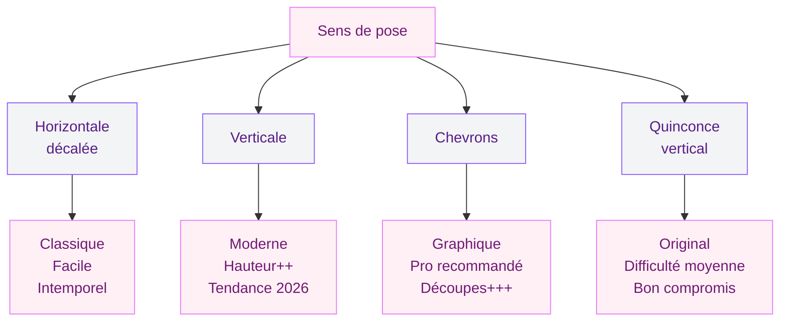

Tu adores le look du carrelage métro mais tu ne sais pas comment l'intégrer dans ta salle de bain ? Format, couleur, finition, sens de pose - les options sont larges et les erreurs faciles à faire. Bonne nouvelle : c'est un des revêtements muraux les plus simples à poser, les plus faciles à entretenir, et il s'adapte à presque tous les styles. Je t'explique tout ce que tu dois savoir pour faire le bon choix.

## D'où vient le carrelage métro (et pourquoi il plaît autant)

Ce petit carreau rectangulaire a été créé en 1900 pour habiller les stations du métro parisien. À l'époque, l'objectif était simple : un revêtement mural hygiénique, facile à nettoyer, qui reflète la lumière dans les tunnels sombres. Le résultat ? Un carreau en céramique biseauté, blanc, au format 7,5 x 15 cm, avec des bords légèrement bombés qui captent la lumière.

Depuis, le carrelage métro a quitté les souterrains pour s'inviter dans nos intérieurs. Cuisines, salles de bains, buanderies - il fonctionne partout. Son secret ? Un aspect à la fois rétro et moderne, qui se marie aussi bien avec une déco classique qu'avec un style industriel ou minimaliste.

En 2026, les carreaux métro se déclinent dans des dizaines de couleurs et de finitions. On est loin du simple blanc brillant - et c'est tant mieux.

## Quel format choisir pour tes carreaux métro

Le format original est le 7,5 x 15 cm, mais tu trouveras aussi du 10 x 20 cm (le plus vendu aujourd'hui), du 10 x 30 cm pour un effet plus allongé, et même du 5 x 15 cm pour un rendu plus graphique.

### Le 10 x 20 cm : la valeur sûre

C'est le format que je recommande dans 80% des cas. Il est proportionnellement agréable à l'oeil, facile à poser, et disponible dans toutes les gammes de prix. Chez Leroy Merlin, tu trouves le basique blanc à partir de 16,90 EUR/m². Chez As de Carreaux, les versions biseautées démarrent autour de 25 EUR/m².

### Le 10 x 30 cm : pour allonger visuellement

Ce format plus allongé crée un effet d'étirement qui agrandit la pièce. Posé à l'horizontale, il élargit ; à la verticale, il donne de la hauteur. C'est un bon choix si ta salle de bains est un peu étroite.

### Le 7,5 x 15 cm : le charme de l'original

Le petit format d'origine a un côté authentique que les grands formats n'ont pas. Plus de joints, plus de texture visuelle, un aspect presque artisanal. Par contre, la pose prend plus de temps - et les joints se salissent plus vite.

> [!TIP]
> Pour une petite salle de bain (moins de 5 m²), le format 10 x 20 cm en pose horizontale décalée est le meilleur compromis entre esthétique et praticité. Il agrandit visuellement l'espace sans surcharger.

## Couleurs et finitions : comment trouver ton style

C'est là que ça devient fun. Le blanc reste un classique absolu, mais les couleurs font une entrée en force dans les salles de bains en 2026.

### Le blanc : luminosité maximale

Le carrelage métro blanc est le choix le plus répandu - et pour cause. Il reflète la lumière, agrandit l'espace et s'associe à tout. Version brillante pour un effet miroir, version mate pour un rendu plus doux et contemporain.

### Le gris : chic et discret

Du gris clair au gris anthracite, c'est la teinte parfaite si tu veux du caractère sans trop de risque. Le gris clair fonctionne bien en total look, le gris foncé est génial en mur d'accent derrière la vasque ou dans la douche. Tu peux aussi mixer les deux pour créer du contraste.

### Les couleurs affirmées : vert sauge, bleu canard, terracotta

Tu veux de la personnalité ? Un mur entier en carrelage métro vert sauge (un des best-sellers de 2026), c'est magnifique. Le bleu canard apporte de la profondeur, le terracotta de la chaleur. Pour un rendu harmonieux, garde les couleurs vives sur un seul mur et équilibre avec du blanc ou du clair sur le reste.

> [!NOTE]
> Les carreaux métro foncés (noir, vert forêt, bleu nuit) sont superbes mais rendent une petite salle de bains encore plus petite. Réserve-les aux pièces avec de la lumière naturelle ou à un seul mur d'accent.

### Finitions : brillant, mat ou biseauté ?

La finition change totalement le rendu de ton carrelage :

- **Brillant (glazed)** : reflète la lumière, agrandit l'espace, look classique. Attention aux traces de doigts et de calcaire.
- **Mat** : plus moderne, plus doux, cache mieux les imperfections et les traces d'eau. Tendance 2026.
- **Biseauté** : les bords du carreau sont légèrement bombés, ce qui crée un jeu d'ombres et de relief. C'est LE look métro authentique.
- **Plat (flat)** : pas de biseau, rendu plus contemporain et minimaliste.

## La pose : horizontale, verticale ou en chevrons

Le sens de pose influence énormément le rendu final. Voici les options les plus courantes.

### Pose décalée horizontale (la classique)

C'est la pose la plus répandue : les carreaux muraux sont posés à l'horizontale, décalés d'un demi-carreau à chaque rangée (comme un mur de briques). Résultat : un look intemporel et élégant. Si tu débutes, c'est la pose la plus facile à réaliser toi-même.

### Pose verticale (la tendance 2026)

Poser les carreaux métro à la verticale, c'est LA tendance du moment. Ça donne immédiatement un effet plus moderne et plus original que la pose classique. L'avantage supplémentaire : ça fait paraître le plafond plus haut. Dans une [douche italienne](/guides/salle-de-bain/douche-italienne/), l'effet est spectaculaire.

### Pose en chevrons (herringbone)

Les carreaux sont posés en V, comme un parquet point de Hongrie. C'est le motif le plus graphique et le plus "wow", mais aussi le plus technique à réaliser. Je recommande de confier cette pose à un pro, les découpes d'angle sont nombreuses et le moindre écart se voit.

### Pose en quinconce vertical

Les carreaux sont posés verticalement mais décalés d'un demi-carreau, comme la pose classique mais tournée de 90 degrés. C'est un bon compromis entre l'originalité de la verticale et la facilité de la pose décalée.

> [!IMPORTANT]
> Quelle que soit la pose choisie, prévois 10 à 15% de carreaux en plus pour les découpes et la casse. Pour une pose en chevrons, monte à 15-20%. Ça t'évitera de devoir recommander en urgence un lot qui n'aura peut-être plus exactement la même teinte.

## Les joints : un détail qui change tout

Le choix du joint est souvent négligé, mais il peut transformer complètement l'aspect de ton carrelage métro.

**Joint blanc sur carrelage blanc** : discret, propre, agrandit l'espace. C'est le combo le plus safe. Mais les joints blancs dans une salle de bains... ça jaunit. Opte pour un joint époxy (type Mapei Kerapoxy) : plus cher (25-30 EUR le seau de 5 kg contre 8-12 EUR pour un joint classique) mais quasi indestructible face à l'humidité et aux moisissures.

**Joint coloré contrastant** : un joint gris foncé sur du carrelage blanc fait ressortir chaque carreau individuellement. L'effet est graphique et très tendance. Le joint noir est encore plus radical - superbe sur du blanc ou du vert sauge.

**Joint ton sur ton** : même couleur que le carrelage, pour un rendu uniforme et apaisant. C'est ce que je te conseille sur les couleurs foncées.

> [!WARNING]
> Évite les joints ciment classiques dans les zones de douche - ils se dégradent vite avec l'humidité permanente. Le joint époxy coûte plus cher mais il résiste à l'eau, aux moisissures et au jaunissement pendant 15 à 20 ans.

## Prix : combien coûte le carrelage métro en 2026

Bonne nouvelle : le carrelage métro reste un des revêtements muraux les plus accessibles. Voici les fourchettes de prix au m² constatées en 2026.

**Entrée de gamme (10-20 EUR/m²)** : carreaux basiques en céramique, blanc ou quelques coloris, finition lisse ou légèrement biseautée. Leroy Merlin, Castorama, Brico Dépôt. C'est correct pour un premier projet ou un budget serré.

**Milieu de gamme (20-40 EUR/m²)** : carreaux en céramique de qualité, large choix de couleurs et finitions, bords bien biseautés. As de Carreaux, Carrelages du Marais, Saint-Maclou. C'est là où le rapport qualité-prix est le meilleur.

**Haut de gamme (40-80 EUR/m²)** : carreaux artisanaux, effet zellige, émaillage fait main, pièces uniques. Emery & cie, Popham Design, Made a Mano. Pour les projets où tu veux un rendu vraiment spécial.

À ça, ajoute la colle (5-10 EUR/m²), les joints (3-8 EUR/m²), et la main d'oeuvre si tu ne poses pas toi-même (30-60 EUR/m² selon ta région et la complexité de la pose).

Pour une salle de bain standard (environ 15 m² de surface murale à carreler), tu arrives à :
- **Budget serré** : 270-600 EUR en matériaux seuls, 750-1500 EUR pose comprise
- **Budget confort** : 450-900 EUR en matériaux, 1200-2100 EUR pose comprise
- **Budget premium** : 900-1800 EUR en matériaux, 1500-3000 EUR pose comprise

## Entretien au quotidien : garder tes carreaux métro comme neufs

Un des gros avantages du carrelage métro, c'est son entretien simple. La surface céramique est lisse, non poreuse (surtout en émaillé) et résiste bien aux produits ménagers courants.

**Au quotidien** : un coup de raclette après la douche pour éviter les traces de calcaire, c'est le geste qui fait toute la différence. Trust me, c'est 30 secondes qui t'épargnent 30 minutes de frottage le weekend.

**Une fois par semaine** : nettoyage à l'eau chaude avec un peu de vinaigre blanc ou un produit neutre. Les carrelages brillants montrent plus les traces que les mats - à prendre en compte au moment du choix.

**Les joints** : si tu as opté pour un joint ciment classique, un passage régulier au bicarbonate de soude + brosse à dents évite le jaunissement. Avec un joint époxy, un simple coup d'éponge suffit.

Pour des inspirations sur les styles de [salle de bain tendance en 2026](/guides/salle-de-bain/salles-de-bains-modernes-2026-modeles-designs-decoration/), tu peux mixer le carrelage métro avec d'autres matériaux comme le bois ou le béton ciré.

## 5 erreurs courantes à éviter

1. **Choisir un format sans voir un échantillon en vrai.** Les photos en ligne ne rendent pas la texture ni les reflets. Commande des échantillons (la plupart des enseignes les proposent gratuits ou à petit prix) et pose-les contre le mur de ta salle de bain.

2. **Négliger l'éclairage.** Le carrelage biseauté crée des ombres qui changent selon la lumière. Un spot mal placé peut transformer un bel effet de relief en surface plate et terne.

3. **Sous-estimer le nombre de carreaux.** Rappel : +10 à 15% pour les découpes, +15 à 20% pour les chevrons. Et commande tout d'un coup - les lots peuvent varier en teinte.

4. **Oublier le traitement des angles.** Les angles sortants (coins de murs, niches) demandent des baguettes de finition ou des coupes à 45 degrés. C'est un détail, mais c'est lui qui donne un rendu pro ou amateur.

5. **Poser du carrelage métro brillant au sol.** Les carreaux muraux ne sont pas conçus pour le sol - ils sont trop glissants et pas assez résistants à l'usure. Pour le sol, oriente-toi vers un [carrelage adapté à la douche italienne](/guides/salle-de-bain/carrelage-douche-italienne/) avec un bon indice antidérapant.

## Style métro et déco : les combinaisons qui fonctionnent

Le carrelage métro s'adapte à presque tous les univers déco. Voici mes combos préférés :

**Métro blanc + bois clair + laiton** : ambiance scandinave, propre et lumineuse. Le grand classique qui ne lasse jamais. Un meuble vasque en chêne, de la robinetterie laiton brossé, et tu as une salle de bain magazine.

**Métro vert sauge + terrazzo au sol + noir mat** : ambiance contemporaine avec du caractère. C'est le trio que je vois partout sur les projets de rénovation en 2026, et je comprends pourquoi.

**Métro noir + joints blancs + [style industriel](/guides/salle-de-bain/salle-de-bain-industrielle/)** : le contraste graphique maximum. Ajoute des étagères en métal noir et des accessoires en cuivre pour un rendu loft new-yorkais.

**Métro couleur pastel + miroir vintage + plantes** : ambiance rétro et douce, parfaite pour une salle de bains parentale. Un miroir chiné en brocante (20-60 EUR) et quelques [plantes de salle de bain](/guides/salle-de-bain/plantes-salle-de-bains/) vertes complètent le tableau.

## FAQ

### Le carrelage métro convient-il à une petite salle de bains ?

Oui, c'est même un des meilleurs choix pour les petits espaces. Le format allongé et la surface réfléchissante (surtout en finition brillante) agrandissent visuellement la pièce. Privilégie le blanc ou le gris clair, en pose horizontale, pour maximiser cet effet.

### Peut-on poser du carrelage métro soi-même ?

La pose décalée classique est accessible aux débutants motivés. Tu as besoin d'une coupe-carreaux (location en magasin de bricolage, environ 30 EUR/jour), de colle murale, de croisillons, et de patience. La pose en chevrons, en revanche, demande de l'expérience.

### Quel joint choisir avec du carrelage métro blanc ?

Pour un rendu classique et lumineux, le joint blanc. Pour un look graphique et tendance, le joint gris foncé ou noir. Dans tous les cas, opte pour un joint époxy en salle de bain - il résiste à l'humidité et ne jaunit pas, ce qui n'est pas le cas du joint ciment standard.
