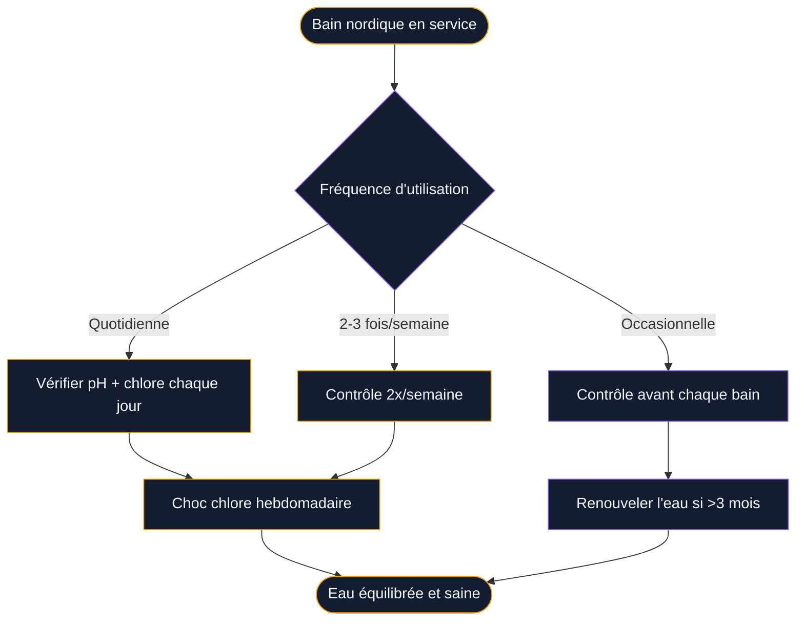
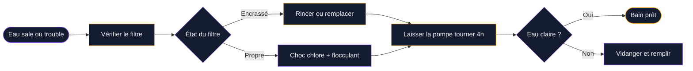

Tu as investi dans un bain nordique et tu veux qu'il dure le plus longtemps possible ? Bonne nouvelle : avec quelques gestes simples au bon moment, tu peux garder ton bac nickel pendant des années. L'entretien d'un bain nordique, c'est un peu comme prendre soin d'une terrasse en bois ou d'une piscine - ça demande de la régularité, pas des heures de travail.

Dans cet article, on passe en revue tout ce qu'il faut savoir : le traitement de l'eau (qui fait peur à beaucoup de gens à tort), l'entretien du bois, les erreurs classiques, et ce qu'on fait quand arrive l'hiver.

## Pourquoi l'entretien d'un bain nordique est différent d'une piscine

Un bain nordique - ou hot tub en bois - fonctionne à des températures entre 36 °C et 40 °C. Cette chaleur, c'est parfait pour se détendre, mais c'est aussi un terrain idéal pour les bactéries si l'eau n'est pas traitée correctement. Le volume d'eau est généralement entre 1 000 et 1 500 litres, bien moins qu'une piscine, donc les déséquilibres chimiques se produisent plus vite.

  

Autre particularité : la cuve en bois (épicéa, pin traité, cèdre rouge ou teck selon les modèles) réagit à l'humidité, aux produits chimiques et aux variations de température. L'entretien du bois est donc aussi important que celui de l'eau.

## Le traitement de l'eau : la base de tout

  

### Comprendre le trio pH / chlore / alcalinité

L'eau de ton bain nordique se gère autour de trois paramètres qui se tiennent :

- **pH** : entre 7,2 et 7,6 (idéalement 7,4). En dessous, l'eau est acide et attaque le bois. Au-dessus, le chlore devient moins efficace.
- **Taux de chlore libre** : entre 1 et 3 mg/L (ppm). C'est lui qui tue les bactéries.
- **Alcalinité totale (TAC)** : entre 80 et 120 mg/L. Elle stabilise le pH et évite les variations brusques.

Pour mesurer tout ça, tu as deux options : les bandelettes de test (5 à 15 € pour 50 bandelettes, marques Aqua Check ou Gre) ou le testeur photométrique électronique type IQPool ou TFA Dostmann (autour de 30 à 60 €). Le testeur électronique est bien plus précis si tu utilises ton bain souvent.

> [!TIP]
> Achète des bandelettes 6-en-1 qui mesurent en même temps le pH, le chlore libre, le chlore total, l'alcalinité, la dureté et l'acide cyanurique. Tu gagnes du temps et tu as une vision complète en 30 secondes.

### Les produits à avoir chez toi

Pour réguler l'eau d'un bain nordique, ton kit de base c'est :

- **Chlore choc** (granulés ou liquide) pour la désinfection initiale et hebdomadaire - ex. : Bayrol Chloriklar, environ 15-20 € le kg
- **pH plus et pH moins** pour corriger l'acidité - marques Bayrol, CTX ou Ocedis, autour de 8-12 € les 500 g à 1 kg
- **Augmenteur d'alcalinité** (bicarbonate de soude ou produit spécialisé) - 5-8 €
- **Algicide** si tu laisses le bain sans traitement plusieurs jours - 10-15 €
- **Floculant** optionnel pour clarifier l'eau trouble - 10 €

Budget mensuel estimé pour un bain nordique utilisé régulièrement : entre 20 et 35 €.

### Le planning de traitement semaine par semaine

**Avant chaque bain** : une vérification rapide du pH et du chlore avec une bandelette (1 minute).

**Deux fois par semaine** : mesure complète avec ajustement si nécessaire. On commence toujours par corriger l'alcalinité, puis le pH, puis le chlore - dans cet ordre, jamais l'inverse.

**Une fois par semaine** : choc chlore. On ajoute une dose de chlore choc (selon la marque, souvent 10 g pour 1 000 L) le soir, après utilisation. On laisse la pompe tourner 2 heures minimum.

**Toutes les 6 à 12 semaines** : vidange complète et remplissage avec de l'eau fraîche. En utilisation intensive (4-5 bains par semaine), c'est plutôt 6 semaines. En utilisation légère, 10 à 12 semaines.

> [!WARNING]
> Ne jamais mélanger différents produits de traitement directement dans le bain ou dans le même récipient. Chlore et algicide, par exemple, peuvent réagir violemment. On ajoute chaque produit séparément, avec 15 minutes d'intervalle minimum.

## Entretenir le bois : le geste souvent négligé

  

### Pourquoi le bois demande de l'attention

Le bois d'un bain nordique gonfle quand il absorbe l'eau, et se rétracte quand il sèche. C'est normal et même souhaitable pour l'étanchéité - les douelles (les planches du bac) se dilatent et forment un joint naturel. Mais si le bois se sèche trop vite entre les utilisations ou reste trop longtemps en contact avec des produits agressifs, il peut craquer, se décolorer ou commencer à pourrir.

Voici ce que tu dois faire :

**À la première mise en eau** : remplis le bac lentement, laisse le bois gonfler 24 à 48 heures à froid avant de chauffer. Cette étape est souvent zappée et c'est dommage - elle conditionne l'étanchéité des premières semaines.

**Nettoyage des parois internes** : à chaque vidange, frotte les parois avec une brosse douce (pas métallique) et un produit neutre ou du vinaigre blanc dilué. Évite les détergents classiques qui laissent des résidus moussants.

**Traitement de l'extérieur** : la partie extérieure du bac n'est pas en contact avec l'eau mais subit les UV et la pluie. Une fois par an (au printemps), applique une huile de protection pour bois extérieur type Ronseal, Osmo Öl ou Rubio Monocoat (30 à 60 € selon le produit). Ça nourrit le bois, protège la couleur et repousse l'eau.

> [!NOTE]
> Le grisaillement du bois à l'extérieur est naturel et ne signifie pas que le bois se dégrade. C'est une patine due aux UV. Si tu préfères garder la couleur d'origine, applique l'huile de protection deux fois la première année, puis une fois par an.

### Les marques de bain nordique et leurs spécificités bois

Selon que tu as un **Kirami** (épicéa nordique), un **Skargards** (sapin nordique ou teck), un **Nordkap** (mélèze ou pin Douglas traité) ou un modèle made in France comme ceux de **BoisDesign**, les recommandations varient.

Kirami et Skargards déconseillent les huiles trop grasses sur l'intérieur de la cuve - elles créent un film glissant et déséquilibrent le traitement de l'eau. Pour l'intérieur, l'eau et le traitement chloré suffisent. Nordkap propose un traitement thermique du bois (rétification) qui le rend plus résistant à l'humidité - dans ce cas, l'entretien bois est bien plus simple.

## Le filtre : le coeur souvent oublié

Même si ton bain nordique chauffe au bois et semble "naturel", il dispose souvent d'une pompe de filtration - et le filtre doit être entretenu.

  

**Filtre à cartouche** (le plus courant) : rincer à l'eau claire toutes les deux semaines. Remplacer la cartouche tous les 3 à 6 mois selon l'usage. Prix : 15 à 40 € selon le modèle (Jacuzzi, Waterco, Hayward). Tremper la cartouche une nuit dans du vinaigre blanc dilué (1/4 vinaigre, 3/4 eau) dégraisse le filtre et prolonge sa durée de vie.

**Bains nordiques sans pompe** : si ton modèle est chauffé uniquement au bois et n'a pas de système de filtration, l'entretien de l'eau est plus contraignant. Il faut renouveler l'eau plus souvent (toutes les 4 à 6 semaines en utilisation régulière) et être encore plus rigoureux sur le traitement chlore.

## L'hivernage : protéger ton bain pendant les mois froids

L'hiver est la période où beaucoup de propriétaires font des erreurs. Il y a deux scénarios.

  

### Scénario 1 : tu utilises ton bain en hiver

Le bain nordique en hiver, c'est une expérience sublime - la vapeur dans l'air froid, les étoiles... Pas besoin de mettre le bac en veille. En revanche :

- Maintiens l'eau à minimum 20 °C même quand tu ne l'utilises pas, pour éviter le gel des canalisations si ton modèle en a.
- Sur un bain chauffé au bois sans plomberie, la question du gel ne se pose pas vraiment pour la cuve elle-même - le bois résiste. Vide-le simplement si tu pars plus de 2 semaines.
- Couvre le bac avec une bâche isotherme ou un couvercle rigide (accessoire souvent vendu en option chez Kirami ou Skargards, 80 à 200 €). Ça réduit la perte de chaleur et garde l'eau plus propre.

### Scénario 2 : tu mets le bain en hivernage complet

Si tu n'utilises pas ton bain de novembre à mars :

1. **Vide complètement** le bac, pompe toute l'eau résiduelle.
2. **Nettoie les parois** avec une brosse douce et du vinaigre blanc.
3. **Laisse sécher** 2 à 3 jours avant de couvrir (un bois trop humide couvert risque de moisir).
4. **Couvre avec une bâche respirante** (pas une bâche étanche qui emprisonne l'humidité).
5. **Dépose quelques granulés d'absorbeur d'humidité** à l'intérieur si ton bain est sous une terrasse couverte.
6. **Protège la robinetterie** si tu en as, avec du produit antigel.

> [!CAUTION]
> Ne laisse jamais d'eau stationnaire dans un bain nordique en période de gel sans chauffage. Le gel peut fissurer les douelles et endommager la robinetterie. Vide totalement avant les premières gelées si tu n'utilises pas le bain.

## Les erreurs les plus courantes

**Entrer dans le bain juste après avoir ajouté du chlore.** Il faut attendre minimum 4 heures, idéalement une nuit. Le chlore libre à forte dose irrite la peau et les yeux.

**Utiliser du savon ou du shampoing dans le bain.** Même "naturel", ça mousse, déséquilibre le pH et encrasse le filtre à toute vitesse. Une douche avant le bain, c'est la règle de base.

**Négliger la vidange et croire qu'il suffit d'ajouter des produits.** L'eau chargée en matières organiques (sueur, crème solaire, kératine) finit par saturer le système et aucun traitement ne suffira plus. La vidange régulière est le seul vrai "reset".

**Laisser le niveau d'eau baisser trop bas.** Si la pompe tourne à vide, elle chauffe et grille. Surveille le niveau à chaque utilisation.

**Utiliser les mêmes produits que pour une piscine extérieure.** Les bains nordiques ont un volume d'eau bien plus faible et une température plus élevée. Les dosages sont différents - lis toujours les instructions spécifiques aux spas et hot tubs.

Si tu aimes l'idée d'un bain relaxant intégré à ton intérieur, jette un oeil à la [baignoire japonaise](/guides/salle-de-bain/baignoire-japonaise/) qui suit une philosophie similaire mais pour l'intérieur. Et si tu hésites encore sur le type de bain nordique à choisir, l'article sur la [baignoire scandinave](/guides/salle-de-bain/baignoire-scandinave/) peut t'aider à faire la différence entre les styles.

> [!IMPORTANT]
> Pour limiter la consommation d'eau liée aux vidanges fréquentes, certains propriétaires récupèrent l'eau de vidange pour arroser le jardin. Attention : l'eau traitée au chlore est déconseillée pour les plantes. Laisse-la déchlorer 48 heures à l'air libre avant usage, ou oriente-toi vers d'autres sources comme expliqué dans notre guide sur la [récupération d'eau piscine](/guides/exterieur/recuperation-eau-piscine/).

## Récapitulatif : ton planning d'entretien

```mermaid
gantt
    title Planning d'entretien mensuel bain nordique
    dateFormat  DD
    section Hebdomadaire
    Test pH + chlore          :active, a1, 01, 2d
    Test pH + chlore          :active, a2, 08, 2d
    Test pH + chlore          :active, a3, 15, 2d
    Test pH + chlore          :active, a4, 22, 2d
    Choc chlore               :crit, b1, 07, 1d
    Choc chlore               :crit, b2, 14, 1d
    Choc chlore               :crit, b3, 21, 1d
    Choc chlore               :crit, b4, 28, 1d
    section Mensuel
    Rinçage filtre             :c1, 05, 2d
    Nettoyage couvercle        :c2, 19, 2d
    section Trimestriel
    Vidange complète           :d1, 01, 3d
```

En résumé, voilà ce qui compte :

| Fréquence | Action |
|-----------|--------|
| Avant chaque bain | Test rapide bandelette pH/chlore |
| 2x par semaine | Mesure complète + ajustements |
| 1x par semaine | Choc chlore, rinçage filtre si nécessaire |
| Tous les 2 mois | Vidange, nettoyage complet |
| 1x par an | Huile de protection bois extérieur, contrôle des cerclages |
| Avant l'hiver | Traitement antigel ou hivernage complet |

L'entretien d'un bain nordique, c'est 15 minutes deux fois par semaine et une grande vidange toutes les 6 à 8 semaines. C'est très raisonnable pour une installation qui peut durer 15 à 20 ans si elle est bien traitée. Et franchement, quand tu plonges dans une eau parfaitement équilibrée par une soirée fraîche, tu te diras que ces quelques minutes valaient largement la peine.

Si tu cherches d'autres idées pour transformer ta salle de bains en espace de détente, jette un oeil aux [salles de bains modernes 2026](/guides/salle-de-bain/salles-de-bains-modernes-2026-modeles-designs-decoration/) pour te donner des idées de design, ou explore comment les [plantes salle de bains](/guides/salle-de-bain/plantes-salle-de-bains/) peuvent compléter l'ambiance zen de ton espace bien-être.

---

## Questions fréquentes

**Combien de fois par semaine peut-on utiliser un bain nordique ?**
Autant que tu veux, à condition de maintenir le traitement de l'eau en conséquence. Avec une utilisation quotidienne, contrôle le pH et le chlore chaque jour et anticipe une vidange toutes les 4 à 6 semaines.

**L'eau de mon bain nordique est verte, que faire ?**
De l'eau verte signale une prolifération d'algues ou un taux de chlore tombé à zéro. Fais un choc chlore intense (double dose), laisse la pompe tourner 6 heures, puis contrôle à nouveau. Si l'eau reste verte après 24 heures, la vidange est inévitable.

**Peut-on utiliser du sel à la place du chlore dans un bain nordique ?**
Oui, certains systèmes d'électrolyse au sel (comme les chlorinateurs Hayward ou Astral) peuvent être adaptés aux bains nordiques. Ils produisent du chlore naturellement à partir du sel. Le coût d'installation est plus élevé (400 à 800 €) mais les produits chimiques sont moins chers sur le long terme.

**Faut-il couvrir le bain nordique entre les bains ?**
Toujours. Un couvercle isolant réduit la perte de chaleur (donc la consommation de bois ou d'énergie), empêche les feuilles et insectes de tomber dans l'eau, et limite l'évaporation du chlore.

**Comment savoir si le bois de mon bain nordique est abîmé ?**
Les signes d'alerte : fissures profondes sur les douelles, noircissement (moisissure), gonflement irrégulier avec fuite d'eau persistante. Les petites fissures superficielles à l'extérieur sont normales. Un spécialiste peut traiter les douelles fissurées avec des résines, mais si la dégradation est avancée, le remplacement de la cuve est parfois plus économique.
