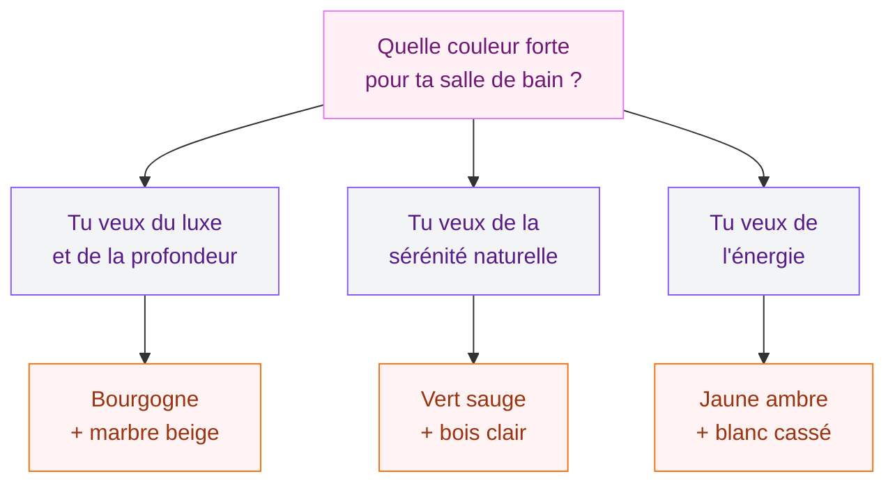
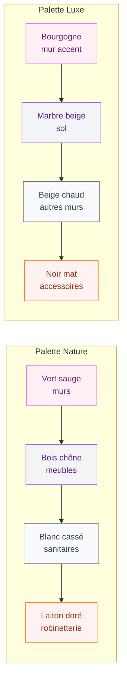
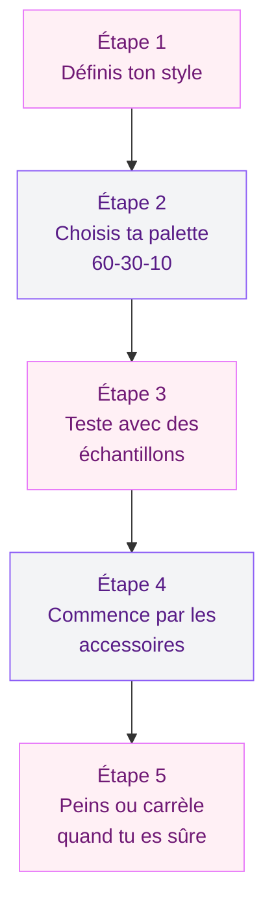

Tu en as marre du blanc clinique dans ta salle de bain ? Bonne nouvelle : en 2026, la couleur reprend ses droits et les palettes se font plus chaudes, plus riches, plus personnelles. On est loin de la froideur des salles de bain "showroom" des années précédentes. Cette année, la tendance est claire - on ose, on assume, on crée une ambiance qui te ressemble.

Je te présente les couleurs qui dominent cette année, les associations qui fonctionnent, les peintures à privilégier et surtout les combinaisons concrètes pour ta rénovation ou ton rafraîchissement. Avec des marques, des prix et des astuces testées.

## Les neutres chaleureux : la base de tout en 2026

  

### Beige chaud et tons sable

Le beige revient en force, mais pas le beige triste des années 2000. On parle de beiges riches, presque dorés, qui tirent vers le sable, le lin, la terre sèche. Ces teintes représentent environ 70 % de la palette globale des salles de bain tendance cette année - c'est la base sur laquelle tout le reste s'articule.

Pourquoi ça marche si bien ? Parce que le beige chaud s'associe avec absolument tout : du bois blond, du marbre veiné, de la robinetterie dorée ou noire mate. C'est le fond parfait pour ajouter des touches de couleur sans risquer la faute de goût.

Côté peinture, voici mes références préférées :
- **Tollens "Dune Tiède"** (T2077-5) : un sable lumineux parfait pour les murs, environ 35 € les 2,5 L
- **Farrow & Ball "Setting Plaster"** (231) : plus haut de gamme, un rose-beige sublime, 55 € le litre
- **Dulux Valentine "Lin Naturel"** : bon rapport qualité-prix à 28 € les 2,5 L

> [!TIP]
> Pour éviter l'effet "plat" avec du beige, joue sur les textures : un carrelage mat au sol, une peinture satinée aux murs, des accessoires en rotin ou en bois brut. La couleur est la même, mais la lumière accroche différemment chaque surface.

### Taupe et brun doux

Le taupe, c'est le beige qui a grandi. Plus profond, plus sophistiqué, il donne une impression cocooning immédiate. Associé à des meubles en bois foncé (noyer ou chêne teinté) et à une robinetterie en laiton brossé, tu obtiens un rendu très hôtel-boutique.

Le brun doux - pas le marron chocolat, plutôt un café au lait - fonctionne aussi très bien en duo avec le blanc cassé. C'est une combinaison sûre, élégante, et qui ne se démode pas.

## Les couleurs fortes qui s'imposent

  

### Le bourgogne : la star de l'année

Le bourgogne est LA couleur qui fait parler d'elle en 2026. Ce rouge sombre, profond, presque vineux, apporte une dimension luxueuse à la salle de bain. C'est enveloppant, sensuel, et ça crée une atmosphère qu'aucune autre couleur ne peut reproduire.

Deux façons de l'utiliser :

**En total look** : tous les murs en bourgogne, avec un sol en marbre beige ou en carrelage grand format couleur sable. Ça demande du courage, mais le résultat est spectaculaire. Pense à une bonne ventilation et un éclairage chaud (2700K) pour éviter que la pièce paraisse trop sombre.

**En touche d'accent** : un seul mur, un meuble vasque laqué, ou simplement des accessoires (serviettes, tapis, distributeurs). C'est plus accessible et ça permet de tester sans engagement.

> [!WARNING]
> Le bourgogne absorbe beaucoup de lumière. Si ta salle de bain fait moins de 5 m2 ou n'a pas de fenêtre, limite-le à un seul mur ou aux accessoires. Sinon l'effet "grotte" est garanti.

Pour les peintures bourgogne en milieu humide :
- **V33 Rénovation Perfection** spéciale salle de bain, teinte "Lie de Vin" : 42 € les 2 L, très bonne tenue à l'humidité
- **Ressource Peintures "Bourgogne"** (collection Héritage) : environ 65 € le litre, rendu mat velouté à tomber

### Le vert sauge et les verts nature

Le vert sauge continue sa progression en 2026 - et franchement, c'est mérité. Cette teinte gris-vert douce évoque la nature sans imposer une ambiance trop "botanique". Elle s'associe à merveille avec le bois clair, le marbre blanc et les métaux dorés.

Le vert sauge, c'est aussi la couleur la plus facile à vivre parmi les teintes fortes. Elle ne fatigue pas, elle apaise, et elle fonctionne dans toutes les tailles de salle de bain. Pour les petits espaces, c'est même un meilleur choix que le blanc pur - ça donne de la profondeur sans écraser.

D'autres verts à considérer : le vert olive (plus chaud, style méditerranéen), le vert forêt (plus sombre, ambiance luxe), et le vert d'eau (plus frais, esprit bord de mer).

Si tu cherches des idées pour associer ces teintes vertes avec des éléments naturels, notre guide sur les [plantes en salle de bains](/guides/salle-de-bain/plantes-salle-de-bains/) te donnera plein d'inspiration.

### Le bleu profond et le bleu marine

Le bleu marine, c'est le classique qui ne déçoit jamais. En 2026, il se porte dans des versions plus saturées, presque encre, sur un mur entier ou en carrelage zellige. L'association bleu marine + laiton doré + marbre blanc est un trio gagnant qui donne un rendu très parisien, très raffiné.

Le bleu profond (pas turquoise, pas ciel - un vrai bleu nuit) fonctionne aussi très bien en petite salle de bain. Contrairement à ce qu'on pourrait penser, une couleur foncée dans un petit espace peut l'agrandir visuellement - à condition d'avoir un bon éclairage et des éléments réfléchissants (miroir grand format, robinetterie brillante).

> [!NOTE]
> Les carreaux zellige en bleu marine sont un choix canon pour la douche ou la crédence. Compte entre 80 et 130 € le m2 posé, mais l'effet est vraiment unique avec leurs irrégularités de surface qui jouent avec la lumière.

## Les teintes solaires : la surprise 2026

  

### Jaune ambre et orange doux

C'est la tendance qu'on n'attendait pas : les tons chauds et ensoleillés font leur entrée dans la salle de bain. Jaune d'or, orange doux, ambre - ces couleurs insufflent une énergie positive à la pièce. En 2026, on les retrouve sur les meubles laqués, les accessoires, et parfois même sur les carrelages.

Ça marche surtout pour les salles de bain orientées nord ou sans fenêtre, là où la lumière naturelle manque. Un meuble vasque jaune moutarde, c'est 100 % de bonne humeur le matin. Et ça se marie parfaitement avec le bois clair et la pierre.

**Où trouver des meubles dans ces teintes ?**
- **Ikea "Hemnes"** customisé avec peinture Castorama "Ambre Doux" : environ 200 € tout compris
- **Made.com** collection salle de bain : meubles vasques en jaune curry à partir de 350 €
- **Tikamoon** : meubles en teck avec façade colorée, à partir de 450 €

### Le rose poudré : doux et sophistiqué

Le rose poudré n'est pas nouveau, mais il s'affirme en 2026 dans une version plus mature, presque nude. Loin du rose bonbon, on parle d'un rose désaturé, tendre, qui crée une ambiance douce et féminine sans être "too much".

L'association rose poudré + gris perle + laiton brossé est une valeur sûre. C'est élégant, lumineux, et ça plaît à tout le monde. Pour les salles de bain partagées en couple, c'est souvent un bon compromis - plus chaleureux que le gris seul, moins polarisant que le vert ou le bourgogne.

## Les palettes complètes qui fonctionnent

Choisir une couleur c'est bien, mais créer une palette harmonieuse, c'est là où ça devient vraiment intéressant. Voici quatre combinaisons testées et approuvées :

  

**Palette "Spa nature"** : vert sauge + chêne clair + blanc cassé + laiton doré. Budget moyen : 2 000 - 4 000 € pour une salle de bain de 6 m2 (peinture + accessoires + robinetterie).

**Palette "Luxe feutré"** : bourgogne + marbre beige + beige chaud + noir mat. Budget moyen : 3 500 - 7 000 € (le marbre fait monter la note).

**Palette "Bord de mer"** : bleu marine + blanc + bois flotté + chrome satiné. Budget moyen : 1 500 - 3 000 €, la plus accessible.

**Palette "Soleil"** : jaune ambre + blanc pur + bois clair + inox brossé. Budget moyen : 1 800 - 3 500 €.

> [!IMPORTANT]
> Règle des 60-30-10 : 60 % de ta couleur dominante (souvent un neutre), 30 % de la couleur secondaire, et 10 % de la couleur d'accent. Ça marche à tous les coups pour éviter les erreurs de dosage. Applique cette règle et tu ne peux pas te tromper.

## Comment choisir la bonne couleur pour TA salle de bain

La couleur tendance c'est bien, mais la couleur qui convient à ton espace c'est mieux. Voici les critères à prendre en compte :

  

**La taille de la pièce** : en dessous de 4 m2, privilégie les neutres chaleureux et garde les couleurs fortes pour un seul mur ou les accessoires. Au-dessus de 6 m2, tu as plus de liberté.

**La luminosité** : une salle de bain avec fenêtre peut se permettre des teintes sombres (bourgogne, bleu marine, vert forêt). Sans fenêtre, mise sur des couleurs claires et un bon éclairage LED en 3000K.

**Les éléments que tu gardes** : si ton carrelage de sol est gris anthracite et que tu ne le changes pas, élimine le bourgogne et le bleu marine (trop sombre sur sombre). Opte plutôt pour du beige chaud ou du vert sauge pour créer du contraste.

**Ton style de vie** : tu es du genre à vouloir changer ta déco tous les deux ans ? Garde les murs en neutre chaud et joue avec les accessoires colorés. Ça coûte 50 à 150 € pour tout renouveler, contre 500 à 1 500 € pour repeindre.

Pour plus d'idées sur l'aménagement global de ta salle de bain, notre guide complet [aménager une salle de bain en 2026](/guides/salle-de-bain/amenager-une-salle-de-bain-en-2026-styles-et-conseils/) t'aidera à combiner ces couleurs avec les bons matériaux et le bon mobilier.

## Les finitions peinture à connaître

En salle de bain, la finition compte autant que la couleur. Voici les trois options :

**Mat** : tendance en 2026, le mat donne un rendu velouté très élégant. Mais attention, il marque plus facilement et n'aime pas les éclaboussures répétées. À réserver aux murs éloignés de la douche et de la baignoire.

**Satiné** : le meilleur compromis. Facile à nettoyer, résistant à l'humidité, et il reflète juste assez de lumière pour agrandir visuellement la pièce. C'est mon choix par défaut pour 90 % des salles de bain.

**Brillant** : pour les petits espaces uniquement, car il reflète beaucoup de lumière et peut devenir agressif sur de grandes surfaces. Par contre, sur un meuble ou une niche, ça peut être très beau.

> [!TIP]
> Toujours utiliser une peinture spéciale salle de bain (anti-moisissure, lessivable). Même si la teinte de la peinture classique te plaît davantage, elle ne tiendra pas dans un environnement humide. Les marques V33, Dulux Valentine et Tollens proposent toutes des gammes dédiées avec beaucoup de choix coloré.

Et si tu t'interroges sur les matériaux qui accompagnent ces couleurs, découvre aussi notre dossier sur les [salles de bains modernes 2026](/guides/salle-de-bain/salles-de-bains-modernes-2026-modeles-designs-decoration/) pour un tour complet des tendances design et matières.

## Les erreurs couleur à éviter

Avant de te lancer, voici les pièges classiques :

**Choisir sa couleur sur écran** : les écrans trahissent toujours les nuances. Commande systématiquement un échantillon ou un testeur (entre 5 et 12 €) et applique-le directement sur ton mur. Observe-le à différentes heures de la journée.

**Oublier le plafond** : un plafond blanc dans une salle de bain bourgogne ou bleu marine crée une coupure visuelle brutale. Peins-le dans une version très claire de ta couleur dominante, ou en blanc cassé tirant vers la même tonalité.

**Négliger le sol** : le sol représente une grande surface visuelle. Si ton carrelage est froid (gris clair, blanc), une couleur chaude aux murs peut créer un décalage. Pense à ajouter un tapis de bain en couleur assortie pour faire le lien.

**Trop de couleurs** : trois couleurs maximum dans une salle de bain. Au-delà, l'oeil ne sait plus où se poser et l'effet "zen" que tu cherches disparaît.

Pour un aperçu des carrelages qui s'harmonisent avec ces palettes, tu peux aussi jeter un oeil à notre guide sur le [carrelage douche italienne](/guides/salle-de-bain/carrelage-douche-italienne/) qui détaille les formats et associations les plus réussis.

## Sur le meme theme

- [salle de bain rustique moderne](/guides/salle-de-bain/salles-de-bains-rustiques-decoration-et-design-modernes/)

## FAQ

**Quelle est la couleur la plus tendance pour une salle de bain en 2026 ?**
Le bourgogne s'impose comme la couleur forte de l'année pour les salles de bain. Les neutres chaleureux (beige sable, taupe) restent la base la plus populaire, et le vert sauge continue sa progression pour ceux qui veulent de la couleur sans trop de risque.

**Peut-on mettre une couleur foncée dans une petite salle de bain ?**
Oui, à condition de bien gérer l'éclairage. Un mur accent en bleu marine ou bourgogne avec un bon éclairage LED en 3000K et un grand miroir peut même donner une impression de profondeur. Évite juste le total look sombre si ta pièce fait moins de 4 m2.

**Quelle peinture choisir pour une salle de bain humide ?**
Toujours une peinture spéciale salle de bain, anti-moisissure et lessivable. Trois options fiables : V33 Rénovation Perfection (milieu de gamme, très résistant), Dulux Valentine Salle de Bain (bon rapport qualité-prix), et Farrow & Ball Modern Emulsion (haut de gamme, rendu sublime).

**Comment associer plusieurs couleurs sans se tromper ?**
Utilise la règle des 60-30-10 : 60 % de couleur dominante (neutre chaud), 30 % de couleur secondaire (ta teinte préférée), et 10 % d'accent (métallerie, accessoires). Limite-toi à trois couleurs maximum pour garder un ensemble harmonieux.
