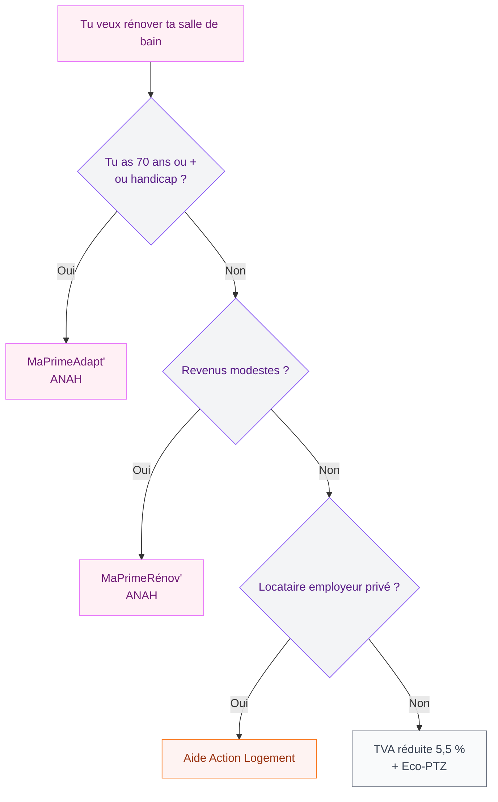

Tu as sûrement vu passer des publicités promettant une "douche à 1 euro" et tu te demandes si c'est une vraie opportunité ou une arnaque. C'est une question légitime, parce que ce dispositif a beaucoup fait parler de lui - et pour cause, il touchait directement le porte-monnaie de milliers de familles. Voici la vérité sur ce qu'il reste de cette aide en 2026, et surtout comment rénover ta salle de bain sans te ruiner.

## La douche à 1 euro, c'était quoi exactement ?

Le dispositif "douche à 1 euro" était une aide gouvernementale qui permettait aux ménages modestes et aux personnes âgées de plus de 70 ans de remplacer leur baignoire par une douche à l'italienne pour 1 euro symbolique. Le reste des travaux - qui pouvait représenter entre 3 000 et 8 000 euros - était pris en charge par une combinaison d'aides publiques et de crédits d'impôt.

Le principe était simple : tu faisais appel à une entreprise certifiée RGE (Reconnu Garant de l'Environnement), elle réalisait les travaux, et elle se faisait rembourser directement par les organismes financeurs. Toi, tu ne payais que 1 euro.

Ce dispositif ciblait surtout :
- Les personnes âgées de plus de 70 ans (prévention des chutes)
- Les personnes à mobilité réduite
- Les ménages aux revenus modestes, propriétaires ou locataires

> [!NOTE]
> Le dispositif original a été suspendu en juin 2021, après le COVID-19, en raison de contraintes budgétaires. Face au succès du programme, les files d'attente et les abus de certaines entreprises peu scrupuleuses ont aussi pesé dans cette décision.

## Pourquoi le dispositif a disparu (et ce qui a mal tourné)

Soyons honnêtes : la douche à 1 euro a aussi généré beaucoup d'arnaques. Des entreprises peu sérieuses démarchaient à domicile des personnes âgées vulnérables, leur faisaient signer des devis en blanc, et facturaient des prestations de mauvaise qualité à des prix gonflés. L'aide publique couvrait tout, donc personne ne vérifiait vraiment la qualité des travaux.

Résultat : des milliers de plaintes, des procédures judiciaires, et une mauvaise réputation pour l'ensemble du secteur. Le gouvernement a donc stoppé le dispositif tel quel et reorganisé les aides.

> [!WARNING]
> Si quelqu'un te contacte par téléphone ou à domicile en te proposant une "douche à 1 euro" aujourd'hui, c'est très probablement une arnaque. Les vrais dispositifs d'aide passent par des organismes officiels (ANAH, CAF, Action Logement) et ne se vendent jamais en porte-à-porte.

## Ce qui remplace la douche à 1 euro en 2026

Bonne nouvelle : les aides existent encore, elles sont juste mieux encadrées. Voici les dispositifs actifs en 2026.

### MaPrimeAdapt'

C'est le successeur direct de la douche à 1 euro pour les personnes âgées et celles en situation de handicap. Lancé en janvier 2024 par l'ANAH (Agence Nationale de l'Habitat), MaPrimeAdapt' finance les travaux d'adaptation du logement pour rester à domicile.

**Qui peut en bénéficier ?**
- Personnes de 70 ans et plus (ou 60 ans avec une perte d'autonomie avérée)
- Personnes en situation de handicap avec un taux d'incapacité d'au moins 50 %
- Propriétaires occupants uniquement (les locataires doivent passer par leur bailleur)

**Ce que ça couvre :**
- Remplacement de la baignoire par une douche à l'italienne
- Installation de barres d'appui, siège de douche, receveur antidérapant
- Élargissement des portes pour l'accès fauteuil
- Installation de WC surélevés

**Le montant ?** Jusqu'à 70 % des travaux pris en charge pour les ménages modestes, 50 % pour les ménages intermédiaires. Sur des travaux à 5 000 euros, ça peut représenter 2 500 à 3 500 euros d'aide.



### MaPrimeRénov' pour les travaux de salle de bain

MaPrimeRénov' n'est pas spécifiquement dédiée aux salles de bain, mais elle peut financer des travaux dans le cadre d'une rénovation globale du logement. Elle cible les ménages propriétaires occupants et certains bailleurs.

Le montant dépend de tes revenus (4 catégories : bleu, jaune, violet, rose) et de la nature des travaux. Pour une salle de bain seule, les montants sont plus limités, mais dans le cadre d'un projet plus large, l'aide peut être substantielle.

### Les aides des caisses de retraite

Beaucoup de personnes l'ignorent, mais les caisses de retraite comme la CNAV (Caisse Nationale d'Assurance Vieillesse) ou la MSA pour les agriculteurs proposent des aides pour l'adaptation du logement. Ces aides sont distinctes de MaPrimeAdapt' et peuvent se cumuler.

La CNAV propose par exemple un "Plan d'actions personnalisé" (PAP) qui peut inclure des travaux de salle de bain jusqu'à 3 000 euros d'aide selon les ressources.

> [!TIP]
> Renseigne-toi auprès de ta caisse de retraite avant de commencer les travaux. Les délais d'instruction peuvent être longs (2 à 3 mois), donc anticipe. Beaucoup de caisses régionales ont aussi leurs propres enveloppes, en plus des aides nationales.

### L'aide d'Action Logement

Si tu es salarié d'une entreprise privée de plus de 10 salariés, ou retraité ayant cotisé à Action Logement, tu peux bénéficier d'une aide pour adapter ton logement. Les montants varient selon les ressources et la région, mais l'aide peut atteindre 5 000 euros.

Le critère principal : avoir 70 ans ou plus, ou un handicap reconnu.

### La TVA à taux réduit (5,5 %)

Même si tu ne bénéficies d'aucune aide directe, tu as le droit à la TVA à 5,5 % sur les travaux de rénovation et d'adaptation dans un logement achevé depuis plus de 2 ans. C'est le cas pour l'installation d'une douche à l'italienne en remplacement d'une baignoire.

Sur des travaux à 5 000 euros HT, la TVA réduite te fait économiser environ 650 euros par rapport au taux normal de 20 %.

## Comment faire les démarches sans te perdre

Le système des aides est complexe, c'est vrai. Mais il existe des solutions pour t'y retrouver sans passer des semaines à éplucher des formulaires.

### France Rénov' : ton point d'entrée unique

Le site france-renov.gouv.fr et le numéro 0 808 800 700 (gratuit) te permettent d'être orienté vers les aides auxquelles tu as droit. Des conseillers humains peuvent faire un diagnostic de ta situation et t'accompagner dans les démarches.

Tu peux aussi trouver des "conseillers France Rénov'" dans des agences locales (souvent hébergées dans des maisons de l'habitat, des communautés de communes ou des ADIL). Ces conseillers sont indépendants et gratuits.

### Les étapes concrètes pour obtenir MaPrimeAdapt'

1. **Vérifie ton éligibilité** sur le site maprimeadapt.gouv.fr ou via France Rénov'
2. **Crée ton compte** sur le portail ANAH (monespace-renov.anah.gouv.fr)
3. **Fais réaliser un devis** par un artisan certifié RGE ou Handibat
4. **Dépose ta demande d'aide** avant de commencer les travaux (c'est obligatoire)
5. **Lance les travaux** après validation de ton dossier
6. **Transmets les factures** pour obtenir le versement

```mermaid
sequenceDiagram
    participant T as Toi
    participant F as France Rénov'
    participant A as ANAH / Portail
    participant E as Artisan RGE
    participant B as Banque

    T->>F: Éligibilité et conseils
    F-->>T: Orientation et aides détaillées
    T->>E: Demande de devis
    E-->>T: Devis certifié
    T->>A: Dépôt dossier (avant travaux)
    A-->>T: Validation accord de principe
    T->>E: Lancement des travaux
    E-->>T: Fin travaux + factures
    T->>A: Envoi factures
    A->>B: Versement aide directement

    Note over T,B: Délai moyen : 2-4 mois du dossier au versement

    style T fill:#FFF0F5,stroke:#E879F9,color:#701A75
    style A fill:#F3F4F6,stroke:#8B5CF6,color:#581C87
    style E fill:#FEF3F2,stroke:#F97316,color:#9A3412
    style F fill:#F9FAFB,stroke:#6B7280,color:#374151
    style B fill:#F9FAFB,stroke:#6B7280,color:#374151
```

## Quel type de douche choisir pour ta rénovation ?

Une fois que tu as bouclé le financement, vient le moment choisi la douche. Et là, les options sont nombreuses.

### La douche à l'italienne : le grand classique

C'est la solution la plus demandée dans le cadre des aides, et pour de bonnes raisons. Pas de rebord, entrée de plain-pied, entretien facile. Pour un résultat propre, compte entre 1 500 et 4 000 euros de travaux selon la taille et les finitions.

Si tu veux aller plus loin dans la réflexion sur les revêtements, jette un oeil à notre guide sur le [carrelage pour douche italienne](/guides/salle-de-bain/carrelage-douche-italienne/) - il y a des options très efficaces pour les petits budgets.

### La douche avec bac à douche

Plus économique à l'installation (entre 800 et 2 000 euros), c'est une bonne option si la douche à l'italienne n'est pas envisageable (problème de chape, appartement en location, etc.). Choisis un bac antidérapant d'au moins 90x90 cm pour le confort.

### Les équipements de sécurité à ne pas oublier

Dans le cadre des aides pour l'adaptation, certains équipements sont pris en charge en plus de la douche elle-même :
- Barre d'appui pliante (compter 150 à 400 euros pour un modèle solide de marque Inda ou Vigour)
- Siège de douche mural rabattable (compter 100 à 350 euros pour un modèle Pressalit ou Ponte Giulio)
- Receveur extra-plat avec surface antidérapante (marques Kinedo, Allibert, Ardeco)
- Robinetterie thermostatique pour éviter les brûlures (Grohe, Hansgrohe, compter 200-400 euros)

> [!TIP]
> Pour une salle de bain complète avec une esthétique travaillée, regarde aussi notre guide sur le [meuble salle de bain béton ciré](/guides/salle-de-bain/meuble-salle-de-bain-beton-cire/) - un matériau moderne qui s'adapte très bien aux douches à l'italienne et qui coûte moins cher qu'on ne le croit.

## Les arnaques à éviter absolument

Maintenant que tu connais les vraies aides, voici les signaux d'alarme qui doivent te faire fuir.

**Les signes d'une arnaque :**
- Démarchage téléphonique ou à domicile en mentionnant "la douche à 1 euro"
- Devis signé le jour même, sous pression
- Entreprise qui "s'occupe de tout" sans t'impliquer dans la demande d'aide
- Pas de mention de certification RGE ou Handibat
- Paiement demandé avant la validation du dossier d'aide
- Prix très élevés sans justification (une douche à l'italienne facturée 12 000 euros, c'est suspect)

> [!CAUTION]
> La règle d'or : ne signe jamais un devis le jour du démarchage. Tu as un délai légal de rétractation de 14 jours pour les ventes à domicile. Utilise-le si tu as le moindre doute. En cas de problème, tu peux contacter la DGCCRF (Direction Générale de la Concurrence, de la Consommation et de la Répression des Fraudes) ou la plateforme SignalConso.

## Budgets réels pour une rénovation de salle de bain en 2026

Pour que tu puisses comparer, voici des fourchettes de prix réelles (tout compris, pose incluse) :

| Prestation | Budget bas | Budget moyen | Budget élevé |
|---|---|---|---|
| Douche à l'italienne seule (100x80 cm) | 1 800 € | 3 000 € | 5 500 € |
| Douche + barre d'appui + siège | 2 200 € | 3 800 € | 6 500 € |
| Rénovation complète salle de bain | 5 000 € | 10 000 € | 20 000 € |
| Carrelage mural (au m²) | 60 € | 120 € | 250 € |
| Robinetterie thermostatique | 200 € | 400 € | 1 000 € |

Avec MaPrimeAdapt' à 70 % pour les ménages modestes, une douche à l'italienne complète avec équipements de sécurité à 4 000 euros revient à 1 200 euros de ta poche. C'est loin du 1 euro symbolique d'avant, mais c'est quand même un gros coup de pouce.


## Sur le meme theme

- [douches italiennes](/guides/salle-de-bain/douches-italiennes-idees/)
- [receveur pour douche italienne](/guides/salle-de-bain/quel-receveur-pour-douche-italienne/)

## Questions fréquentes sur la douche à 1 euro

**La douche à 1 euro existe-t-elle encore en 2026 ?**
Non, le dispositif original à 1 euro symbolique a été arrêté en 2021. Il a été remplacé par MaPrimeAdapt' pour les personnes âgées et handicapées, qui peut couvrir 50 à 70 % des travaux selon les revenus.

**Qui peut bénéficier de MaPrimeAdapt' ?**
Les personnes de 70 ans et plus (ou 60 ans avec perte d'autonomie), et les personnes handicapées avec un taux d'incapacité d'au moins 50 %. Le logement doit être la résidence principale.

**Peut-on cumuler plusieurs aides ?**
Oui, dans certaines limites. MaPrimeAdapt' peut se cumuler avec les aides de la caisse de retraite, la TVA réduite à 5,5 %, et dans certains cas avec les aides locales (régions, départements, communes). Mais le total des aides ne peut pas dépasser 100 % du montant des travaux.

**Combien de temps prend le dossier ?**
Compte 2 à 4 mois entre le dépôt du dossier et le versement de l'aide. Certaines caisses de retraite peuvent aller plus vite (4 à 6 semaines). Pense à anticiper avant d'engager l'artisan.

**Un locataire peut-il bénéficier de ces aides ?**
MaPrimeAdapt' est réservée aux propriétaires occupants. Un locataire doit obtenir l'accord de son bailleur et peut, dans certains cas, bénéficier d'aides via Action Logement si son employeur cotise à cet organisme.

---

Si tu envisages aussi de repenser d'autres espaces, notre guide sur la [baignoire japonaise](/guides/salle-de-bain/baignoire-japonaise/) peut t'intéresser - une alternative compacte et zen à la baignoire traditionnelle, qui peut aussi être financée dans certains cas par les aides à l'adaptation.
