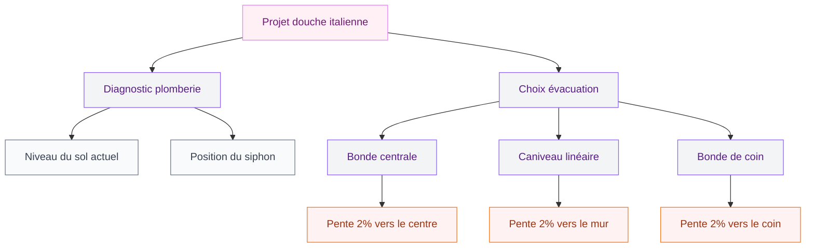
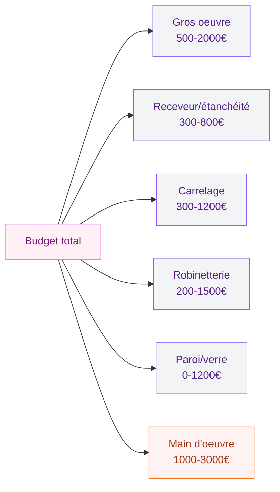

Tu rêves d'une salle de bain qui ressemble à un spa, sans baignoire encombrante ni paroi qui claque ? La douche italienne, c'est exactement ce genre de projet qui peut transformer une salle de bain moyenne en espace vraiment agréable à vivre. Avant de sauter le pas, laisse-moi te donner tous les détails - parce que c'est un chantier qui demande un peu de préparation.

## C'est quoi exactement une douche italienne ?

Une douche italienne (qu'on appelle aussi douche à l'italienne ou douche de plain-pied), c'est une douche sans receveur surélevé, sans cabine fermée. Le sol de la douche est au même niveau que le reste de la salle de bain. L'eau s'évacue via une grille ou une bonde encastrée, et l'espace peut être délimité par une paroi de verre, un muret, ou complètement ouvert.

  

Ce qui la distingue d'une douche classique ? L'absence de "marche" à enjamber. Tu entres directement dedans, point. C'est cette continuité du sol qui donne cette sensation d'espace et cet aspect minimaliste qu'on adore.

> [!NOTE]
> La douche italienne est souvent confondue avec la "douche walk-in" ou la "douche à l'américaine". La walk-in est généralement une grande cabine avec une paroi de verre sur un côté. La douche italienne vraie n'a pas forcément de paroi - c'est la continuité du sol qui la définit.

## Pourquoi c'est aussi populaire en ce moment ?

Honnêtement ? Parce que ça coche beaucoup de cases à la fois.

  

**L'esthétique d'abord.** Une douche italienne bien faite, avec un beau carrelage, une niche murale et une robinetterie soignée, c'est visuellement imbattable. Ça donne immédiatement un air "rénovation haut de gamme" à une salle de bain. Et puisqu'on parle de carrelage, tu peux faire des choses magnifiques - découvres les possibilités dans notre guide sur le [carrelage pour douche italienne](/guides/salle-de-bain/carrelage-douche-italienne/) pour vraiment te faire une idée.

**L'accessibilité ensuite.** C'est la solution parfaite pour une salle de bain accessible à tous. Plus de bord à enjamber, plus de risque de chute. Si tu anticipes un vieillissement à domicile ou si tu as des personnes à mobilité réduite dans ta famille, c'est un vrai plus à long terme.

**L'entretien.** Fini les joints de cabine à récurer, les rails de porte qui s'encrassent, les portes coulissantes qui déraillent. Une douche italienne carrelée, ça s'entretient beaucoup plus facilement.

> [!TIP]
> Si tu choisis un carrelage avec une surface légèrement texturée pour le sol de ta douche italienne, tu gagnes en sécurité antidérapante sans sacrifier l'esthétique. Les grès cérame structurés de chez Coem ou Roca font très bien l'affaire autour de 40-80€ le m².

## Le côté technique à ne pas négliger

C'est là où beaucoup de gens se plantent. Une douche italienne, ça ne s'improvise pas. Le point le plus délicat ? L'évacuation.

  

### La pente, c'est la base

Le sol doit avoir une pente d'au moins 1,5% à 2% pour que l'eau s'écoule correctement vers la bonde. Ça paraît rien, mais sur une douche de 90x90 cm, ça représente 1,8 cm de dénivelé. Cette pente doit être faite lors de la pose du receveur à carreler ou lors de la réalisation de la chape.

Si ton plancher actuel est en béton et que tu dois baisser l'évacuation, ça implique de casser le sol - c'est un poste de coût à anticiper.

### Les 3 types d'évacuation

**La bonde centrale** : classique, l'eau s'écoule vers le milieu de la douche. Ça fonctionne bien mais ça oblige à créer une pente de tous les côtés, ce qui est plus technique à poser.

**Le caniveau linéaire** : une grille allongée posée le long d'un mur. Visuellement très propre, particulièrement tendance. La pente ne part que dans une direction, c'est plus simple à réaliser. Compter entre 80€ et 400€ pour un caniveau de qualité (Geberit, Wedi, ACO).

**La bonde de coin** : une option moins connue mais pratique quand la plomberie se trouve dans un angle.

> [!WARNING]
> Ne lésine pas sur la qualité de l'étanchéité. Une douche italienne mal étanchée, c'est de l'humidité qui s'infiltre sous le carrelage et dans la structure. Prévois un système d'étanchéité liquide (comme le Schlüter KERDI ou l'Aquapanel) avant de poser le carrelage - c'est 200 à 600€ de matériau mais ça t'évite des dégâts des eaux catastrophiques.

## Quel receveur choisir ?

Oui, même pour une douche "de plain-pied", il existe des receveurs spéciaux. Ce sont des receveurs ultra-plats (entre 2,5 cm et 6 cm de hauteur) conçus pour être carrelés par-dessus ou utilisés tels quels.

  

Les receveurs à carreler en Wedi ou en mousse expansée sont très pratiques : ils ont la pente déjà intégrée, l'étanchéité est traitée, tu n'as qu'à coller ton carrelage dessus. Comptez 150 à 500€ selon la taille et la marque.

Les receveurs en résine ultra-plats (type Villeroy & Boch Squaro Infinity ou Kaldewei Superplan Zero) sont une autre option - finition béton ou pierre, très esthétiques, dès 300€ et jusqu'à 1200€. Pour t'aider à choisir la meilleure option pour ton projet, le guide sur [quel receveur pour une douche italienne](/guides/salle-de-bain/quel-receveur-pour-douche-italienne/) détaille tout ça en profondeur.

## Combien ça coûte vraiment ?

Soyons honnêtes sur les prix, parce que c'est souvent là où les gens ont des surprises.

  

**Budget entrée de gamme (DIY partiel) : 1800 à 3000€**
Tu te charges de la pose carrelage et des finitions toi-même, tu fais appel à un plombier juste pour la partie évacuation.

**Budget intermédiaire (artisan complet) : 3500 à 6000€**
Tout est pris en charge par des pros. C'est le budget réaliste pour une belle douche italienne bien faite en 90x90 ou 100x100 cm.

**Budget haut de gamme : 6000€ et plus**
Grandes dimensions (120x90 cm et plus), carrelage premium, robinetterie design, siège intégré, douche de tête.

> [!IMPORTANT]
> Si tu rénoves une salle de bain existante et que tu remplaces une baignoire ou une douche classique par une douche italienne, prévois impérativement un devis pour l'adaptation de la plomberie. Selon la configuration de ton appartement ou maison, faire descendre le siphon peut nécessiter de casser le sol ou passer sous le plancher - et ça, c'est souvent la grosse surprise budgétaire.

## Les dimensions à respecter

La taille minimum pour une douche italienne confortable ? **80x80 cm**. Mais honnêtement, en dessous de 90x90 cm, c'est un peu juste pour se laver à l'aise. L'idéal, si tu as la place, c'est 100x100 cm ou une douche rectangulaire 120x80 cm.

Pour les salles de bain petites, la douche italienne est d'ailleurs souvent plus intelligente qu'une douche cabine : elle ne mange pas visuellement l'espace et donne une impression de continuité qui agrandit la pièce.

## Les inconvénients à connaître avant

Parce que ce serait trop facile si c'était parfait sur tous les points.

**Le froid.** Sans paroi, l'air de la salle de bain n'est pas isolé de la zone de douche. En hiver, si ton chauffage n'est pas au top, tu peux sentir un courant d'air. La solution : un sèche-serviettes électrique bien dimensionné et/ou une paroi de verre sur au moins un côté.

**Les projections d'eau.** Une douche ouverte sans aucune paroi, ça asperge autour. Si tu choisis une configuration sans verre, prévoie un carrelage mural sur une large surface et une bonne ventilation. La VMC est non négociable pour éviter l'humidité sur toute la pièce.

**L'intimité.** Si ta salle de bain est partagée et que la douche est ouverte sur la pièce, certains membres de la famille ne seront peut-être pas à l'aise. Une paroi de verre trempé reste souvent le bon compromis.

**L'entretien des joints.** On dit souvent que c'est plus facile à entretenir - c'est vrai pour les parois, mais les joints de carrelage au sol (surtout autour de la bonde) demandent un nettoyage régulier pour éviter la moisissure. Les joints époxy résinent au quotidien bien mieux que les joints ciment classiques.

## Les idées déco qui fonctionnent vraiment

Le plus sympa avec une douche italienne, c'est la liberté déco. Le carrelage est ton principal outil d'expression.

**Le grand format continu** : le même carrelage au sol et aux murs de la douche, en grand format (60x60 cm ou plus), c'est le look "hôtel de luxe" accessible. La marque Marazzi a des collections béton très bien dans les 35-60€/m².

**La niche carrelée** : une niche encastrée dans le mur pour poser tes shampoings, c'est pratique et ça fait vraiment pro. À faire tailler lors de la construction (entre deux montants ou dans une cloison doublée).

**La robinetterie thermo** : les mitigeurs thermostatiques, c'est le confort absolu - tu règles une fois ta température et tu n'y retouches plus. Grohe et Hansgrohe ont des gammes entre 200 et 600€. Pour les petits budgets, les modèles Leroy Merlin Sensea font le job à partir de 150€.

Pour encore plus d'inspiration, jette un oeil à notre sélection d'[idées pour douches italiennes](/guides/salle-de-bain/douches-italiennes-idees/) - il y a de quoi trouver ton style quelle que soit la superficie de ta salle de bain.

> [!TIP]
> Mon combo préféré pour un rendu haut de gamme sans se ruiner : carrelage grand format imitation béton ciré (Castorama en a de très bien autour de 25-35€/m²), joints époxy gris anthracite, robinetterie noire mate (Leroy Merlin propose des gammes noires à partir de 80€ pour le mitigeur). Résultat garanti.

## Sur le meme theme

- [douche à 1 euro](/guides/salle-de-bain/douche-1-euro/)
- [peinture pour carrelage de douche](/guides/salle-de-bain/peinture-pour-carrelage-douche/)

## FAQ

**Peut-on installer une douche italienne dans un appartement en étage ?**
Oui, mais c'est plus complexe. Il faut s'assurer que le plancher peut supporter les modifications nécessaires et que les voisins du dessous ne seront pas impactés. Un architecte ou un chef de chantier peut évaluer ça avant de commencer.

**La douche italienne est-elle adaptée aux personnes âgées ?**
Absolument - c'est même l'une de ses grandes forces. L'absence de seuil à enjamber réduit le risque de chute. Ajoute des barres d'appui (Grab Bars) et un siège de douche pliant pour encore plus de sécurité.

**Combien de temps dure un chantier de douche italienne ?**
Compter 3 à 5 jours de travaux effectifs pour un artisan expérimenté. Ajoute le temps de séchage des joints et de la chape : la douche ne sera utilisable qu'après 7 à 10 jours minimum.

**Peut-on faire une douche italienne sans casser le sol ?**
Dans certains cas oui, avec un système de receveur à carreler très plat posé sur le sol existant. Mais ça crée une légère surélévation (2 à 6 cm) - ce n'est plus vraiment "de plain-pied" mais ça reste sans marche dangereuse.

**Le carrelage de la douche italienne doit-il être différent du reste de la salle de bain ?**
Pas forcément - c'est même souvent plus beau quand c'est continu. Mais le carrelage du sol de la zone douche doit avoir une résistance antidérapante suffisante (classement R10 minimum, R11 pour plus de sécurité).
