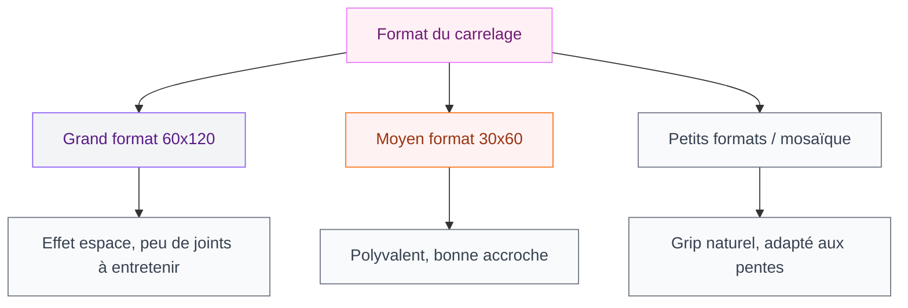
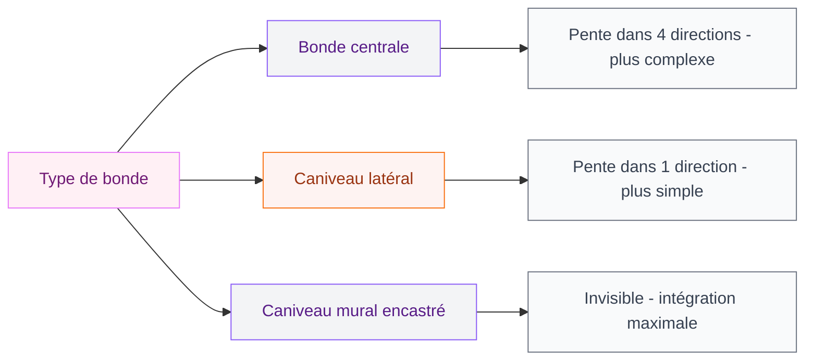
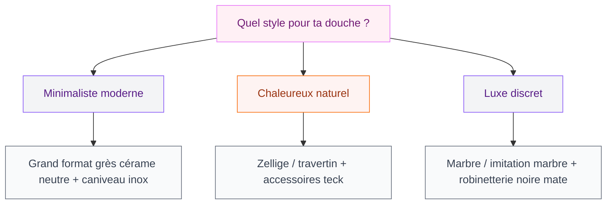

La douche italienne, c'est probablement la renovation la plus demandee en ce moment - et pour de bonnes raisons. Pas de porte à nettoyer, un sol continu qui agrandit visuellement la pièce, et des possibilités déco presque illimitées. Que tu aies 3 m² ou 15 m², il existe une configuration qui correspond à ton espace et ton budget.

J'ai compilé 15 idées concrètes, avec des prix réels et des marques accessibles, pour t'aider à visualiser ce que tu peux faire dans ta salle de bain.

## Qu'est-ce qui rend la douche italienne si populaire ?

Une douche italienne (ou "walk-in shower") se distingue par son absence de bac surélevé et, souvent, de porte. L'eau s'évacue par une bonde intégrée au sol - soit un caniveau linéaire sur le côté, soit une bonde centrale. Le résultat : un sol de salle de bain continu, sans obstacle visuel, qui donne une impression d'espace.

Ce qui change vraiment par rapport à une douche classique :
- Le sol s'incline légèrement vers la bonde (pente de 1 à 2%)
- L'étanchéité est gérée par une membrane sous le carrelage
- Tu peux délimiter l'espace avec un simple retour de mur, une paroi vitrée, ou laisser la douche complètement ouverte

Le budget varie énormément : de 1 500 € pour une installation basique à 8 000 € ou plus pour une version haut de gamme avec carrelage de designer.

> [!NOTE]
> Si tu rénoves depuis une baignoire ou une douche avec bac, prévois une mise à niveau du sol. C'est souvent ce poste qui fait grimper la facture - compte 300 à 800 € selon la surface et la complexité.

## 15 idées pour ta douche italienne

### 1. Le grand format minimaliste

Des carreaux 60x120 cm ou 80x80 cm en grès cérame posés dans la continuité du sol de la salle de bain. C'est l'idée la plus populaire parce qu'elle efface visuellement les limites de la douche.

**Budget** : Carrelage Castorama "Calacata" en 60x120, environ 35 €/m². Pour une douche de 1,5 m², tu en as pour 50 à 70 € de carrelage côté sol, plus les parois si tu les carreaux aussi.

### 2. Le carrelage imitation marbre

Le marbre vrai, c'est beau mais ça coûte cher à l'entretien (entretien régulier, sensible aux acides). La porcelaine imitation marbre donne le même effet pour trois fois moins de tracas.

**Budget** : Chez Leroy Merlin, la série "Statuario" de Coem tourne autour de 45-55 €/m². Sur une douche de 2 m², tu restes sous 300 € de carrelage.

Pour aller plus loin sur les choix de revêtement, consulte notre guide sur le [carrelage pour douche italienne](/guides/salle-de-bain/carrelage-douche-italienne/).

### 3. Le béton ciré

Le béton ciré donne une ambiance loft urbain très recherchée. Appliqué en couche mince (2 à 3 mm) sur l'existant, il peut recouvrir le carrelage en place dans certains cas.

**Budget** : Une application professionnelle coûte entre 80 et 150 €/m². Pour une douche de 3 m² (sol + parois), compte 500 à 800 € de main d'oeuvre et matériaux. En kit DIY (marque Béton Ciré Direct ou V33), tu descends à 30-50 €/m² mais l'application demande de la technique.

> [!TIP]
> Le béton ciré nécessite une protection hydrofuge après application - une à deux couches de cire ou de résine. Sans ça, les taches d'eau laissent des marques. Renouvelle la protection tous les 2-3 ans dans une zone humide.

### 4. La douche noire intégrale

Carrelage anthracite ou noir mat, robinetterie noire, caniveau noir - l'effet est saisissant, surtout dans une petite salle de bain sombre qu'on assume complètement.

**Budget** : La gamme "Midnight" de Roca propose des colonnes de douche noires mat autour de 350-500 €. Pour le carrelage, Terranova chez Point P a des références noires mat à partir de 25 €/m².

### 5. La mosaïque au sol

Au sol uniquement, la mosaïque 5x5 cm ou 2,5x2,5 cm crée du grip naturel grâce aux nombreuses lignes de joint. C'est aussi une solution parfaite quand le sol n'est pas parfaitement plan - les petits formats s'adaptent mieux aux légers dénivelés.

**Budget** : Mosaïque en grès cérame chez Maison du Monde ou Ikea, entre 20 et 40 €/m². Pour 1 m² de sol de douche, budget de 25 à 50 €.

### 6. L'effet zellige

Le zellige est un carrelage artisanal marocain avec de légères irrégularités de surface qui jouent avec la lumière. En blanc ou en vert sauge, il donne une chaleur artisanale que les carreaux industriels ne peuvent pas reproduire.

**Budget** : Plus cher que le carrelage industriel - compte 60 à 120 €/m² selon l'origine. Andersen & Bøe ou Emery & Cie proposent de belles sélections. Pour une niche ou un mur d'accent, 0,5 m² suffit souvent.

### 7. La paroi vitrée fixe minimaliste

Plutôt qu'une porte coulissante ou pivotante, une simple paroi fixe de 80 à 100 cm délimite la douche sans fermer l'espace. L'eau est contenue par la pente du sol et la paroi positionnée stratégiquement.

**Budget** : Paroi fixe 80 cm en verre trempé 8 mm, profil aluminium brossé - entre 200 et 400 € selon la marque. Chez Allibert ou Sanijura, tu trouves des solutions autour de 250 €.

### 8. La douche dans l'alcôve

Si tu as une alcôve dans ta salle de bain (un renfoncement entre deux murs), c'est l'emplacement parfait pour une douche italienne. Les trois murs existants font le travail de containment - pas besoin de paroi vitrée.

**Budget** : Configuration la moins chère car elle utilise l'existant. Si l'alcôve fait 80x90 cm, tu peux installer une douche fonctionnelle avec caniveau pour 1 500 à 2 500 € travaux compris.

> [!WARNING]
> Dans une alcôve, assure-toi que la ventilation est suffisante. L'humidité s'accumule plus facilement dans un espace fermé sur trois côtés. Une VMC hygro-réglable est vraiment utile ici.

### 9. La douche plante verte

Une ou deux plantes tropicales qui aiment l'humidité (fougère de Boston, Monstera, pothos) transforment la douche en oasis. Pose-les dans un coin hors du jet direct, sur une petite tablette en teck ou un support mural.

**Budget** : Tablette en teck 30x30 cm chez Ikea (modèle BEHANDLA ou JUTIS) entre 15 et 30 €. Une plante fougère en pot : 8-15 € en jardinerie.

### 10. Le caniveau latéral discret

Le caniveau linéaire positionné le long d'un mur (plutôt qu'en centre de sol) donne un résultat plus propre. Il se remarque moins, et tu peux le couvrir d'un cache en inox brossé ou en carrelage assortie au sol.

**Budget** : Caniveau linéaire Geberit ou Advantix (Viega) en 60 ou 80 cm, entre 80 et 200 €. Cache-grille en acier inox brossé inclus. L'installation est plus simple qu'une bonde centrale car la pente ne va que dans un sens.

### 11. Le mix matières : pierre et bois

Associer un carrelage effet pierre naturelle (travertin, ardoise) avec des accessoires en teck crée un contraste chaleureux. Porte-savon en teck, tablette, caillebotis de sol.

**Budget** : Carrelage travertin chez Castorama autour de 20-30 €/m². Accessoires teck : caillebotis Ikea "Runnen" à 35 € pour 0,81 m², porte-savon teck entre 10 et 25 €.

### 12. La douche avec niche murale

Une niche encastrée dans le mur (30x20 cm ou 60x10 cm) remplace les tablettes et porte-shampooings. Carrelée avec le même revêtement ou avec un contraste en mosaïque ou marbre, elle est à la fois pratique et décorative.

**Budget** : La niche elle-même coûte peu - c'est principalement de la main d'oeuvre (coffrage, étanchéité, carrelage spécifique). Compte 150 à 300 € en supplément chez un carreleur. Si tu fais poser le carrelage de toute façon, demande à inclure une niche dans le devis.

> [!TIP]
> Prévois la niche à hauteur des yeux (entre 140 et 170 cm), pas trop haute ni trop basse. Et oriente-la pour qu'elle ne soit pas dans le jet direct de l'eau - sinon l'eau stagne dedans.

### 13. La douche XXL en fond de salle de bain

Si ta salle de bain fait plus de 8 m², tu peux concevoir une zone douche qui occupe toute une partie de la pièce, sans paroi. Juste un changement de matière au sol (par exemple, mosaïque vs grand format) et un léger muret de 40-50 cm de haut pour contenir les projections.

**Budget** : Plus de surface de carrelage à poser, donc plus de matériaux et de main d'oeuvre. Prévoir 20 à 30% de budget en plus par rapport à une douche standard de même configuration.

### 14. La douche balnéo minimaliste

Une tête de pluie encastrée dans le plafond (rain shower), un mitigeur mural thermostatique, et rien d'autre. Pas d'accessoires superflus, juste le strict minimum bien choisi.

**Budget** : Tête de pluie plafond encastrée Hansgrohe Raindance E 300 : environ 400-600 €. Mitigeur thermostatique Grohe Grohtherm Cube : 250-400 €. C'est là que le budget s'envole, mais la durabilité compense sur le long terme.

### 15. La reconversion baignoire en douche italienne

Tu as une vieille baignoire que tu n'utilises plus ? La transformer en douche italienne est l'un des projets de renovation les plus populaires et les plus rentables (en confort au quotidien comme en valeur à la revente).

Pour comprendre comment ça marche niveau accessibilité et aides financières, consulte notre guide sur la [douche à 1 euro](/guides/salle-de-bain/douche-1-euro/) - il y a des dispositifs d'aide pour ce type de travaux.

**Budget** : Entre 2 000 et 5 000 € selon l'état de l'existant et les finitions choisies. La majeure partie du budget va à la reprise du sol (évacuation, étanchéité, carrelage).

## Sur le meme theme

- [salle de bain rustique moderne](/guides/salle-de-bain/salles-de-bains-rustiques-decoration-et-design-modernes/)

## Les questions à se poser avant de choisir

Avant de te lancer dans une direction, quelques points pratiques à clarifier :

**Quelle surface ?** Une douche italienne confortable commence à 80x80 cm, mais 90x90 cm ou 90x120 cm c'est vraiment mieux au quotidien. Si tu as la place, une douche de 120x90 cm change tout.

**Quel niveau d'entretien acceptes-tu ?** Le blanc pur montre tout. Le gris moyen ou l'anthracite est plus indulgent. La mosaïque a plus de joints à nettoyer. Le béton ciré demande un entretien périodique.

**Paroi ou pas ?** Sans paroi, tu as une sensation d'espace maximale mais les projections d'eau peuvent atteindre les meubles proches. Avec une paroi fixe, tu contiens mieux l'eau tout en gardant l'aspect ouvert.

## Les erreurs à eviter

**Sous-estimer l'etancheite** : C'est le point technique le plus critique. Une étanchéité mal faite provoque des dégâts des eaux dans le sol ou les murs en quelques mois. Insiste pour que ton artisan utilise une membrane d'étanchéité sous le carrelage, pas juste du joint de silicone.

**Carrelage trop glissant** : Un beau carrelage poli en 60x120 cm est magnifique... et dangereux mouillé. Vérife la classication R (résistance au glissement) : R10 minimum pour une douche, R11 pour un usage intensif.

**Parois et sol qui ne s'accordent pas** : C'est souvent l'erreur numéro un en DIY. Si tu changes le sol mais gardes les murs anciens, le résultat est incohérent. Prévois d'harmoniser au moins 1 à 2 murs de la douche.

Si tu cherches aussi à rénover les meubles ou les finitions autour de ta douche, notre guide sur le [meuble salle de bain béton ciré](/guides/salle-de-bain/meuble-salle-de-bain-beton-cire/) présente des options pour créer un style cohérent dans toute la pièce. Et si tu veux intégrer un espace bain complet, la [baignoire japonaise](/guides/salle-de-bain/baignoire-japonaise/) peut cohabiter très bien avec une douche italienne dans une grande salle de bain.

> [!IMPORTANT]
> Fais toujours etablir 2 ou 3 devis par des artisans qualifiés (label RGE ou Qualibat pour la rénovation salle de bain). Les prix varient énormément selon les régions et les entreprises. Un devis trop bas cache souvent une économie sur l'étanchéité ou la qualité des matériaux.

---

## FAQ - Douches italiennes

**Combien coûte une douche italienne ?**

Le budget varie de 1 500 € (installation basique dans un espace existant, carrelage simple) à 8 000 € ou plus (grande surface, matériaux haut de gamme, reprise complète du sol). En moyenne, une douche italienne de 90x120 cm avec carrelage milieu de gamme et caniveau tourne autour de 3 000 à 4 500 € pose comprise.

**Peut-on faire une douche italienne dans une petite salle de bain ?**

Oui, c'est même souvent le meilleur choix. Sans bac ni porte, la douche italienne libère visuellement l'espace. Une configuration de 80x80 cm est faisable, mais 90x90 cm est plus confortable. L'absence de porte qui s'ouvre vers l'intérieur est un gain de place réel dans les petits espaces.

**Quel entretien pour une douche italienne ?**

Principalement les joints de carrelage et la vitre si tu as une paroi. Les joints gris ou anthracite montrent moins les traces. Un nettoyage hebdomadaire avec un produit anticalcaire suffit dans les zones à eau dure. Aère bien la salle de bain après chaque douche pour limiter les moisissures.

**La douche italienne convient-elle aux personnes agées ou PMR ?**

C'est un de ses gros avantages : sans bac à enjamber, l'accès est facilité. Avec des barres de maintien, un siège rabattable et un carrelage antidérapant R11, elle devient vraiment accessible. C'est d'ailleurs pour cela qu'il existe des aides financières pour ce type de transformation (voir [douche à 1 euro](/guides/salle-de-bain/douche-1-euro/)).

**Peut-on poser la douche italienne soi-même ?**

La partie carrelage peut se faire en DIY si tu as de l'expérience. Mais l'étanchéité du sol et le raccordement à l'évacuation demandent une vraie compétence technique. Une erreur là, et c'est un dégât des eaux dans le plancher. Si tu hésites, sous-traite au moins cette partie à un professionnel.
