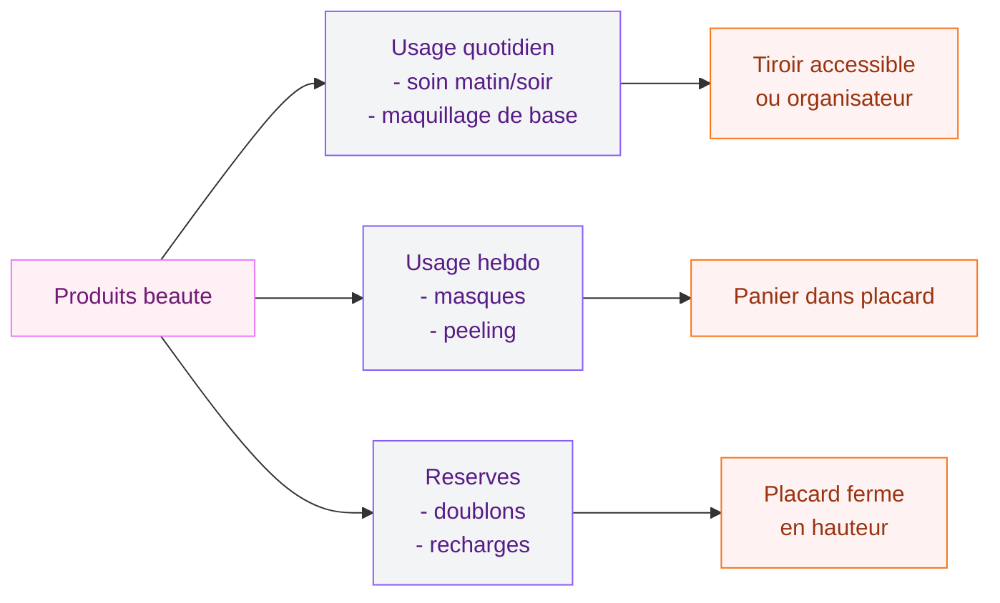

Ta salle de bains ressemble parfois à un chaos organisé : tubes de dentifrice qui roulent, serviettes qui traînent, produits de maquillage empilés en tours bancales. Si tu te reconnais dans ce tableau, tu es exactement au bon endroit. Le rangement de la salle de bains, c'est LA question que tout le monde se pose, qu'on ait 3 m² ou 15 m². Et la bonne nouvelle, c'est qu'il existe des solutions pour chaque configuration, chaque budget et chaque style de déco.

Ce guide, je l'ai conçu comme une boîte à outils complète : tu pioches ce qui correspond à ta situation, tu adaptes à ton espace, et tu transformes cette pièce en un endroit où il fait vraiment bon commencer et terminer sa journée.

## Faire le point avant de ranger

Avant d'acheter le moindre meuble ou panier, une seule chose à faire : le grand tri. Vraiment. C'est l'étape que tout le monde saute, et c'est pourtant celle qui change tout.

  

Vide tes placards, tes tiroirs, tes étagères. Regarde les dates de péremption de tes produits. Compte tes serviettes - honnêtement, tu en as besoin de combien ? Trie en trois catégories : garder, donner, jeter. Tu vas souvent découvrir que tu n'as pas un problème de manque de rangement, mais un problème de trop de choses.

Une fois que tu sais ce que tu gardes, répartis par usage : produits du quotidien accessibles facilement, produits de beauté, médicaments, linge, produits d'entretien. Cette organisation par catégorie va guider tous tes choix de rangements.

> [!TIP]
> Avant d'investir dans de nouveaux meubles, fais un tour de ta salle de bains avec un regard neuf. Les placards existants sont souvent sous-utilisés : un organisateur de tiroir à 8 euros chez Ikea peut tripler ta capacité de rangement.

## Les rangements sous le lavabo : une mine inexploitée

L'espace sous le lavabo ou la vasque est souvent le plus négligé. Pourtant, c'est potentiellement la zone de rangement la plus importante de la pièce.

  

### Les meubles avec tiroirs

Un meuble vasque avec tiroirs bien organisés, c'est le rêve. Les tiroirs avec compartiments permettent de tout voir d'un coup d'oeil : plus de fouilles interminables pour retrouver ta crème du soir. Chez Ikea, le meuble HAVBACK avec ses deux tiroirs tourne autour de 180-250 euros selon la largeur. Pour quelque chose de plus design, Maisons du Monde propose des options en bois laqué autour de 300-450 euros.

Si tu as déjà un meuble sous lavabo avec une porte, installe des organisateurs à l'intérieur. Des paniers coulissants qu'on glisse sous l'évier se trouvent à partir de 15 euros chez Action ou Gifi. Ils transforment un espace mort en rangement accessible.

### Les paniers et boîtes sous la vasque

Pour les meubles ouverts ou les espaces avec siphon apparent, les paniers en osier ou en métal perforé sont très pratiques. Tu ranges les produits d'entretien dans un panier, les réserves de savon dans un autre. Ajoute une étiquette et c'est réglé - tout le monde sait où ranger.

> [!NOTE]
> Dans une salle de bains, l'humidité est ennemie des matériaux. Privilégie les paniers en métal zinc, en plastique recyclé ou en fibres naturelles traitées pour les zones proches de l'eau. Le bois brut se déforme et moisit rapidement sous l'évier.

## Optimiser l'espace autour de la douche et de la baignoire

La zone douche/baignoire cumule souvent le plus de produits : shampoings, après-shampoings, gels douche, huiles, rasoirs. L'organisation y est d'autant plus importante que l'humidité complique les choses.

  

### Les étagères de douche

La classique étagère d'angle en inox reste une valeur sûre. Pour une douche à l'italienne, les étagères à ventouses repositionnables (type TISKEN chez Ikea, autour de 10 euros) sont pratiques et ne nécessitent aucun perçage. Si tu peux percer, les étagères murales en inox mat ou en céramique s'intègrent très bien dans un esprit contemporain.

Pour une baignoire, un tablier de bain en bambou qui se pose en travers fait office de petit plateau de rangement pour bougie, livre et savon. Compte 25-40 euros chez Zara Home ou La Redoute.

### Ranger les serviettes avec style

Les serviettes, c'est souvent le détail qui fait ou défait une salle de bains. Un porte-serviettes échelle en bambou (environ 30-50 euros chez H&M Home ou La Redoute), c'est à la fois fonctionnel et très joli. Tu y accroches les serviettes du quotidien, et ça devient un élément de déco à part entière.

Pour les serviettes de réserve, des paniers en osier suspendus au mur sont une idée très tendance. Tu libères de l'espace au sol et tu ajoutes une touche chaleureuse. Suspends-les à des taquets en laiton pour un effet boutique.

Si tu veux un look plus propre, une colonne de rangement avec des tiroirs en tissu ou en bambou stocke plusieurs serviettes pliées nettement. Ikea propose le GNEJS autour de 25 euros, parfait pour les petits espaces.

## Maximiser l'espace vertical dans les petites salles de bains

Les petites salles de bains - celles de moins de 5 m² - imposent de penser en 3D. L'espace mural est ta meilleure ressource, et les rangements verticaux vont devenir tes meilleurs alliés.

  

### Les étagères flottantes

Deux ou trois étagères flottantes au-dessus des toilettes ou du lavabo, c'est un grand classique qui marche à tous les coups. En chêne clair pour un esprit scandinave, en marbre pour quelque chose de plus luxueux, en bois peint en blanc pour un look frais. La hauteur idéale pour la première étagère : environ 40-50 cm au-dessus du plan de travail.

Place les étagères du bas avec les objets qu'on utilise tous les jours. Plus on monte, plus on range les choses dont on a besoin rarement. Évite de tout surcharger : deux ou trois produits bien choisis sur une étagère, c'est déjà une vraie déco.

> [!TIP]
> Trust me sur ce point : une étagère flottante avec 3 beaux contenants assortis (un pot en céramique pour les cotons, un verre pour les brosses à dents, un bocal pour les épingles à cheveux) a bien plus d'allure que la même étagère surchargée. Moins c'est plus, toujours.

### Les colonnes et armoires hautes

Une colonne de salle de bains avec portes et étagères prend 30-40 cm de largeur mais monte jusqu'au plafond. C'est un très bon investissement dans les petites salles de bains. Tu ranges les médicaments en hauteur hors de portée des enfants, les produits du quotidien à hauteur de main, le linge de bain en bas.

Pour les placards encastrés, si ta configuration le permet, c'est l'idéal : rien ne dépasse, tout est invisible, la pièce paraît plus grande.

### Crochets et tringles : le rangement discret

Derrière la porte de la salle de bains, un système de crochets permet de pendre les peignoirs, les serviettes du jour et même les sacs de rangement. Un rail avec plusieurs crochets ajustables (style Ikea BYGEL, autour de 8 euros) se pose facilement et supporte bien le poids des textiles.

Dans la douche, des crochets autocollants repositionnables permettent de suspendre le rasoir, la brosse et les accessoires sans percer les carreaux. Change-les quand ils commencent à tirer sur les joints - pas la peine d'aller chercher plus compliqué.

## Organiser les produits de beauté et de maquillage

Le maquillage, les soins du visage, les parfums : tout ça nécessite une organisation à part entière. Et c'est souvent la catégorie qui génère le plus de désordre.

  

### La salle de bains comme espace beauté organisé

Pour le maquillage, un organisateur à compartiments transparent te permet de tout voir sans sortir chaque produit. Ceux de chez Muji sont les références (autour de 10-25 euros selon la taille), mais Primark Home propose des versions très correctes à moitié prix.

Les tiroirs organisateurs divisés en petits carrés ou rectangles sont parfaits pour les produits de soin. Tu ranges par type : hydratants d'un côté, sérums de l'autre, contours des yeux dans le compartiment d'angle. Ikea SKUBB ou VARIERA font très bien le job à petit prix.

### Boîtes et paniers pour regrouper les catégories

Une stratégie que j'aime beaucoup : un panier ou une boîte par personne dans les salles de bains partagées. Chacun a son coin, ses produits sont regroupés, et le linge commun (serviettes de bain, papier toilette, produits d'entretien) reste dans les placards communs. Ça évite énormément de conflits et de désordre.

Pour les produits en vrac (cotons, épingles, élastiques), des petits pots ou bocaux en verre avec couvercle bambou sont très jolis et pratiques. Tu les repères facilement et ça ne ressemble pas à une pharmacie.

> [!WARNING]
> Attention au rangement des médicaments en salle de bains. La chaleur et l'humidité altèrent beaucoup de traitements. Mets-les dans un placard fermé, en hauteur si tu as des enfants, et de préférence pas directement dans la pièce la plus humide.

## Meubles multifonction et solutions débrouillardes

Les meubles qui font plusieurs choses à la fois, c'est le jackpot dans un petit espace.

### Le banc de rangement

Un banc avec coffre intégré près de l'entrée de la salle de bains ou dans un coin : tu t'y assieds pour te sécher les pieds et tu ranges les serviettes propres à l'intérieur. Maisons du Monde propose de jolis modèles en bois clair avec couvercle rabattable, autour de 80-120 euros.

### L'échelle décorative

Une petite échelle décorative en bois ou métal, ça tient dans un angle de 20 cm de large et tu y accroches serviettes et peignoirs. C'est décoratif, c'est pratique, et ça peut aussi servir d'étagère si tu y poses des petits paniers sur les échelons. Amazon et Leroy Merlin en proposent à partir de 25 euros.

Si tu aimes le style brut et contemporain, un coup d'oeil sur notre guide [salle de bain industrielle](/salle-de-bain-industrielle/) te donnera des idées très intéressantes pour associer rangements en métal et surfaces texturées dans une déco cohérente.

## Choisir les bons matériaux pour le rangement

Dans une salle de bains, tous les matériaux ne se valent pas. L'humidité est permanente, les projections d'eau fréquentes, et la température varie beaucoup.

Le bois traité ou huilé reste très beau, mais assure-toi qu'il est conçu pour les pièces humides. Le béton ciré est une option magnifique pour les meubles vasque - si tu veux explorer cette option, notre article sur les [meubles salle de bain béton ciré](/meuble-salle-de-bain-beton-cire/) détaille tout ce qu'il faut savoir sur ce matériau.

## Entretenir son organisation dans la durée

Créer un beau rangement, c'est une chose. Le maintenir, c'en est une autre. Quelques habitudes simples pour que ça tienne dans le temps :

Chaque dimanche ou en début de semaine, prends deux minutes pour remettre les produits à leur place. Ce n'est pas une corvée si tu le fais régulièrement - ça devient un réflexe.

Tous les trois mois, refais un petit tri. Quelques produits vides traînent toujours, des doublons s'accumulent. Trois minutes de maintenance évitent l'effet "tout déborde" en fin d'année.

Implique tout le monde. Si tu vis en famille ou en colocation, un système ne marche que si chacun sait où va quoi. Étiquette les paniers et explique la logique choisie.

> [!IMPORTANT]
> Un bon système de rangement doit être plus rapide à utiliser que le désordre. Si tu mets plus de temps à ranger qu'à jeter n'importe où, le système est trop compliqué. Simplifie jusqu'à ce que ranger devienne le chemin de la moindre résistance.

## Par où commencer si tu es completement perdu(e) ?

Si tu ne sais pas par quel bout prendre ce chantier, voilà la séquence qui marche le mieux :

1. Commence par le grand tri (une heure maxi, sois sans pitié)
2. Identifie tes trois plus grands problèmes de rangement actuels
3. Résous-les un par un avec les solutions adaptées à ta configuration
4. Investis progressivement : commence par les organisateurs de tiroirs (pas chers, impact immédiat), puis les étagères, puis éventuellement les meubles

Ces principes valent aussi pour le reste de la maison : notre guide sur [comment ranger sa chambre](/ranger-chambre/) applique les mêmes logiques avec les spécificités de cet espace.

L'objectif final n'est pas une salle de bains "parfaite" comme sur Pinterest. C'est une pièce qui te simplifie la vie tous les matins, où chaque chose a sa place. Ça, c'est vraiment à portée de main.

---

## Sur le meme theme

- [salle de bain rustique moderne](/salles-de-bains-rustiques-decoration-et-design-modernes/)
- [carrelage métro salle de bain](/carrelage-metro-salle-de-bain/)

## Questions fréquentes

**Comment optimiser le rangement dans une toute petite salle de bains ?**
Mise sur la verticalité : étagères flottantes jusqu'en hauteur, colonne de rangement avec portes, crochets derrière la porte. Réduis aussi le nombre de produits gardés dans la pièce - les réserves peuvent aller dans un autre placard de la maison.

**Quels paniers choisir pour la salle de bains ?**
Préfère les paniers en métal zinc, osier verni ou plastique recyclé. L'osier brut non traité absorbe l'humidité et moisit. Les paniers en métal laqué ou inox sont les plus durables dans les zones proches de la douche ou du lavabo.

**Comment ranger les serviettes proprement ?**
Plie les serviettes en tiers dans le sens de la longueur, puis en trois dans le sens de la largeur. Range-les debout dans les paniers pour voir toutes les couleurs d'un coup, ou roule-les pour un effet hôtel dans une corbeille décorative.

**Est-ce qu'on peut installer des étagères sans percer dans une salle de bains ?**
Oui, tout à fait. Les ventouses de bonne qualité (Ikea TISKEN, Command Bath) tiennent très bien sur les carrelages lisses. Les étagères de douche à tension se calent entre le sol et le plafond sans percer. Les crochets autocollants résistants à l'eau conviennent bien pour les accessoires légers.

**Comment éviter que les placards sentent mauvais ?**
Ne range pas les textiles humides dans des placards fermés. Laisse les portes entrouvertes après la douche. Un sachet de charbon actif dans chaque placard absorbe odeurs et humidité - change-le tous les deux mois.
