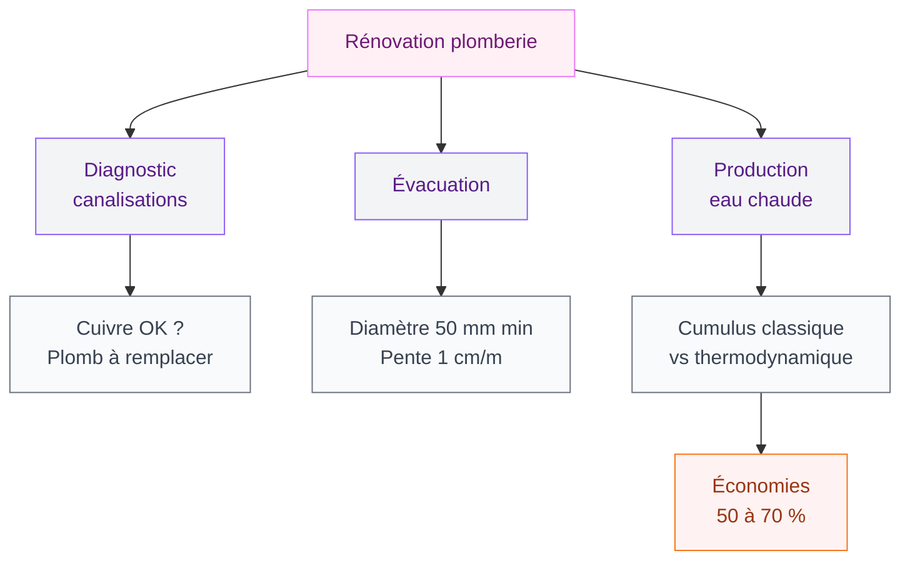
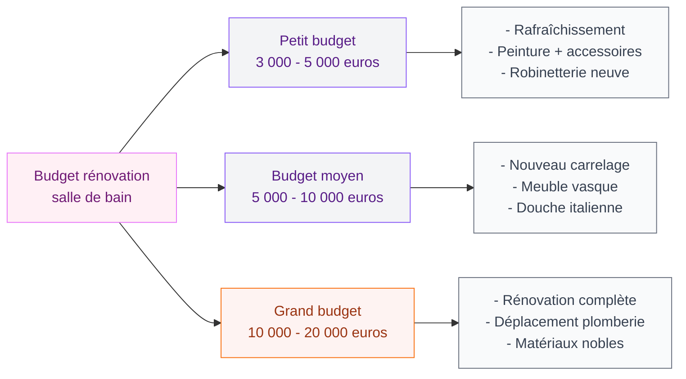

Tu as décidé de te lancer dans la rénovation de ta salle de bain. Bonne idée - c'est l'un des projets qui changent le plus la vie au quotidien. Mais c'est aussi celui où les erreurs coûtent cher. Un drain mal placé, une ventilation oubliée, un éclairage mal pensé... et tu te retrouves avec une pièce jolie sur Instagram mais pénible à vivre.

J'ai vu passer des dizaines de projets de rénovation autour de moi, et les regrets sont presque toujours les mêmes. Alors je t'ai préparé un guide concret, avec les vrais points à surveiller et des prix réels pour que tu puisses planifier ton budget sans mauvaises surprises.

## La ventilation : le sujet que tout le monde oublie

C'est le point numéro un, et pourtant c'est celui qu'on traite en dernier. La ventilation, c'est ce qui empêche la moisissure, les mauvaises odeurs et la dégradation prématurée de tes matériaux. Sans une bonne aération, même le plus beau carrelage du monde finira par souffrir.

  

Dans une salle de bain, tu produis entre 1 et 2 litres de vapeur d'eau par douche. Si cette humidité n'est pas évacuée correctement, elle se condense sur les murs, le plafond, derrière les meubles. Résultat : des joints qui noircissent, de la peinture qui cloque, et parfois des problèmes de santé.

### Ce qu'il te faut concrètement

- **VMC simple flux** : c'est le minimum légal. Un extracteur relié à une gaine qui sort en toiture. Installation par un pro : 300 à 600 euros selon la configuration.
- **VMC double flux** : elle récupère la chaleur de l'air extrait pour préchauffer l'air entrant. Plus chère (1500 à 3500 euros installée), mais elle réduit ta facture de chauffage de 15 à 25 %.
- **Extracteur ponctuel** : si tu ne peux pas installer de VMC, un extracteur mural ou en plafond fait le job. Le Silent 100 de S&P coûte environ 30 euros, le modèle hygrostat (qui se déclenche automatiquement selon l'humidité) tourne autour de 60 euros.

> [!WARNING]
> Ne ferme jamais la grille de ventilation de ta salle de bain, même en hiver. L'humidité accumulée dans une pièce non ventilée peut générer des moisissures en quelques semaines seulement.

## La plomberie : anticiper plutôt que réparer

Quand tu ouvres les murs pour rénover, c'est LE moment de vérifier et upgrader ta plomberie. Parce que toucher à la tuyauterie une fois que tout est refermé, c'est le genre de galère que personne ne veut vivre.

  

### Les points à vérifier

**L'état des canalisations** : si ta maison a plus de 30 ans, les canalisations en cuivre peuvent être corrodées, et celles en plomb (encore présentes dans certains immeubles anciens) doivent être remplacées. Un diagnostic plomberie coûte entre 100 et 200 euros - c'est un petit investissement qui t'évitera des dégâts des eaux.

**L'évacuation** : le diamètre de tes évacuations doit être adapté à tes équipements. Une douche à l'italienne demande une évacuation en diamètre 50 mm minimum avec une pente de 1 cm par mètre. Si tu veux en savoir plus sur ce sujet, j'ai un guide complet sur la [douche italienne](/douche-italienne/) qui détaille toute la partie technique.

**Le chauffe-eau** : une rénovation, c'est le bon moment pour passer à un chauffe-eau thermodynamique. Le coût est plus élevé (entre 2000 et 4000 euros pose incluse), mais les économies sur ta facture d'eau chaude vont de 50 à 70 % par rapport à un cumulus électrique classique.

> [!TIP]
> Profite de la rénovation pour installer des robinets thermostatiques. Ils maintiennent la température choisie à 1 degré près et évitent les brûlures. Le modèle Grohe Grohtherm 1000 coûte environ 120 euros - un excellent rapport qualité-prix.

### Le débit et la pression

Avant de choisir ta robinetterie, vérifie la pression d'eau chez toi. Une colonne de douche type "pluie" a besoin d'au moins 2,5 bars pour fonctionner correctement. Si ta pression est trop faible (fréquent dans les étages élevés des immeubles), un surpresseur (150 à 400 euros) peut résoudre le problème.

## L'éclairage : la pièce qui change tout

L'éclairage est souvent traité comme un détail, un plafonnier central et basta. C'est une erreur. Une salle de bain bien éclairée est plus agréable, plus fonctionnelle, et paraît plus grande.

  

### Les trois niveaux d'éclairage

**Éclairage général** : un plafonnier ou des spots encastrés en LED. Prévois environ 300 lumens par m2 pour une salle de bain. Pour une pièce de 5 m2, ça fait 1500 lumens - soit 2 à 3 spots LED de 7W. Budget : 15 à 40 euros le spot encastré chez Leroy Merlin.

**Éclairage de tâche** : c'est le plus important. Des appliques de chaque côté du miroir (pas au-dessus, ça crée des ombres sous les yeux). Les appliques Astro Mashiko sont une référence à environ 90 euros pièce, mais tu trouves des modèles corrects chez IKEA avec la gamme LEDSJOE à partir de 25 euros.

**Éclairage d'ambiance** : un bandeau LED derrière le miroir ou sous le meuble vasque. Ça coûte entre 15 et 50 euros pour un kit complet de 2 mètres, et ça crée une atmosphère hyper cosy le soir. En plus, c'est parfait comme veilleuse.

> [!NOTE]
> Toute source lumineuse dans la salle de bain doit respecter les normes IP. Zone 0 (dans la douche) : IP67 minimum. Zone 1 (au-dessus de la baignoire/douche) : IP44 minimum. Zone 2 (60 cm autour des points d'eau) : IP44. Au-delà : pas de contrainte spécifique.

### La température de couleur

Ne néglige pas ce point. Un éclairage trop froid (5000K et plus) donne un effet salle d'hôpital. Trop chaud (2700K), tu ne vois pas les couleurs correctement pour te maquiller. Le bon compromis pour la salle de bain : 3000K à 3500K pour l'éclairage général, et 4000K pour l'éclairage miroir.

## Le revêtement de sol : entre esthétique et sécurité

Le sol de la salle de bain, c'est un choix technique autant qu'esthétique. Il doit résister à l'eau, être facile à nettoyer, et surtout ne pas glisser.

  

### Les options et leurs prix

**Le carrelage grès cérame** : c'est le choix le plus répandu et le plus fiable. Il existe dans tous les formats, tous les styles (imitation bois, béton, marbre). Compte 20 à 80 euros le m2 selon la gamme. Pour la pose, ajoute 30 à 50 euros le m2 pour un carreleur pro.

**Le vinyle/PVC clipsable** : option économique et rapide à poser. Les gammes Gerflor ou Quick-Step proposent des lames vinyle imitation bois étanches à partir de 15 euros le m2. Pose possible en DIY, ce qui réduit le budget total.

**Le béton ciré** : superbe rendu, pas de joints, surface continue. Mais il demande une préparation du support impeccable et une pose par un pro. Budget : 80 à 150 euros le m2 pose incluse. Si ce matériau t'intéresse, jette un oeil à notre guide [meuble salle de bain en béton ciré](/meuble-salle-de-bain-beton-cire/) pour des idées d'association.

**La pierre naturelle** : travertin, ardoise, marbre. Le summum du chic, mais un budget conséquent (60 à 200 euros le m2) et un entretien régulier (imperméabilisation annuelle).

> [!IMPORTANT]
> Vérifie toujours le classement antidérapant de ton revêtement de sol. Pour une salle de bain, le minimum recommandé est R10 (classement PN16 en France). Pour une douche à l'italienne, vise R11 ou plus. Ce n'est pas un détail, c'est une question de sécurité.

### Le joint : un détail qui compte

Les joints de carrelage dans une salle de bain, c'est le point faible. Ils absorbent l'humidité, noircissent, moisissent. Deux solutions : utiliser un joint époxy (plus cher mais quasiment imperméable, environ 25 euros le kg contre 5 euros pour un joint ciment classique) ou opter pour des grands formats de carrelage qui réduisent le nombre de joints.

## Le rangement : prévoir avant de construire

Combien de fois j'ai vu des salles de bain rénovées à grands frais mais sans rangement suffisant. Tu finis avec des produits qui s'accumulent sur le rebord de la baignoire et des serviettes en pile sur un tabouret.

  

### Intégrer le rangement dès le départ

**Niche encastrée dans la douche** : la meilleure idée rangement en salle de bain. Ça ne prend aucune place au sol, c'est facile à nettoyer, et ça remplace ces étagères à ventouses qui tombent tout le temps. Coût de réalisation : environ 150 à 300 euros si tu la prévois pendant les travaux de carrelage.

**Meuble vasque avec tiroirs** : choisis un meuble avec des tiroirs plutôt que des portes battantes. Tu vois tout d'un coup d'oeil et tu perds moins de place. Le meuble GODMORGON chez IKEA démarre à 249 euros pour un 60 cm, avec des organisateurs de tiroirs à 15 euros pour tout ranger proprement.

**Colonne de rangement** : si tu as la place, une colonne étroite (30 à 40 cm de large) ajoute énormément de capacité de stockage. Castorama en propose à partir de 89 euros dans la gamme GoodHome.

Pour d'autres idées d'organisation, tu peux consulter notre article sur les [idées de rangement et placards pour la salle de bain](/idees-de-rangement-et-de-placards-pour-la-salle-de-bains/) qui va plus en détail.

## L'étanchéité : l'invisible qui protège tout

C'est la partie que tu ne vois pas, mais c'est elle qui détermine si ta rénovation va durer 5 ans ou 20 ans. L'étanchéité sous carrelage (ce qu'on appelle le SPEC - Système de Protection à l'Eau sous Carrelage) est obligatoire dans les zones humides.

### Où appliquer l'étanchéité

- Sous le receveur de douche et sur les murs de la douche (hauteur : 2 mètres minimum)
- Autour de la baignoire (mur et sol)
- Sous le lavabo et les points d'eau

### Les produits et prix

Une membrane d'étanchéité liquide comme le Mapelastic de Mapei coûte environ 40 euros pour 5 kg (de quoi couvrir 4 à 5 m2 en deux couches). C'est un investissement minime comparé au coût d'un dégât des eaux.

Les bandes d'étanchéité pour les angles et les raccords coûtent entre 5 et 15 euros le rouleau de 5 mètres. Ne les oublie pas - c'est là que les fuites se produisent le plus souvent.

## Le budget global : combien prévoir vraiment

Je ne vais pas te donner de fourchette vague type "ça dépend". Voici des chiffres concrets basés sur une salle de bain standard de 5 à 7 m2 en 2026 :

| Poste | Budget économique | Budget moyen | Budget premium |
|-------|------------------|--------------|----------------|
| Plomberie | 500 - 1 000 euros | 1 000 - 2 500 euros | 2 500 - 5 000 euros |
| Carrelage (fourniture + pose) | 500 - 1 500 euros | 1 500 - 3 000 euros | 3 000 - 6 000 euros |
| Meuble vasque | 200 - 500 euros | 500 - 1 500 euros | 1 500 - 4 000 euros |
| Robinetterie | 100 - 300 euros | 300 - 800 euros | 800 - 2 000 euros |
| Douche ou baignoire | 300 - 800 euros | 800 - 2 000 euros | 2 000 - 5 000 euros |
| Éclairage | 50 - 200 euros | 200 - 600 euros | 600 - 1 500 euros |
| Électricité | 200 - 500 euros | 500 - 1 000 euros | 1 000 - 2 000 euros |
| **Total** | **1 850 - 4 800 euros** | **4 800 - 11 400 euros** | **11 400 - 25 500 euros** |

> [!TIP]
> Prévois toujours une marge de 10 à 15 % pour les imprévus. Dans une rénovation de salle de bain, il y a presque toujours une surprise derrière les murs - un problème d'humidité caché, un tuyau non conforme, une prise à déplacer. C'est normal et ça fait partie du jeu.

## Sur le meme theme

- [salle de bain rustique moderne](/salles-de-bains-rustiques-decoration-et-design-modernes/)

## Les erreurs les plus courantes

Pour finir, voici les pièges que je vois le plus souvent et que tu peux facilement éviter :

**Déplacer la plomberie sans nécessité** : chaque mètre de canalisation déplacé, c'est 200 à 500 euros de plus et un risque de problème supplémentaire. Si possible, garde les arrivées et évacuations d'eau à leur emplacement actuel.

**Choisir l'esthétique avant la fonction** : une douche magnifique avec un drain mal positionné qui accumule l'eau stagnante, c'est le genre de frustration quotidienne qui te fera regretter tes choix. Si tu cherches des idées qui allient style et praticité, le guide sur les [salles de bains modernes 2026](/salles-de-bains-modernes-2026-modeles-designs-decoration/) te donnera de bonnes pistes.

**Négliger l'éclairage** : une seule source lumineuse au plafond, c'est le truc le plus courant et le plus dommage. Trois sources bien placées coûtent à peine plus cher mais changent complètement l'expérience.

**Oublier les prises** : prévois au moins 2 prises électriques à côté du miroir (à plus de 60 cm des points d'eau). Sèche-cheveux, brosse à dents électrique, rasoir - tu en as besoin.

**Sous-estimer le temps** : une rénovation complète de salle de bain prend en moyenne 2 à 4 semaines avec un artisan. Prévois une solution de douche temporaire si tu n'as qu'une seule salle de bain. Un camping de jardin chez Decathlon à 30 euros peut sauver la mise.

La rénovation de salle de bain, c'est un vrai projet - mais quand c'est bien planifié, le résultat change ton quotidien. Prends le temps de lister tes priorités, fais faire plusieurs devis (minimum 3), et n'hésite pas à échelonner les travaux si le budget est serré. Ta future salle de bain t'attend !
