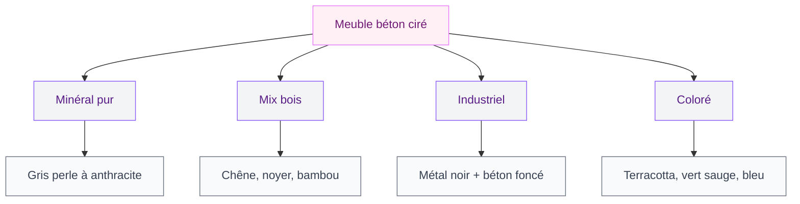

Tu cherches à donner un vrai caractère à ta salle de bain sans tomber dans le classique meuble blanc laqué ? Le béton ciré est exactement ce qu'il te faut. C'est un matériau qui apporte une présence visuelle dingue, un côté brut et chic à la fois, et qui se prête à tous les styles - du minimaliste au plus industriel.

Je te dis tout : comment choisir ton meuble en béton ciré, combien ça coûte, les meilleures marques, et même comment le faire toi-même si tu es un peu bricoleuse. On y va !

## Pourquoi le béton ciré cartonne en salle de bain

Le béton ciré n'est pas un matériau nouveau, mais son utilisation sur le mobilier de salle de bain a vraiment explosé ces deux dernières années. Et pour de bonnes raisons.

D'abord, le rendu est unique. Chaque meuble en béton ciré a sa propre texture, ses nuances, ses imperfections. C'est le contraire du mobilier industriel identique chez tout le monde. Et cette matière se marie avec à peu près tout : le bois, le métal noir, le laiton, la céramique.

Ensuite, c'est un matériau résistant à l'humidité quand il est bien traité. Une fois protégé avec un vernis ou une cire adaptée, ton meuble supporte les éclaboussures, la vapeur et les variations de température. C'est aussi simple à nettoyer qu'un plan de travail de cuisine.

Et le gros plus ? Le béton ciré s'applique sur des supports existants. Tu peux transformer un meuble basique en pièce unique sans tout casser.

> [!TIP]
> Le béton ciré n'est pas du béton massif. C'est un enduit décoratif de 2 à 3 mm d'épaisseur que tu appliques sur un support existant. Il est donc bien plus léger qu'il n'y paraît !

## Les différents styles de meubles en béton ciré

### Le style minéral pur

Tout en béton ciré, du plan vasque aux façades de tiroirs. On reste sur des teintes grises - gris perle, gris anthracite, gris souris. L'effet est sobre, presque sculptural. Ce style fonctionne très bien dans une [salle de bain zen et spa](/salle-de-bain-zen-spa-maison/) avec des plantes vertes et de la lumière naturelle.

### Le mix béton ciré et bois

C'est le combo le plus populaire, et je comprends pourquoi. Le béton ciré gris ou blanc cassé sur le plan vasque, et du bois (chêne blanchi, noyer, bambou) pour la structure et les tiroirs. Atlantic Bain propose ce type de meuble sur mesure à partir de 1200 euros, avec un rendu très haut de gamme.

### Le style industriel

Béton ciré anthracite ou noir, pieds en métal, robinetterie noire mate. On ajoute un miroir à cadre métal et des étagères ouvertes. Si tu aimes le [style industriel moderne](/style-industriel-moderne/), c'est la version salle de bain parfaite.

### Le béton ciré coloré

On n'y pense pas assez, mais le béton ciré existe en couleurs ! Terracotta, vert sauge, bleu canard, rose poudré. Ça permet de créer un meuble vraiment original sans tomber dans le kitsch. Les kits colorés se trouvent chez Mercadier (à partir de 85 euros le kit) ou Résinence (environ 60 euros chez Leroy Merlin).

## Combien ça coûte ? Les prix concrets

C'est LA question, et je vais être transparente. Le budget varie énormément selon que tu achètes un meuble fini, que tu le fais fabriquer sur mesure, ou que tu le réalises toi-même.

### Meuble prêt à poser

- **Leroy Merlin** : meubles sous-vasque effet béton à partir de 199 euros (gamme Neo). Ce n'est pas du vrai béton ciré, mais un revêtement mélaminé imitation. Correct pour un petit budget.
- **Castorama** : gamme GoodHome avec finition béton, entre 250 et 450 euros selon la taille.
- **IKEA** : pas de béton ciré à proprement parler, mais les caissons ENHET (à partir de 80 euros) sont une base parfaite pour un projet DIY.

### Meuble sur mesure

- **Atlantic Bain** : spécialiste du meuble salle de bain sur mesure en béton ciré. Comptage entre 800 et 3000 euros selon les dimensions et les finitions. Leur combo béton ciré + chêne blanchi est superbe.
- **Artisans locaux** : entre 600 et 2000 euros pour un meuble vasque en béton ciré véritable. Demande toujours un échantillon de teinte avant de valider.

### DIY (Do It Yourself)

- **Kit béton ciré** : entre 50 et 120 euros pour couvrir un meuble standard (Mercadier, Résinence, Harmony Béton).
- **Support IKEA** : un caisson ENHET ou GODMORGON entre 80 et 250 euros.
- **Budget total DIY** : entre 150 et 400 euros pour un meuble unique, c'est imbattable.

> [!NOTE]
> Les meubles "effet béton" en mélaminé ne sont pas du béton ciré. Ils coûtent moins cher mais n'ont pas la même profondeur de matière ni la même durabilité. Si ton budget est serré, le DIY sur un caisson IKEA reste la meilleure option qualité-prix.

## Fabriquer son meuble en béton ciré : le tuto pas à pas

C'est le moment fun ! Transformer un meuble basique en pièce designer, c'est totalement faisable, même si tu débutes. Le blog Déconome a documenté ce projet avec des modules ENHET d'IKEA et le résultat est bluffant.

### Le matériel nécessaire

- Un meuble support (caisson IKEA, ancien meuble, médium ou contreplaqué)
- Un kit béton ciré (micro-béton + finition) - Mercadier, Résinence ou Achrodéco
- Un primaire d'accrochage adapté au support
- Des spatules inox (une large, une étroite)
- Du papier de verre grain 120 et 240
- Un rouleau mousse pour le vernis de finition
- Du ruban de masquage

### Les étapes

**1. Préparer le support** - Ponce légèrement la surface, nettoie et dégraisse. Si c'est du bois brut, applique une sous-couche d'accrochage (type peinture d'apprêt) pour éviter que les tanins remontent dans le béton ciré.

**2. Appliquer le primaire** - Une couche fine au rouleau, laisser sécher 4 à 6 heures. C'est l'étape qui garantit l'adhérence, ne la saute pas.

**3. Première couche de béton ciré** - Avec la spatule inox, étale une fine couche (1 mm environ). Travaille par petites zones, en gestes croisés. Laisse sécher 12 à 24 heures.

**4. Poncer légèrement** - Grain 120, juste pour lisser les petites irrégularités. Pas besoin d'appuyer fort.

**5. Deuxième couche** - Même technique, en croisant les passes pour un rendu homogène. C'est cette couche qui donne la profondeur et la texture finale. Sécher 24 heures.

**6. Poncer finement** - Grain 240 cette fois, pour un toucher soyeux.

**7. Protéger** - Deux couches de vernis hydrofuge ou de cire protectrice. C'est l'étape la plus importante en salle de bain pour garantir l'étanchéité.

> [!WARNING]
> En salle de bain, la protection hydrofuge n'est pas optionnelle. Sans elle, l'humidité va pénétrer le béton ciré et provoquer des taches, des cloques, voire un décollement. Deux couches de vernis polyuréthane mat, c'est le minimum.

## Entretien au quotidien : c'est plus simple que tu crois

Un des gros avantages du béton ciré, c'est son entretien minimaliste. Une fois bien protégé, ton meuble demande très peu d'attention.

### Le nettoyage courant

Un chiffon microfibre humide avec un peu de savon de Marseille ou de savon noir. C'est tout. Pas de produit abrasif, pas de javel, pas de vinaigre blanc (trop acide pour le béton ciré).

### Ce qu'il faut éviter

- Les produits acides (vinaigre, détartrant, citron) qui attaquent la surface
- Les éponges abrasives ou la paille de fer
- Laisser de l'eau stagner longtemps (même avec le vernis)
- Les produits à base de solvants

### Le re-cirage annuel

Une fois par an, applique une couche de cire ou de vernis de protection. Ça prend 30 minutes et ça prolonge la durée de vie de ton meuble de plusieurs années. Ponce très légèrement au grain 400 avant d'appliquer.

> [!TIP]
> Garde toujours un petit pot de béton ciré de la même teinte. Si un éclat ou une rayure apparaît, tu peux faire une retouche locale en 5 minutes. C'est l'avantage du béton ciré par rapport à un meuble peint ou laqué.

## Quel plan vasque choisir avec un meuble béton ciré ?

Le choix de la vasque fait toute la différence dans le rendu final.

### Vasque à poser

La plus tendance. Une vasque ronde ou ovale en céramique blanche posée sur un plan en béton ciré gris. Le contraste est magnifique. Comptage entre 80 euros (Leroy Merlin, Castorama) et 350 euros (Duravit, Alape) pour la vasque seule.

### Plan vasque intégré

Le plan vasque et la vasque forment un seul bloc en béton ciré. C'est le choix le plus harmonieux, mais il faut un coffrage sur mesure ou un artisan. Budget : 400 à 1200 euros selon la taille.

### Vasque sous-plan

Encastrée sous le plan en béton ciré. Le rendu est épuré et moderne, très facile à nettoyer puisqu'il n'y a pas de joint apparent. Ce style s'accorde bien avec un [éclairage d'ambiance travaillé](/eclairage-ambiance-techniques-sublimer/) pour mettre en valeur les textures.

## Béton ciré vs alternatives : comment choisir

Tu hésites avec d'autres matériaux ? Comparons.

**Béton ciré vs carrelage** : le béton ciré offre un rendu sans joint, plus contemporain. Le carrelage reste moins cher et plus facile à poser. Si tu aimes les [tendances carrelage 2026](/carrelage-moderne-tendances-2026/), tu peux aussi mixer les deux.

**Béton ciré vs bois massif** : le bois est plus chaleureux mais demande plus d'entretien en salle de bain (traitement hydrofuge régulier). Le béton ciré est plus résistant à l'eau.

**Béton ciré vs résine** : la résine est moins chère et plus facile à appliquer, mais le rendu manque de profondeur. Le béton ciré a cette texture vivante que la résine ne reproduit pas.

**Béton ciré vs tadelakt** : le tadelakt (enduit marocain à la chaux) offre un rendu similaire mais plus organique. Il est plus délicat à appliquer et coûte plus cher en main d'oeuvre. Les deux sont étanches une fois bien finis.

## Les erreurs à éviter absolument

J'ai vu pas mal de projets béton ciré qui tournent mal. Voici les pièges classiques.

**Sauter le primaire d'accrochage.** C'est la première cause d'échec. Sans primaire, le béton ciré se décolle en quelques mois, surtout sur du mélaminé ou du stratifié.

**Appliquer des couches trop épaisses.** Le béton ciré se pose en couches très fines (1 mm max). Si tu en mets trop, ça fissure en séchant. Mieux vaut trois couches fines qu'une couche épaisse.

**Oublier la protection en salle de bain.** Je le répète parce que c'est important : le béton ciré seul n'est pas étanche. Il a besoin d'un vernis ou d'une cire de protection, et en salle de bain c'est non négociable.

**Choisir un béton ciré bas de gamme.** Les kits à moins de 30 euros ont souvent une tenue médiocre. Investis dans une marque reconnue (Mercadier, Achrodéco, Marius Aurenti) pour un résultat durable.

**Ne pas tester la teinte.** Fais toujours un échantillon sur un bout de carton ou de bois avant d'appliquer sur ton meuble. La couleur sèche est souvent différente de la couleur humide.

## Où acheter : mes adresses préférées

- **Mercadier** (mercadier.fr) : la référence française du béton ciré. Kits complets à partir de 85 euros, large choix de teintes. Livraison sous 5 jours.
- **Achrodéco** (achrodeco.com) : spécialiste avec de très bons tutos en ligne. Kits à partir de 70 euros.
- **Résinence** : disponible chez Leroy Merlin et Castorama, à partir de 55 euros le kit. Pratique pour un premier essai.
- **Atlantic Bain** (atlantic-bain-morisseau.com) : pour du meuble sur mesure haut de gamme. Devis sur demande, atelier en France.
- **IKEA** : pour les caissons supports (ENHET, GODMORGON). Le meilleur rapport qualité-prix en base de départ pour un projet DIY.

> [!IMPORTANT]
> Avant de commander un kit béton ciré, vérifie bien qu'il inclut le primaire, le béton et la protection. Certains kits "pas chers" ne contiennent que le béton, et tu te retrouves à acheter le reste séparément pour un coût total plus élevé.

## Questions fréquentes

### Le béton ciré est-il adapté à une salle de bain humide ?

Oui, à condition d'appliquer un traitement hydrofuge (vernis polyuréthane ou cire protectrice). Le béton ciré seul est poreux et absorbe l'eau. Avec une bonne protection, il résiste très bien à l'humidité quotidienne d'une salle de bain.

### Combien de temps dure un meuble en béton ciré ?

Avec un entretien correct (nettoyage doux + re-cirage annuel), un meuble en béton ciré dure facilement 10 à 15 ans. La patine du temps lui donne même un charme supplémentaire.

### Peut-on appliquer du béton ciré sur un meuble IKEA ?

Tout à fait. Les caissons ENHET et GODMORGON sont de très bons supports. Il faut juste poncer la surface, appliquer un primaire d'accrochage, et suivre les étapes classiques. Le blog Déconome a réalisé un projet complet avec des modules ENHET, et le résultat est pro.

### Le béton ciré jaunit-il avec le temps ?

Les teintes claires (blanc, gris perle) peuvent légèrement jaunir si elles sont exposées à une forte lumière UV. En salle de bain, c'est rarement un problème car l'exposition au soleil direct est limitée. Choisis un vernis avec filtre UV pour plus de sécurité.
