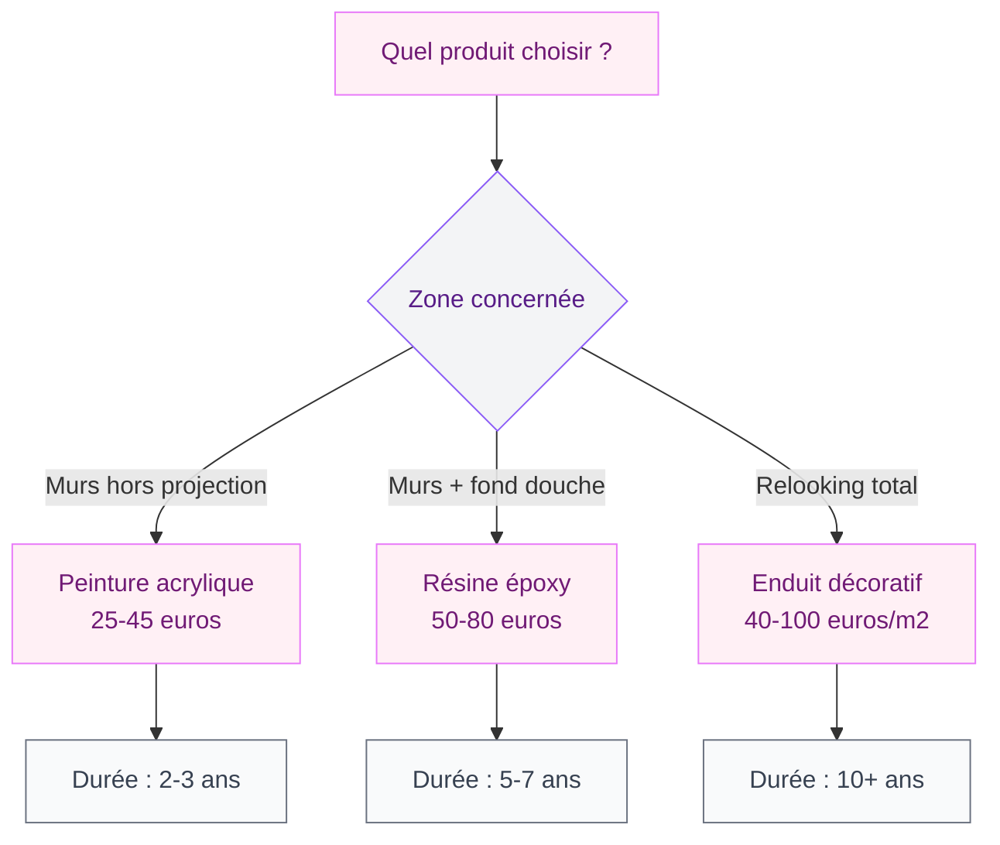

Tu en as marre de ton carrelage de douche qui date des années 2000 mais tu n'as ni le budget ni l'envie de tout casser ? Bonne nouvelle : la peinture pour carrelage de douche est une vraie solution. Pas un bricolage bancal, une technique qui tient la route quand on choisit les bons produits et qu'on respecte les étapes. Je t'explique tout pour passer d'un carrelage fatigué à une douche qui a du style - sans travaux lourds.

## Pourquoi peindre le carrelage de ta douche

Remplacer un carrelage de douche, c'est un chantier : démolition, évacuation des gravats, pose d'un nouveau revêtement, étanchéité à refaire... On parle facilement de 1500 à 3000 euros pour une douche standard, et plusieurs jours de travaux. La peinture, elle, coûte entre 30 et 80 euros en produits, et tu peux finir en un week-end.

  

Mais attention, peindre du carrelage dans une douche n'est pas la même chose que peindre un mur de cuisine. L'eau ruisselle directement dessus, la vapeur sature l'air, les champignons guettent le moindre défaut. C'est pour ça qu'il existe des peintures spécifiques, formulées pour résister à ces conditions extrêmes.

Le vrai avantage, au-delà du prix : tu peux changer de couleur tous les 3 à 5 ans si tu en as envie. C'est une approche déco flexible que je recommande pour les logements locatifs ou quand tu hésites encore sur ton style long terme.

> [!NOTE]
> La peinture pour carrelage de douche n'est pas un produit d'étanchéité. Si ton carrelage a des fissures profondes ou si les joints sont poreux, il faut d'abord réparer l'étanchéité avant de peindre. La peinture protège la surface, mais pas la structure en dessous.

## Les types de peinture adaptées à la douche

Toutes les peintures carrelage ne se valent pas, et certaines n'ont rien à faire dans une douche. Voici les trois grandes familles qui tiennent la route en milieu humide.

  

### La peinture acrylique spéciale salle de bain

C'est la plus accessible : prix doux (25-45 euros le pot de 0,75 L), application facile au rouleau mousse, séchage rapide et peu d'odeur. Les marques comme V33 (gamme Rénovation Perfection Salle de Bain, environ 35 euros) ou Julien proposent des formules qui résistent à l'humidité et aux éclaboussures.

Le hic : sur les zones de projection directe d'eau (le receveur, le fond de la douche), la tenue est limitée dans le temps. Compte 2 à 3 ans avant de devoir retoucher si ta douche est utilisée quotidiennement par plusieurs personnes. Pour les murs autour de la douche ou les zones moins exposées, ça fonctionne bien.

### La résine époxy

C'est le haut de gamme de la peinture carrelage en zone humide. La résine époxy crée un film dur, lisse et imperméable qui résiste vraiment à l'eau, aux produits ménagers et à l'usure. Les kits de résine époxy pour carrelage (Résinence, environ 60 euros chez Leroy Merlin, ou Syntilor) couvrent généralement 5 à 10 m².

L'application demande plus de rigueur : il faut mélanger deux composants (résine + durcisseur), respecter un temps de travail limité (30 à 45 minutes en général), et poser deux couches fines. Le rendu est brillant ou satiné selon la formule, avec un toucher très lisse presque vitrifié.

> [!TIP]
> Si tu ne devais retenir qu'un seul type de peinture pour l'intérieur de ta douche, c'est la résine époxy. Elle tient 5 à 7 ans même sur les zones de projection directe, et son rendu brillant donne un vrai coup de neuf au carrelage.

### L'enduit décoratif (béton ciré, effet pierre)

Ce n'est pas une peinture à proprement parler, mais c'est une alternative populaire qui mérite sa place ici. Un enduit béton ciré ou minéral recouvre complètement le carrelage et les joints, pour un rendu monolithique ultra moderne. Les prix varient de 40 à 100 euros le m² en fournitures seules.

Si le look béton ciré te tente pour ta salle de bain, tu peux aller voir mon guide sur les [meubles salle de bain en béton ciré](/meuble-salle-de-bain-beton-cire/) pour t'inspirer du rendu global. L'enduit sur le carrelage de douche crée une continuité visuelle avec le reste de la pièce.

## Préparation du carrelage : l'étape qui fait toute la différence

Je te le dis tout net : 80% des échecs de peinture sur carrelage viennent d'une mauvaise préparation. La peinture, même la meilleure, ne colle pas sur une surface grasse, humide ou poussiéreuse. Voici la méthode complète.

  

### Étape 1 : Nettoyage en profondeur

Commence par un nettoyage à la lessive Saint-Marc ou au savon noir dilué. L'objectif est d'éliminer toute trace de savon, de calcaire et de graisse. Frotte chaque carreau et chaque joint avec une brosse rigide. Rince abondamment à l'eau claire et laisse sécher au moins 24 heures - ventilateur d'appoint si besoin.

### Étape 2 : Réparation des joints et fissures

Inspecte chaque joint. S'ils sont fissurés, noircis en profondeur ou décollent, il faut les refaire avant de peindre. Un tube de joint silicone spécial salle de bain (5-10 euros) fait l'affaire pour les petites réparations. Pour des joints de carrelage entiers à refaire, utilise du mortier à joints souple.

### Étape 3 : Dégraissage et ponçage léger

Passe un chiffon imbibé d'acétone ou d'alcool ménager sur toute la surface pour un dégraissage final. Puis un léger ponçage au papier de verre grain 120 - tu ne cherches pas à enlever l'émail, juste à créer des micro-rayures pour que la peinture accroche mieux. Dépoussière bien après.

### Étape 4 : Sous-couche d'accrochage

Sauf si tu utilises une résine époxy ou une peinture "direct carrelage" qui intègre le primaire, applique une sous-couche d'accrochage spéciale surfaces lisses. Les primaires Julien ou Zinsser (15-25 euros le pot) sont très fiables. Une couche suffit, au rouleau mousse en croisant les passes.

> [!WARNING]
> Ne peins JAMAIS sur un carrelage humide ou dans une pièce mal ventilée. L'humidité emprisonnée sous la peinture provoque des cloques et un décollement rapide. Attends au minimum 48 heures après la dernière douche, et assure une ventilation continue pendant le séchage.

## Application : le bon geste pour un rendu pro

Tu as bien préparé ta surface ? Parfait, c'est le moment de peindre. Et là, la technique compte autant que le produit.

  

### Le matériel qu'il te faut

- Un rouleau mousse à poils ras (4-5 mm) pour les grandes surfaces
- Un pinceau à réchampir pour les angles et les joints
- Du ruban de masquage pour protéger la robinetterie et les bords
- Un bac à peinture avec grille d'essorage
- Des gants et un masque si tu utilises de la résine époxy

### Les règles d'application

**Première couche fine.** Charge ton rouleau sans l'engorger, et passe en couches croisées : d'abord verticalement, puis horizontalement. L'erreur classique, c'est de mettre trop de produit d'un coup. Résultat : des coulures, un séchage inégal et une adhérence médiocre.

**Temps de séchage entre couches.** Respecte scrupuleusement le temps indiqué sur le pot. En général : 6 à 8 heures pour la peinture acrylique, 12 à 24 heures pour la résine époxy. Ne triche pas sur ce délai, même si la surface te semble sèche au toucher.

**Deuxième couche (et troisième si besoin).** Même technique, couches croisées. Deux couches suffisent en général avec une résine époxy. Avec une peinture acrylique, trois couches donnent un meilleur résultat sur les zones très exposées.

## Les couleurs qui marchent (et celles à éviter)

Le choix de la couleur, c'est le côté fun du projet. Mais dans une douche, certaines teintes sont plus malines que d'autres.

  

**Le blanc et le gris clair** restent les valeurs sûres. Ils agrandissent visuellement la douche, s'accordent avec tous les styles et masquent bien les traces de calcaire. Le blanc cassé ou le greige (gris beige) évitent l'effet clinique du blanc pur.

**Le bleu canard et le vert sauge** apportent une dose de caractère sans surcharge. Ces teintes fonctionnent bien dans une salle de bain à l'ambiance spa ou naturelle.

**Le noir mat** fait un effet spectaculaire mais il montre absolument chaque trace d'eau, de calcaire et de doigt. Tu passeras ton temps à essuyer. À réserver aux parois partiellement peintes ou aux douches avec adoucisseur d'eau.

> [!CAUTION]
> Évite les finitions mates dans la douche. Elles absorbent les éclaboussures et se salissent plus vite. Privilégie les finitions satinées ou brillantes qui repoussent l'eau et se nettoient d'un coup d'éponge.

Si tu te poses des questions sur les associations de couleurs pour ta salle de bain, mon guide sur le [carrelage de douche italienne](/carrelage-douche-italienne/) donne pas mal d'idées de palettes qui fonctionnent aussi avec la peinture.

## Entretien et durabilité : faire durer ta peinture

Un carrelage de douche peint ne s'entretient pas comme un carrelage brut. Quelques réflexes simples prolongent la durée de vie du revêtement.

**Nettoyage doux uniquement.** Oublie les produits acides (vinaigre blanc pur, anticalcaire agressif) et les éponges abrasives. Un savon neutre type savon de Marseille liquide et une microfibre, c'est tout ce qu'il faut. Les nettoyants Starwax ou Hagerty pour surfaces peintes (environ 8 euros) sont adaptés.

**Rinçage après chaque douche.** Un jet d'eau rapide sur les parois peintes après chaque utilisation empêche les dépôts de savon de s'incruster. Ça prend 30 secondes et ça change tout sur la durée.

**Ventilation permanente.** Si ta salle de bain n'a pas de VMC performante, ouvre la fenêtre ou installe un extracteur d'air. L'humidité résiduelle est l'ennemi numéro un de la peinture sur carrelage. Un déshumidificateur électrique (30-50 euros) peut aussi aider dans les salles de bain sans fenêtre.

**Retouches localisées.** Garde un fond de pot de ta peinture. Si un éclat ou une rayure apparaît, tu peux retoucher localement avec un petit pinceau, sans tout refaire. Ponce légèrement la zone abîmée et applique deux fines couches.

## Les erreurs les plus courantes (et comment les éviter)

Après avoir accompagné des dizaines de projets déco, je connais les pièges classiques de la peinture sur carrelage de douche. En voici cinq.

**Erreur 1 : utiliser une peinture multi-supports générique.** Les peintures "tout en un" à 15 euros du rayon brico ne sont pas faites pour résister à l'eau de douche. Elles tiennent quelques semaines puis cloquent. Investis dans un produit spécifique, c'est le minimum.

**Erreur 2 : peindre les joints au même titre que le carrelage.** Les joints en ciment sont poreux et absorbent la peinture différemment. Résultat : la peinture s'écaille en premier sur les joints. La solution : applique un primaire d'accrochage renforcé sur les joints, ou utilise de la résine époxy qui pénètre mieux.

**Erreur 3 : sous-estimer le temps de séchage complet.** Même si la peinture semble sèche au toucher après 8 heures, le durcissement complet prend 5 à 7 jours pour une acrylique et jusqu'à 14 jours pour une résine époxy. Pendant ce temps, pas de douche dans la zone peinte.

**Erreur 4 : oublier de ventiler pendant et après.** Les vapeurs de résine époxy sont irritantes, et l'humidité emprisonnée provoque des défauts d'adhérence. Ventile en continu pendant les 72 premières heures minimum.

**Erreur 5 : peindre le sol de la douche.** Le sol de la douche subit des frottements mécaniques (poids, pieds) que la peinture ne supporte pas longtemps, même la résine époxy. Pour le sol, mieux vaut opter pour un receveur de douche neuf ou un tapis antidérapant. Si tu veux en savoir plus sur les receveurs, consulte mon guide sur le [choix d'un receveur pour douche italienne](/quel-receveur-pour-douche-italienne/).

> [!IMPORTANT]
> Après la dernière couche, attends au minimum 7 jours avant de réutiliser la douche. Ce délai permet à la peinture de polymériser complètement et d'atteindre sa résistance maximale. C'est long, mais ça fait la différence entre un résultat qui dure et un résultat qui s'écaille en trois mois.

## Budget complet : combien ça coûte vraiment

Pour te donner une idée concrète, voici ce que coûte un projet complet de peinture de douche (environ 4 à 6 m² de carrelage mural) :

| Poste | Budget |
|-------|--------|
| Nettoyant + dégraissant | 5-10 euros |
| Sous-couche d'accrochage | 15-25 euros |
| Peinture ou résine (2 couches) | 30-80 euros |
| Ruban de masquage + rouleau mousse | 10-15 euros |
| Joint silicone (si nécessaire) | 5-10 euros |
| **Total** | **65-140 euros** |

Compare ça aux 1500-3000 euros d'un remplacement complet du carrelage, et le calcul est vite fait. Même si tu dois refaire la peinture tous les 4-5 ans, tu restes largement gagnante sur 10 ans.

Et si tu cherches des idées de rangement pour compléter ta salle de bain rénovée, jette un oeil à mes [astuces rangement salle de bain](/idees-de-rangement-et-de-placards-pour-la-salle-de-bains/) - ça vaut le détour.

## Sur le meme theme

- [peinture carrelage salle de bain](/peinture-pour-carrelage-salle-de-bain-les-choses-a-eviter/)

## FAQ

### Combien de temps dure la peinture sur carrelage de douche ?

Avec une résine époxy bien appliquée sur une surface correctement préparée, tu peux compter 5 à 7 ans. Une peinture acrylique spéciale salle de bain tiendra plutôt 2 à 3 ans sur les zones les plus exposées. L'entretien adapté (produits doux, ventilation) allonge la durée de vie.

### Peut-on peindre le sol de la douche ?

Techniquement oui, mais en pratique c'est déconseillé. Le sol subit trop de contraintes mécaniques (poids, frottements, stagnation d'eau) pour qu'une peinture tienne dans la durée. Pour le sol, oriente-toi vers un remplacement du receveur ou un enduit minéral spécifique type béton ciré haute résistance.

### Faut-il poncer le carrelage avant de peindre ?

Un léger ponçage au grain 120 est recommandé pour créer des micro-rayures qui aident la peinture à accrocher. Mais tu ne cherches pas à retirer l'émail - juste à rayer légèrement la surface. Si tu utilises un primaire d'accrochage adapté, le ponçage reste utile mais moins déterminant qu'avec une peinture directe.

### Quelle finition choisir : mate, satinée ou brillante ?

En douche, privilégie les finitions satinées ou brillantes. Elles résistent mieux à l'humidité, repoussent les dépôts de savon et se nettoient facilement. La finition mate est jolie mais inadaptée à une zone de projection d'eau directe - elle absorbe l'humidité et se tache vite.
