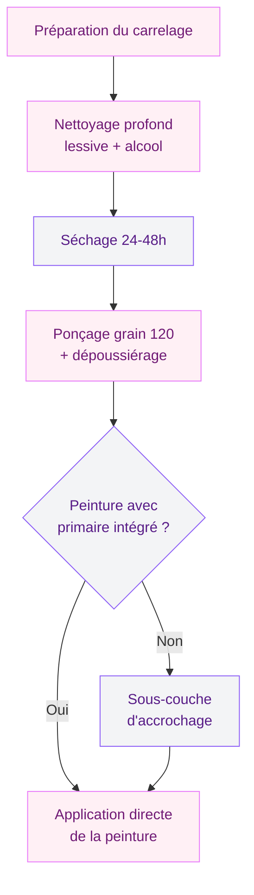
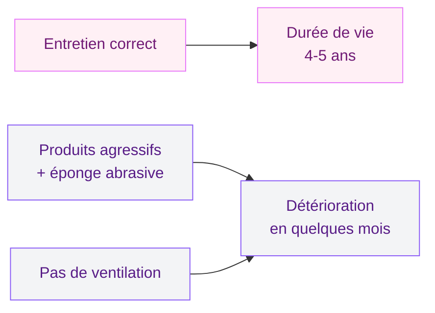

Repeindre le carrelage de ta salle de bain, c'est la promesse d'un relooking rapide et pas cher. Mais entre la promesse et le résultat, il y a un gouffre - et ce gouffre, c'est souvent une série d'erreurs évitables. J'en ai vu des salles de bain où la peinture cloquait après trois semaines, des teintes qui viraient au jaune, des surfaces qui collaient encore deux mois après. À chaque fois, les mêmes causes. Alors avant de te lancer rouleau en main, lis ce qui suit : ça t'évitera de gaspiller ton week-end et tes euros.

## Erreur 1 : acheter une peinture "tous supports" en promo

C'est le piège le plus fréquent. Tu passes au rayon peinture de Leroy Merlin ou Castorama, tu tombes sur un pot à 18 euros qui affiche "multi-supports" et tu te dis que ça fera le travail. Mauvaise idée.

  

Une peinture générique n'est pas formulée pour encaisser l'humidité permanente d'une salle de bain. Elle n'a ni les résines adaptées, ni les agents anti-moisissures, ni la souplesse nécessaire pour résister aux variations de température. Résultat : au bout de quelques semaines, des cloques, des écailles, et tu recommences à zéro.

Ce qu'il te faut, c'est une peinture **spécifique carrelage salle de bain**. Trois références tiennent la route :

- **V33 Rénovation Perfection** (environ 35-45 euros les 0,75 L) - bonne adhérence, gamme de coloris correcte
- **Syntilor Rénov'carrelage** (30-40 euros) - application facile, finition satinée
- **Zolpan Époxy SB** (50-70 euros) - la plus résistante en milieu humide, tenue 5 ans et plus

Oui, c'est plus cher qu'un pot basique. Mais un pot à 18 euros que tu dois refaire au bout d'un mois te revient bien plus cher qu'un produit adapté qui tient 4-5 ans.

> [!WARNING]
> Vérifie toujours que la peinture porte la mention "résistant à l'humidité" ou "spécial pièces humides" sur l'étiquette. La mention "lessivable" seule ne suffit pas pour une salle de bain.

## Erreur 2 : peindre sur un carrelage mal préparé

Tu ouvres ton pot et tu attaques direct ? C'est la recette d'un échec garanti. La préparation du support, c'est 80% du succès. Et quand je dis préparation, ce n'est pas un coup d'éponge rapide.

  

### Le dégraissage en profondeur

Le carrelage de salle de bain accumule des couches invisibles de savon, de calcaire, de silicone de shampooing et de gras corporel. Tout ça crée un film qui empêche la peinture d'accrocher.

La méthode qui fonctionne :
1. Nettoyage à la lessive Saint-Marc ou au savon noir concentré (pas le savon noir cosmétique)
2. Rinçage à l'eau claire
3. Passage à l'alcool ménager ou à l'acétone sur toute la surface
4. Séchage complet : minimum 24 heures, idéalement 48 heures

### Le ponçage léger

Un passage au papier de verre grain 120 sur chaque carreau crée les micro-rayures qui permettent à la peinture de s'accrocher. Tu ne cherches pas à enlever l'émail - juste à "griffer" la surface. Dépoussiére bien après avec un chiffon humide, puis laisse sécher.

### La sous-couche d'accrochage

C'est l'étape que beaucoup sautent, et c'est une erreur. Sur le carrelage (surface lisse et non poreuse), la sous-couche fait office de "pont" entre le support et la peinture. Les primaires Julien, Zinsser ou Tollens pour surfaces lisses coûtent entre 15 et 25 euros. Un pot couvre facilement 8 à 12 m2.

> [!TIP]
> Si tu utilises une résine époxy type V33 ou Résinence, la sous-couche est souvent intégrée dans la formule. Vérifie la fiche technique du produit avant d'acheter un primaire en plus - ça t'évitera une dépense inutile.

## Erreur 3 : peindre sur un carrelage humide

Ça paraît évident, et pourtant. En salle de bain, l'humidité est partout : dans l'air, dans les joints, sous les carreaux. Et l'humidité, c'est l'ennemi numéro un de la peinture.

  

L'eau emprisonnée entre le carrelage et la couche de peinture crée des poches de vapeur. Ces poches poussent la peinture vers l'extérieur et forment des cloques. C'est irréversible - il faut tout gratter et recommencer.

Les règles à suivre :

- **Pas de douche ni de bain pendant 48 heures minimum** avant de peindre
- **Ventile la pièce en continu** : VMC à fond, fenêtre ouverte, ventilateur d'appoint
- **Vérifie l'hygrométrie** si possible : un petit hygromètre à 10 euros te confirme que tu es sous 60% d'humidité relative
- **Peins le matin** quand la salle de bain a eu toute la nuit pour sécher

Et après la dernière couche, même discipline : attends 5 à 7 jours avant de réutiliser la douche. Pendant cette période, la peinture polymérise et atteint sa résistance définitive.

## Erreur 4 : appliquer des couches trop épaisses

L'envie de couvrir en une seule passe est compréhensible. Mais en peinture carrelage, la patience paie. Une couche épaisse sèche en surface alors que l'intérieur reste mou. Résultat : des craquelures, un aspect poisseux au toucher, et une adhérence médiocre.

  

La bonne méthode :

- Charge ton rouleau mousse (poils ras 4-5 mm) sans l'engorger
- Passe en couches croisées : d'abord à la verticale, puis à l'horizontale
- Chaque couche doit être **fine et régulière**
- Deux couches suffisent avec une résine époxy, trois avec une acrylique
- Respecte le temps de séchage entre les couches : 6 à 8 heures pour l'acrylique, 12 à 24 heures pour l'époxy

> [!NOTE]
> Un rouleau mousse à poils ras donne un rendu beaucoup plus lisse qu'un rouleau à poils longs. Sur le carrelage, le moindre grain ou la moindre trace de rouleau se voit. Investis 5-8 euros dans un bon rouleau laqueur, c'est le détail qui change le rendu final.

## Erreur 5 : négliger l'entretien après la peinture

Ta salle de bain est repeinte, le résultat est top. Maintenant, il faut le garder. Et là, beaucoup de gens sabotent leur travail sans le savoir.

  

### Les produits à bannir

- **Vinaigre blanc pur** : trop acide, il attaque le film de peinture
- **Nettoyants anticalcaire agressifs** (Cillit Bang, Antikal concentré) : même problème
- **Éponges abrasives type Scotch-Brite vert** : elles rayent la surface et créent des zones où l'eau s'infiltre
- **Nettoyeurs vapeur** : la chaleur et la pression fragilisent l'adhérence

### La routine qui préserve ta peinture

Un coup de microfibre humide avec du savon de Marseille liquide après chaque utilisation de la salle de bain. Rince à l'eau claire, essuie. C'est tout. Pour le calcaire, un nettoyant doux type Starwax surfaces peintes (environ 8 euros) fait le travail sans abîmer la finition.

Et surtout : ventile. Si ta salle de bain n'a pas de VMC performante, un extracteur d'air à 30-50 euros installé dans la grille d'aération change la donne. L'humidité résiduelle après chaque douche est ce qui raccourcit le plus la durée de vie de ta peinture.

## Erreur 6 : peindre les zones de projection directe avec le mauvais produit

Tous les murs de ta salle de bain ne subissent pas la même exposition à l'eau. Le mur face à la douche ou à la baignoire reçoit des projections en continu. Le mur côté lavabo, beaucoup moins. Et le plafond, presque pas (sauf de la vapeur).

Adapter le produit à la zone, c'est un réflexe malin :

- **Zone de projection directe** (fond de douche, autour de la baignoire) : résine époxy uniquement
- **Zone d'éclaboussures** (contour lavabo, mur attenant) : peinture acrylique spéciale salle de bain
- **Zone sèche** (mur éloigné, plafond) : peinture salle de bain classique, voire une peinture murale lessivable

Ce découpage par zone te permet aussi d'économiser. La résine époxy coûte 50-70 euros le pot, la peinture acrylique 25-35 euros. Pas besoin de mettre de l'époxy partout.

Pour aller plus loin sur le choix de la peinture adaptée à ta douche, mon [guide complet sur la peinture pour carrelage de douche](/guides/salle-de-bain/peinture-pour-carrelage-douche/) détaille chaque type de produit.

## Erreur 7 : oublier les joints

Les joints entre les carreaux sont en ciment ou en résine - des matériaux poreux qui réagissent différemment à la peinture que le carrelage émaillé. Si tu peins par-dessus sans traitement spécifique, la peinture va s'écailler sur les joints en premier.

Deux approches selon l'état de tes joints :

**Joints en bon état** : applique le primaire d'accrochage en insistant bien sur les joints au pinceau fin. La sous-couche pénètre dans la porosité et crée une base solide. Puis peins normalement par-dessus.

**Joints abîmés, noircis ou fissurés** : refais-les avant de peindre. Gratte l'ancien joint, applique du joint souple spécial salle de bain (5-10 euros le tube), laisse sécher 48 heures. Ensuite seulement, primaire et peinture.

> [!IMPORTANT]
> Ne peins jamais sur des joints moisis en profondeur. La moisissure continue à se développer sous la peinture et finit par la soulever. Traite le problème à la racine avec un anti-moisissure avant toute chose.

## Budget : combien ça coûte quand on fait les choses bien

Voici le vrai coût d'un projet de peinture carrelage salle de bain mené correctement, pour environ 8 à 12 m2 de surface :

| Poste | Budget estimé |
|-------|---------------|
| Nettoyant dégraissant (lessive + alcool) | 8-12 euros |
| Sous-couche d'accrochage | 15-25 euros |
| Peinture spéciale carrelage (2 pots) | 50-90 euros |
| Matériel (rouleau mousse, pinceau, ruban) | 12-18 euros |
| Joint souple (si nécessaire) | 5-10 euros |
| **Total** | **90-155 euros** |

C'est un budget raisonnable comparé au remplacement complet du carrelage (1500-3000 euros en moyenne). Et si ta technique est bonne, le résultat tient 4 à 5 ans sans retouche.

Si tu prévois un relooking plus complet de ta salle de bain, jette un oeil à mon guide sur les [tendances salle de bain 2026](/guides/salle-de-bain/amenager-une-salle-de-bain-en-2026-styles-et-conseils/) pour t'inspirer avant de choisir tes couleurs.

## Quelle finition choisir

Le choix entre mat, satiné et brillant n'est pas qu'une question de goût en salle de bain.

**Le satiné** est le meilleur compromis. Il reflète juste assez de lumière pour agrandir visuellement la pièce, repousse les éclaboussures et se nettoie facilement. C'est mon choix par défaut pour 90% des projets.

**Le brillant** donne un coup de neuf spectaculaire mais montre chaque trace de doigt et de calcaire. À réserver aux salles de bain équipées d'un adoucisseur d'eau.

**Le mat**, c'est non en zone humide. Il absorbe l'humidité, se tache vite et jaunit avec le temps. Si tu veux un rendu mat, limite-le aux murs les plus éloignés de l'eau.

Pour plus d'inspiration sur les styles de salles de bain modernes et les associations de couleurs, découvre notre sélection de [salles de bain design 2026](/guides/salle-de-bain/salles-de-bains-modernes-2026-modeles-designs-decoration/).

## Sur le meme theme

- [carrelage métro salle de bain](/guides/salle-de-bain/carrelage-metro-salle-de-bain/)
- [peinture pour carrelage cuisine](/guides/cuisine/peinture-pour-carrelage-cuisine/)

## FAQ

### La peinture carrelage salle de bain tient combien de temps ?

Avec un produit adapté (résine époxy ou peinture spécifique carrelage) et une préparation soignée du support, tu peux compter 4 à 5 ans en moyenne. Les résines époxy haut de gamme tiennent jusqu'à 7 ans. Le facteur clé, c'est l'entretien quotidien et la ventilation de la pièce.

### Peut-on peindre directement sans sous-couche ?

Certaines peintures intègrent un primaire d'accrochage dans leur formule - c'est le cas de la V33 Rénovation Perfection par exemple. Dans ce cas, pas besoin de sous-couche séparée. Pour les autres peintures, sauter la sous-couche, c'est prendre le risque d'un décollement rapide, surtout sur carrelage émaillé lisse.

### Faut-il peindre les joints du carrelage ?

Oui, tu peux peindre par-dessus les joints si tu as bien appliqué la sous-couche en insistant sur les lignes de joints au pinceau. Les joints en ciment sont poreux et absorbent la peinture de façon irrégulière - le primaire corrige ce problème. Si les joints sont abîmés, refais-les avant de peindre.

### Quelle couleur choisir pour une petite salle de bain ?

Les teintes claires (blanc cassé, greige, bleu pâle, vert d'eau) agrandissent visuellement l'espace et reflètent la lumière. Évite le noir et les couleurs sombres dans les petites pièces sans fenêtre - elles écrasent le volume et montrent chaque trace de calcaire.
