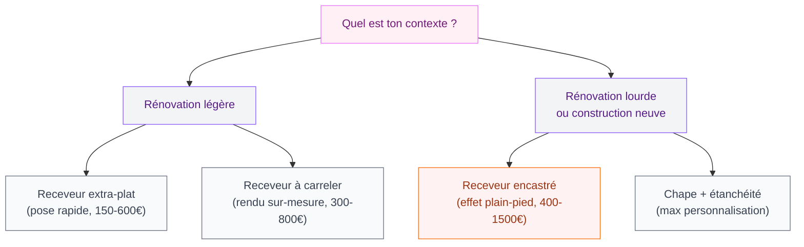
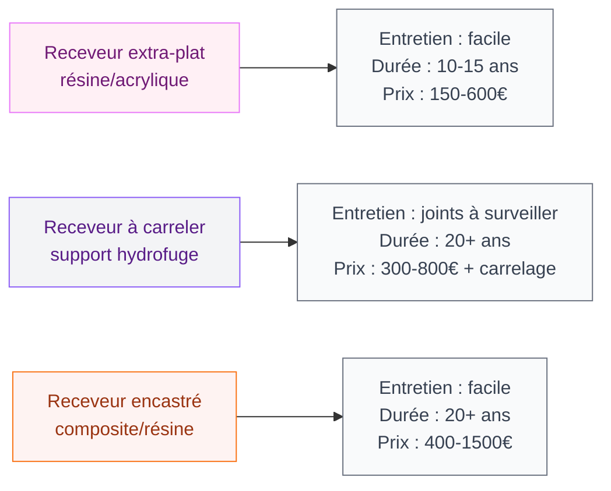

Tu veux une douche italienne et tu te retrouves face à un choix qui semble simple... mais qui ne l'est pas du tout. Receveur extra-plat, receveur à carreler, bac encastré en résine, carrelage directement au sol - les options s'accumulent et chaque vendeur te dit que "son" modèle est le meilleur. Résultat : tu tournes en rond.

Bonne nouvelle : le bon receveur, ça n'existe pas en absolu. Ça dépend de ta situation - rénovation ou construction neuve, budget, style voulu, contraintes techniques. Et c'est exactement ce qu'on va démêler ensemble dans cet article.

## C'est quoi exactement un receveur de douche italienne ?

Avant de choisir, un petit point vocabulaire parce que les termes se mélangent souvent. Une douche italienne (ou douche à l'italienne), c'est une douche sans bac apparent - le sol est au même niveau ou très légèrement en dessous du reste de la salle de bain, avec une évacuation linéaire ou centrale. L'effet visuel est fluide, continu, très épuré.

  

Le receveur de douche italienne, lui, c'est l'élément technique qui assure l'étanchéité et l'écoulement de l'eau. Même quand la douche "n'a pas l'air d'avoir de bac", il y a toujours une structure dessous qui fait le travail.

Et c'est là que les choses deviennent intéressantes : selon le type de receveur, l'installation change complètement, le rendu final aussi, et le budget - pas de la même planète non plus.

> [!NOTE]
> Une douche italienne sans receveur, ça n'existe pas vraiment. Ce qu'on appelle "douche sans bac" utilise souvent un receveur à carreler ou un système de chape hydrofuge - mais la fonction étanchéité est toujours là.

## Les 4 types de receveurs : le tour complet

  

### 1. Le receveur extra-plat : le choix rénovation

C'est le plus vendu, et pour de bonnes raisons. Un receveur extra-plat - entre 3 et 5 cm de hauteur - s'installe directement sur le sol existant sans gros travaux. Tu poses, tu raccordes, tu carrelages autour. Deux jours de chantier max.

Les matériaux ? Résine synthétique le plus souvent (Gelcoat, Stonex), parfois acrylique. Les marques comme **Jacob Delafon, Porcelanosa ou Lapeyre** proposent de bons modèles entre **200 et 600€** selon la taille. Pour un 90x90 cm basique en résine, compte 180-250€ chez Leroy Merlin ou Castorama.

Ce qu'il faut savoir avant d'acheter : l'extra-plat reste visible. Il y a une mini-rehausse au sol (3-5 cm), donc ce n'est pas une vraie douche de plain-pied. Pour l'accessibilité PMR ou si tu veux un effet vraiment "zéro seuil", ce n'est pas le bon choix.

> [!TIP]
> Tu rénoves et tu veux aller vite ? L'extra-plat 80x80 en Gelcoat type **Bac Remix chez Leroy Merlin** (autour de 149€) est une valeur sûre. Solide, facile à entretenir, ça tient 15-20 ans sans problème.

### 2. Le receveur à carreler : l'effet sur-mesure

C'est mon préféré pour les projets où le rendu visuel compte vraiment. Le principe : un support étanche (souvent en polystyrène extrudé ou en mousse hydrofuge) sur lequel tu poses directement ton carrelage. Le receveur disparaît complètement sous les carreaux - tu vois juste la bonde et le carrelage continu.

Résultat : ta douche s'intègre parfaitement au reste du sol. Si tu utilises le même carrelage que la salle de bain, l'espace semble plus grand et la séparation entre douche et reste de la pièce devient presque invisible.

Le prix d'entrée est plus élevé : compte **300 à 800€** pour le système seul (bac + bonde linéaire), plus le carrelage, plus la pose si tu ne le fais pas toi-même. Des marques comme **Wedi, Schluter (Kerdi-Shower) ou Lazer** sont les références sur ce segment.

Le gros avantage aussi : la personnalisation totale des dimensions. Tu peux faire une douche de 120x200 cm, en angle, ou d'une forme atypique. [Pour choisir le bon carrelage pour ta douche italienne](/carrelage-douche-italienne/), je t'ai fait un guide complet - l'antidérapant et le format ont une influence directe sur le confort et la sécurité.

> [!WARNING]
> Le receveur à carreler demande une pose soignée. Si l'étanchéité n'est pas parfaite (bande de doublage, étanchéité sous carrelage), tu risques des infiltrations qui passent inaperçues pendant des mois... et qui font des dégâts catastrophiques. Fais appel à un professionnel si tu n'es pas à l'aise avec la pose de carrelage en milieu humide.

### 3. Le receveur encastré en résine : la solution construction neuve

Pour les constructions neuves ou les rénovations lourdes où tu peux intervenir sur la dalle, le receveur encastré est la solution la plus aboutie. Il s'intègre dans le sol - complètement affleurant - et offre un vrai effet plain-pied.

La résine de synthèse (type minéral composite ou Quaryl) donne un toucher chaleureux, une surface antidérapante naturelle et une résistance intéressante aux chocs. Les grandes marques - **Villeroy & Boch, Duravit, Kaldewei** - proposent des modèles haut de gamme entre **400 et 1500€**.

C'est aussi le meilleur choix pour une salle de bain accessible PMR : zéro seuil, surface antidérapante, fauteuil roulant possible. Si tu projettes un aménagement qui résiste aux années, c'est l'option à regarder sérieusement.

Contrainte : il faut prévoir l'espace sous le sol pour l'encastrement. En rénovation, ça implique souvent de casser le carrelage existant et d'intervenir sur la structure - un chantier plus lourd, donc.

### 4. La douche "bac maison" : chape + étanchéité

Option pour les plus courageux (ou les amateurs de travaux) : réaliser soi-même le support avec une chape en pente (minimum 1,5% vers la bonde) + membrane d'étanchéité + carrelage. Pas de receveur acheté, tout est fait sur place par un carreleur.

Avantage : coût potentiellement réduit et liberté totale de forme. Inconvénient : c'est le système le plus complexe à bien exécuter, et les erreurs d'étanchéité ne pardonnent pas. Je te recommande cette option uniquement si tu travailles avec un professionnel expérimenté.

## Dimensions : quelle taille pour ta douche italienne ?

La question du format arrive toujours trop tard dans la réflexion. Pourtant, le choix du receveur et de sa taille conditionne le confort au quotidien.

  

**90x90 cm** : la taille minimum pour être à l'aise. Suffisant pour une personne, un peu juste à deux. Bon choix pour une petite salle de bain ou une salle d'eau.

**100x100 ou 80x120 cm** : le sweet spot confort/encombrement. Je recommande cette taille si tu as la place - ça change vraiment la sensation de la douche.

**120x80, 120x90 ou plus grand** : pour les douches "de rêve". Plus c'est grand, plus l'effet spa est présent. C'est aussi la taille qu'on retrouve dans les [douches italiennes inspirantes qu'on adore parcourir](/douches-italiennes-idees/) - les grandes surfaces avec paroi de verre, ça en jette.

**Forme** : rectangulaire reste le classique le plus facile à trouver. Mais un receveur à carreler te donne accès aux formes sur-mesure - angle de 45°, forme en L, douche d'angle.

> [!TIP]
> Si ta salle de bain fait moins de 4m2, pense au receveur quart-de-cercle. Il libère de la place dans la pièce tout en conservant une surface de douche confortable. Jacob Delafon en a des bons modèles autour de 300-450€.

## Sur le meme theme

- [douche à 1 euro](/douche-1-euro/)
- [carrelage métro salle de bain](/carrelage-metro-salle-de-bain/)

  

## Les bonnes questions avant d'acheter

  

### Ton évacuation existe déjà ou est à créer ?

Si tu rénoves et que la bonde de douche est déjà posée, le receveur extra-plat ou le receveur à carreler avec bonde centrale est la solution la plus simple. Déplacer une évacuation, c'est un chantier supplémentaire - prévoir 200 à 500€ de plomberie selon la distance.

Si tu es en construction ou rénovation lourde : profites-en pour installer une bonde linéaire (bonde de sol longue sur un côté). C'est plus design, plus facile à nettoyer, et ça facilite la pose du carrelage en pose droite.

### C'est pour toi seul ou pour la famille ?

Pour des enfants en bas âge ou des personnes âgées, le receveur antidérapant est une priorité. Les receveurs en résine composite ont souvent une surface naturellement antidérapante (classement antidérapant R10 minimum). Pour les extra-plats en acrylique, vérifie bien la norme - certains sont glissants quand ils sont mouillés.

Pour une salle de bain PMR, oriente-toi vers le receveur encastré ou le receveur à carreler avec bonde de niveau : l'accès sans seuil est la contrainte numéro 1.

### Quel entretien tu peux gérer ?

Le receveur en résine ou acrylique : facile à entretenir, un coup d'éponge suffit, mais il peut se rayer et jaunir avec le temps.

Le receveur carrelé : plus solide dans la durée, mais les joints sont à entretenir régulièrement (antimoisissures, réfection tous les 3-5 ans). Un carrelage à petits carreaux = beaucoup de joints = plus d'entretien. Mon conseil : grands formats (60x60 cm minimum) pour une douche italienne - moins de joints, plus propre visuellement.

## Budget réaliste : ce que ça coûte vraiment

Ne fais pas l'erreur de regarder uniquement le prix du receveur. Le coût total d'une douche italienne inclut :

- **Le receveur** : 150 à 1500€ selon le type
- **La bonde** : 30 à 200€ (linéaire = plus cher mais plus joli)
- **Le carrelage** (si receveur à carreler ou encastré) : 20 à 80€/m2
- **La paroi de douche** : 150 à 800€ pour une paroi fixe ou une porte coulissante
- **La pose** : 300 à 800€ pour un professionnel selon la complexité

Pour une douche italienne complète en rénovation - receveur extra-plat + paroi fixe + carrelage autour - compte un budget réaliste de **1500 à 3500€** tous travaux compris. Pour un receveur à carreler avec finition haut de gamme, tu peux monter à 5000-8000€.

Si tu envisages aussi de repenser complètement ta salle de bain, va voir l'article sur la [baignoire japonaise](/baignoire-japonaise/) - parfois la question n'est pas "quel receveur" mais "douche ou bain", et les deux peuvent cohabiter dans un espace bien pensé.

> [!IMPORTANT]
> Ne skippe pas l'étanchéité sous prétexte d'économiser 100-200€. Une infiltration non détectée peut coûter 5000 à 20000€ de réparation (parquet, plafond de l'étage dessous, structure...). C'est l'investissement le plus rentable de tout ton chantier douche.

## Receveur et style déco : trouver la cohérence

Le receveur lui-même, tu ne le vois pas ou peu - mais il conditionne ce que tu vas voir. Un receveur à carreler te donne un espace vierge pour exprimer un style fort : zellige marocain, grès cérame effet béton, carreaux de ciment...

Un receveur extra-plat en résine blanche ou grise impose une esthétique plus neutre, fonctionnelle. C'est bien pour un style épuré, scandinave ou minimaliste.

Un receveur encastré en Quaryl ou en composite pierre donne un effet premium, spa. Ça se marie très bien avec un robinet thermostatique mural et une douchette pluie - l'expérience complète.

La couleur du receveur et des joints doit être pensée avec la couleur du carrelage mural. Un receveur blanc avec des joints blancs dans une salle de bain aux carreaux gris anthracite crée une rupture visuelle. Joue la cohérence ou le contraste assumé - mais pas le "on n'y pensait pas".

## Le récap : quel receveur selon ta situation

- **Tu rénoves vite et sans gros travaux** : extra-plat en résine, 150-350€, pose en week-end
- **Tu veux un rendu sur-mesure qui s'intègre au sol** : receveur à carreler, prévoir 2-3 semaines de chantier et 600-1500€ total
- **Tu construis ou tu fais une rénovation lourde** : encastré en composite ou chape maison, budget 400-1500€ + pose
- **PMR ou zéro seuil obligatoire** : encastré ou receveur à carreler affleurant, avec bonde de niveau

La meilleure douche italienne, c'est celle qui correspond à ton chantier, ton budget et ton niveau de confort voulu. Pas la plus chère, ni la plus spectaculaire sur Instagram - la bonne pour toi.

---

## Questions fréquentes

**Peut-on poser un receveur extra-plat sans carreliste ?**
Oui, la plupart des receveurs extra-plats se posent avec un kit de pieds réglables et un joint silicone. Le raccordement à la bonde reste simple. Par contre, le carrelage autour nécessite quand même des connaissances de base.

**Quelle épaisseur minimum pour un receveur encastré ?**
Il te faut généralement 15 à 20 cm de vide technique sous le sol pour encastrer un receveur et le siphon. En rénovation sur plancher béton, c'est un vrai frein - prévois une expertise avant de te lancer.

**Receveur ou carrelage directement au sol : lequel est meilleur ?**
Carrelage directement au sol (chape + étanchéité + carreaux) donne le rendu le plus abouti mais demande une expertise pointue. Le receveur - même à carreler - offre plus de sécurité contre les infiltrations car le support est prévu à cet effet.

**Combien de temps dure un receveur de douche ?**
Un receveur en résine ou acrylique dure 10-15 ans avec un entretien régulier. Un receveur en composite minérale ou Quaryl peut tenir 25-30 ans. Le receveur à carreler, si la pose est bien faite, est quasi indéfini - tu changes les joints, pas le support.

**Existe-t-il des receveurs de douche italienne colorés ?**
Oui ! Les grandes marques proposent des couleurs - anthracite, noir mat, beige sable, terracotta. Chez Duravit, Villeroy & Boch ou Kaldewei, compte 600-1200€ pour un receveur encastré dans une teinte personnalisée. Bel effet, mais vérifie la tendance dans 10 ans...
