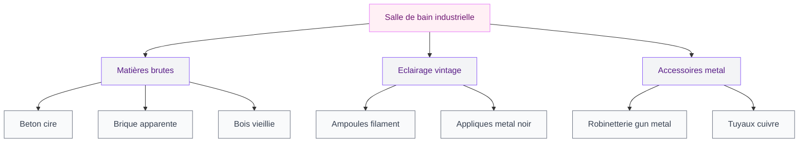
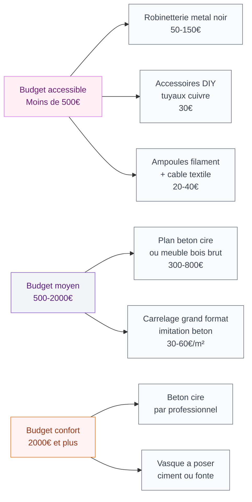

Tu rêves d'une salle de bain qui sort du lot, avec ce côté loft new-yorkais des années 90 qui mêle brut et sophistication ? Le style industriel, c'est exactement ça : des matières honnêtes, des tuyaux qu'on assume, du métal noir et du béton qu'on célèbre. Et contrairement à ce qu'on pourrait croire, ce n'est pas réservé aux grands espaces ou aux budgets XXL. Je te donne toute ma stratégie pour réussir ta salle de bain industrielle.

## Ce qui définit vraiment le style industriel

Le style industriel puise son inspiration dans les anciens entrepôts, ateliers et usines reconvertis. L'idée centrale : montrer ce qu'on cache d'habitude. Les tuyaux restent visibles, les briques s'affichent sans enduit, le métal ne cherche pas à se faire passer pour autre chose.

Ce qui rend ce style particulièrement bien adapté à la salle de bain, c'est sa compatibilité naturelle avec l'humidité. Le métal, le béton, la céramique brute - autant de matières qui vivent bien dans une pièce d'eau quand elles sont bien finies.

Les quatre piliers du style industriel en salle de bain :

- **Les matières brutes** : béton, métal oxydé ou peint, brique, bois flotté ou vieilli
- **La palette sombre** : noir mat, gris anthracite, rouille, blanc cassé comme contrepoint
- **L'éclairage vintage** : ampoules à filament, spots industriels, appliques en métal
- **Les lignes épurées** : peu de fioritures, chaque élément a une fonction visible

> [!TIP]
> Pour tester le style avant de se lancer, commence par les robinetteries et les accessoires en métal noir mat. C'est le changement avec le plus d'impact visuel pour le moins d'investissement - compte 50 à 150€ pour un ensemble robinetterie industrielle chez Leroy Merlin ou Brico Dépôt.

## Les matières à adopter (et comment les combiner)

### Le béton ciré : star incontestée

Le béton ciré est probablement la matière la plus associée au style industriel en salle de bain. Il peut habiller les murs, le sol, le plan vasque ou même une baignoire autoportante. Sa texture légèrement granuleuse et ses variations naturelles de teinte donnent immédiatement cette atmosphère d'atelier chic.

Pour un [meuble salle de bain en béton ciré](/guides/salle-de-bain/meuble-salle-de-bain-beton-cire/), tu as deux options : acheter du mobilier spécialisé (Tikamoon propose des modèles autour de 400-800€) ou faire appliquer du béton ciré sur un meuble existant par un professionnel (compter 200-400€ de main d'oeuvre). Le résultat est bluffant dans les deux cas.

Le béton ciré demande un entretien adapté : une cire protectrice à appliquer une à deux fois par an, et des produits de nettoyage neutres sans acide. Bien entretenu, il dure des décennies.

### La brique et la pierre : l'authenticité brute

Un mur en brique apparente, même un seul, transforme complètement l'ambiance. Si tu as de la chance d'avoir une vraie brique derrière tes cloisons, fais-la dégager. Sinon, les plaques de parement en brique (à partir de 25€/m² chez Castorama) donnent un résultat très convaincant.

La brique dans une salle de bain humide ? Oui, à condition de la protéger avec un hydrofuge incolore et de ventiler correctement la pièce. La brique peinte en blanc ou gris clair fonctionne aussi très bien si tu veux alléger l'ensemble.

### Le métal : l'âme du style industriel

Tuyaux en cuivre ou en acier noir apparents, robinetterie chromée mate, étagères en fer forgé, miroir cerclé de métal rouillé... Le métal est partout dans une salle de bain industrielle. La clé, c'est la cohérence de finition : choisis soit le métal noir mat, soit le cuivre/laiton brut, et tiens-toi-y sur tous les accessoires.

Le métal noir mat (ou "gun metal") donne le résultat le plus contemporain. Le cuivre apporte plus de chaleur. Les deux peuvent coexister si tu les dos bien - par exemple robinetterie cuivre + structures métal noir.

> [!NOTE]
> Les robinetteries en métal noir mat ne supportent pas les produits ménagers agressifs. Utilise uniquement de l'eau savonneuse pour les nettoyer. Certaines marques low cost voient leur finition s'écailler en 2-3 ans - investis dans du Hansgrohe ou du Jacob Delafon si tu veux que ça tienne.

### Le bois brut et vieilli

Le bois joue le rôle de contrepoint chaleureux dans un univers qui peut sinon paraître froid. Bois flotté, chêne vieilli, planches récupérées : l'aspect usé est un atout, pas un défaut. Évite le bois trop poli ou laqué - ce serait trahir l'esprit du style.

Un meuble vasque avec un plateau en chêne massif brut, c'est autour de 300-600€ chez Made.com ou La Redoute. Pour moins cher, un plateau de chêne brut sur des tréteaux en métal noir fait parfaitement l'affaire (entre 150 et 250€ pour le plateau seul chez Ikea ou chez un scieur local).

## Le plan vasque et la douche : les pièces centrales

### Vasque à poser ou semi-encastrée ?

Dans une salle de bain industrielle, la vasque à poser s'impose. Elle assume sa présence au lieu de se cacher. Les modèles en béton (300-500€ chez Allibert ou Leroy Merlin), en fonte émaillée (200-450€), ou en céramique épaisse avec une finition mate sont les plus cohérents.

Le combo gagnant : plan en béton ciré + vasque à poser ronde en ciment + robinetterie col de cygne en métal noir. C'est le classique du style industriel, et pour cause - ça marche à tous les coups.

### La douche à l'italienne dans un esprit industriel

Une [douche italienne avec carrelage sombre](/guides/salle-de-bain/carrelage-douche-italienne/) colle parfaitement au style industriel. Grand format (60x60 ou 80x80 minimum), carreaux de ciment ou imitation béton, ou même un bac à douche en résine imitant le béton.

Les parois de douche jouent aussi un rôle important. Dans l'esprit industriel, opte pour :
- Du verre clair avec profilés en métal noir (Kinedo ou Lapeyre, entre 300 et 600€)
- Une paroi fixe minimaliste plutôt qu'un espace clos
- Ou aucune paroi si la configuration le permet - la douche ouverte est très dans le ton

## L'éclairage : le détail qui change tout

Dans une salle de bain industrielle, l'éclairage est un élément décoratif à part entière. On est loin des spots encastrés anonymes.

**Les options à explorer :**

- **Appliques à cage métal** : le classique industriel, entre 40 et 120€ sur Amazon ou Maisons du Monde
- **Spots sur rail** : pratiques et stylés, permettent d'orienter la lumière selon les besoins
- **Ampoules Edison apparentes** : sur un cable tressé, sans abat-jour - effet atelier garanti
- **Miroir avec éclairage intégré** : pour compenser l'ambiance qui peut être sombre, les miroirs rétroéclairés en monture métal sont une bonne solution (Ikea Storjorm, 80€)

La règle d'or : une lumière principale d'ambiance + un éclairage dédié au miroir pour le maquillage et le rasage. Sans les deux, soit tu es dans le noir, soit tu as l'impression d'être sous un néon de bureau.

> [!WARNING]
> L'éclairage dans une salle de bain est soumis aux normes IP (indice de protection contre l'humidité). Dans les zones proches de la douche ou du bain, utilise uniquement du matériel classé IP44 minimum. Les jolis luminaires décoratifs non adaptés aux pièces humides sont dangereux - vérifie toujours l'étiquette avant d'acheter.

## Les accessoires et le rangement : l'upcycling à l'honneur

L'esprit industriel se prête à merveille au détournement d'objets. C'est d'ailleurs là que le style devient vraiment fun à décliner.

**Quelques idées concrètes :**

- Un casier d'école ou d'usine vintage comme rangement serviettes (Maisons du Monde en propose des reproductions entre 40 et 80€)
- Des tuyaux de plomberie en cuivre comme porte-serviette DIY (moins de 30€ de matériel)
- Une vieille caisse en bois ou un tiroir reconverti en étagère murale
- Des crochets en métal noir plutôt que des barres classiques (lot de 6 chez Ikea, 8€)
- Un tabouret en métal industriel type Tolix (180-250€ neuf, ou 30-60€ en chinant)

Pour les miroirs, le style industriel adore les miroirs ronds dans un cadre métal épais (type hublot de bateau), les miroirs à bords biseautés sans cadre posés sur un appui, ou les miroirs vintage récupérés. Évite les formes trop sophistiquées ou les cadres dorés qui détonneraient complètement.

## Style industriel et baignoire : un mariage possible ?

Oui, et souvent spectaculaire. Une baignoire autoportante en fonte émaillée noire ou blanche avec des pieds en métal, posée sur un sol en béton ciré ou en carreaux de ciment, c'est une image forte.

La baignoire autoportante n'est pas donnée (entre 500€ pour du bas de gamme et 2000€ pour de la vraie fonte), mais elle peut être l'élément central autour duquel tout le reste s'articule. Si tu as la place et le budget, c'est un investissement qui vaut vraiment le coup dans un intérieur industriel.

Pour les petits espaces, une [baignoire scandinave avec sa forme compacte et ses lignes épurées](/guides/salle-de-bain/baignoire-scandinave/) peut aussi s'intégrer dans un esprit industriel doux si tu misez sur des finitions mates et un environnement béton/bois.

> [!IMPORTANT]
> Une baignoire autoportante en fonte pèse entre 80 et 120 kg vide. Avant de l'installer, fais vérifier la résistance de ton plancher, particulièrement en appartement ou dans une maison ancienne. Une dalle insuffisamment renforcée peut poser des problèmes à terme.

## Les erreurs à éviter

Maintenant que tu vois les grandes lignes, quelques pièges courants à contourner :

**Trop de noir, pas assez de lumière.** Le style industriel utilise des tons sombres, certes, mais sans contre-balancer avec des sources lumineuses bien pensées et des matières qui réfléchissent la lumière (métal, miroirs), le résultat peut être oppressant. Pense à maximiser la lumière naturelle et prévois un éclairage en couches.

**Mélanger trop de styles.** Le style industriel fonctionne bien avec une touche scandinave (bois clair, plantes) ou une touche vintage (objets chinés), mais il tolère mal le romantique, le baroque ou le provençal. Sois cohérente dans tes choix.

**Négliger la ventilation.** Les matières brutes comme le béton ou la brique non protégées peuvent souffrir de l'humidité. Une bonne VMC (ventilation mécanique contrôlée) est vraiment importante dans une salle de bain industrielle. C'est moins glamour que de choisir sa robinetterie, mais c'est ce qui fait durer les matériaux.

**Acheter tout neuf.** L'esprit industriel naît souvent d'un mélange de pièces chinées et de quelques investissements ciblés. Les marchés aux puces, Leboncoin et Vinted regorgent d'accessoires parfaits : vieilles lampes d'atelier, tabourets métalliques, caisses en bois. C'est plus authentique et nettement moins cher.

> [!TIP]
> Pour un look industriel cohérent sans se ruiner, applique la règle 80/20 : 80% de ta déco dans des tons neutres (béton, gris, blanc cassé, noir) et 20% en matière contrastante (bois chaud, plante verte, serviettes colorées). Ce ratio évite la salle de bain cave tout en gardant le caractère du style.

## Par où commencer concrètement ?

Si tu pars d'une salle de bain classique et que tu veux migrer vers l'industriel sans tout casser :

1. **Première étape (moins de 200€)** : remplace la robinetterie et les accessoires (porte-papier, porte-serviette, crochets) par des modèles en métal noir mat
2. **Deuxième étape (200-500€)** : change le miroir pour un modèle rond ou rectangulaire à monture métal, et installe un ou deux luminaires de style atelier
3. **Troisième étape (500€ et plus)** : attaque les surfaces - carrelage imitation béton, peinture effet béton sur les murs, ou remplacement du meuble vasque

Si tu fais une rénovation complète, le carrelage est ton premier levier. Un [carrelage grand format pour ta douche italienne](/guides/salle-de-bain/carrelage-douche-italienne/) dans des teintes ardoise ou béton posera immédiatement les bases de l'atmosphère industrielle.

La salle de bain industrielle est l'un des styles les plus durables en déco intérieure - à la différence des tendances éphémères, il ne se démode pas. Son ancrage dans les matières authentiques lui donne une forme d'intemporalité. Et son côté DIY-friendly le rend accessible même avec un budget serré.

---

## Questions fréquentes

**Le style industriel est-il adapté aux petites salles de bain ?**
Oui, très bien. La palette de couleurs sombres peut sembler paradoxale dans un petit espace, mais elle crée une cohérence visuelle qui n'agrandit pas la pièce mais ne la rétrécit pas non plus. Mise sur des grands miroirs pour l'impression d'espace, et évite de multiplier les matières - choisis-en deux ou trois maximum.

**Peut-on mélanger style industriel et style scandinave dans une salle de bain ?**
Absolument. C'est même l'un des mélanges les plus réussis. Le bois clair scandinave apporte de la chaleur au métal et au béton industriel. Le tout forme ce qu'on appelle parfois le style "scandi-industriel" - épuré, fonctionnel, avec un côté chaleureux assumé.

**Combien coûte une salle de bain industrielle de A à Z ?**
Tout dépend de ce que tu veux refaire. Si tu gardes la plomberie existante et que tu travailles sur les finitions et la déco, compte entre 2000 et 5000€ pour une transformation sérieuse. Pour une rénovation complète avec béton ciré, douche italienne et mobilier sur mesure, le budget grimpe entre 8000 et 20 000€ selon les prestations choisies.

**Comment entretenir le béton ciré dans une salle de bain humide ?**
Nettoie avec de l'eau chaude et un peu de savon de Marseille. Applique une cire de protection spécifique une à deux fois par an selon l'usage. Évite absolument les produits acides (détartrant, vinaigre blanc) qui abîment la surface. Bien entretenu, le béton ciré dure des décennies.

**Peut-on poser du béton ciré soi-même ?**
Techniquement oui, mais c'est un matériau qui demande de la technique et de l'expérience. Les kits DIY existent (Zolpan, Weber) mais le résultat peut être décevant en cas d'erreur. Je conseille de faire appel à un professionnel pour les surfaces importantes comme le sol ou les murs, et de réserver le DIY aux petites surfaces comme le plan vasque.
