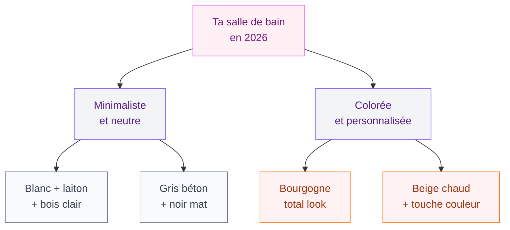
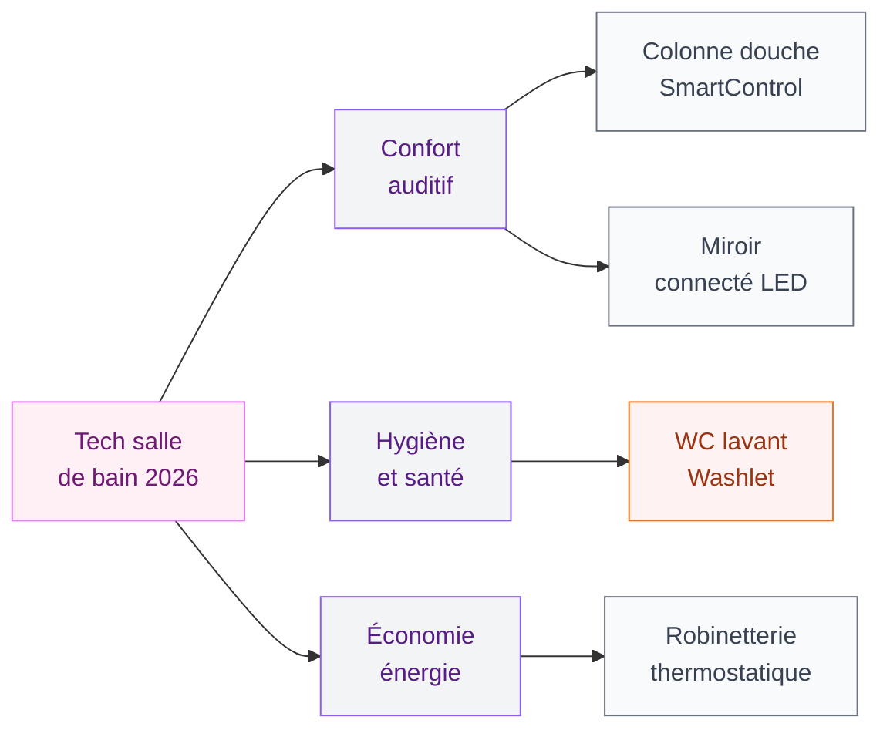
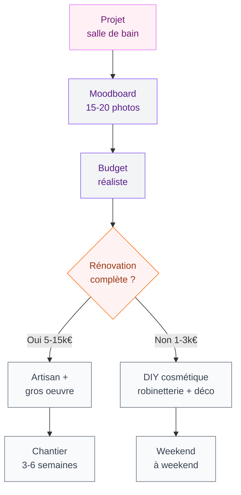

Tu as envie de refaire ta salle de bain mais tu ne sais pas trop vers quoi te tourner ? Tu veux quelque chose de beau, fonctionnel, et qui ne soit pas déjà démodé dans deux ans ? Bonne nouvelle : 2026 apporte des tendances vraiment cohérentes, des directions claires qui durent. On est loin des effets de mode qui te font regretter tes choix à la première réno.

Dans cet article, je te présente les grandes tendances de l'année, avec des exemples concrets, des marques accessibles, et les pièges à éviter. Que tu aies un budget serré ou que tu te lances dans un projet plus conséquent, tu vas repartir avec des idées précises.

## Le minimalisme luxueux : moins d'objets, plus de plaisir

C'est la tendance de fond depuis quelques années, mais en 2026 elle arrive à maturité. Le minimalisme luxueux, c'est le concept "less is more" poussé à son meilleur niveau - des lignes droites, des surfaces nettes, zéro chichis, mais avec des matériaux qui font la différence.

  

Concrètement, ça veut dire quoi ? Un meuble vasque suspendu plutôt qu'un meuble posé au sol (ça dégage le sol visuellement, c'est magique). Des robinets à col de cygne en laiton brossé plutôt qu'en chrome standard. Un miroir sans cadre ou avec un cadre minimaliste en métal noir mat.

Pour les budgets variés :
- **Ikea Godmorgon** : meuble vasque suspendu à partir de 249 €, propre et moderne
- **AM.PM (La Redoute)** : robinetterie tendance autour de 150-300 €
- **Jacob Delafon Vivienne Signature** en laiton brossé : vers 400-600 €, ça fait vraiment l'effet

> [!TIP]
> Si tu ne peux changer qu'une seule chose dans ta salle de bain, change ta robinetterie. Un mitigeur en laiton brossé ou en noir mat sur un lavabo existant, c'est 200-400 € et ça transforme complètement l'espace.

Le truc qui fait la différence dans cette approche, c'est la cohérence. Tu choisis une finition (noir mat, laiton brossé, chrome satiné) et tu t'y tiens pour tous les accessoires - porte-serviettes, distributeur de savon, crochets. Trust me, la cohérence des métaux c'est 80 % du résultat final.

## Bourgogne et beige chaud : les couleurs de l'année

En 2026, les blancs immaculés cèdent la place à des teintes plus riches et plus sensuelles. Le bourgogne s'impose comme LA couleur tendance des salles de bains haut de gamme. C'est profond, enveloppant, ça crée une atmosphère presque cocoon - un peu comme une suite d'hôtel à Milan.

  

Mais attention, le bourgogne ça s'utilise avec intelligence. Voici deux approches qui fonctionnent :

**Le total look bourgogne** : carrelage mural, faïence, meuble dans la même palette. Audacieux, mais ça crée une pièce à part entière avec une vraie personnalité.

**La touche bourgogne** : un mur accent en peinture à effet chaux (effet tendance cette année), des serviettes et accessoires dans ces tons, et le reste en beige chaud ou pierre naturelle. C'est plus accessible et ça passe toujours.

Le beige chaud et les tons sable reviennent aussi en force - pas le beige fade des années 2000, mais des beiges riches, chaleureux, proches de la terracotta ou du lin naturel.

> [!NOTE]
> La peinture à effet chaux (limewash) est une tendance forte de 2026. Elle donne une texture mate et organique aux murs, très différent du carrelage classique. Marque à regarder : Ressource Peintures avec ses pigments naturels, ou V33 Rénovation pour un budget plus accessible.

## Matières nobles : marbre, béton ciré, pierre

Les matériaux naturels et nobles ont le vent en poupe. Marbre, pierre, béton ciré - ces trois-là dominent les tendances 2026, chacun avec son caractère propre.

  

**Le marbre** reste une valeur sûre. Blanc avec des veines grises ou noires pour le classique, mais en 2026 on voit aussi du marbre vert, du marbre nude avec des veines dorées. Si le vrai marbre dépasse ton budget, les grandes marques de carrelage comme Porcelanosa ou Marazzi proposent des faïences effet marbre vraiment convaincantes entre 40 et 80 € le m2.

**Le béton ciré** continue sa progression. Il convient parfaitement aux vasques, aux meubles et aux murs. L'avantage : il s'applique sur n'importe quelle surface existante, ce qui en fait une option rénovation intéressante. Compte 80-150 € le m2 en incluant la main d'oeuvre. Si tu veux te lancer en DIY, des kits Béton Ciré Leroy Merlin existent autour de 50-80 € pour une petite surface - je te montre comment faire dans notre guide sur les [meubles salle de bain en béton ciré](/meuble-salle-de-bain-beton-cire/).

**La pierre naturelle** (ardoise, travertin, calcaire) apporte une texture authentique qu'aucune imitation ne remplace vraiment. Elle demande un entretien régulier (une imprégnation par an), mais le rendu est incomparable.

## Douche italienne : le choix moderne numéro un

Si tu planifies une rénovation et que tu te demandes entre baignoire et douche à l'italienne, la tendance est claire : la douche italienne a quasiment gagné la bataille. Elle agrandit visuellement l'espace, facilite l'entretien, et correspond mieux aux usages actuels.

  

En 2026, les douches italiennes se déclinent avec des carrelages de grand format (60x120 ou même 120x120 cm) pour minimiser les joints et créer une surface propre et continue. Les receveurs à siphon linéaire (la barre d'évacuation sur le côté plutôt que la bonde centrale) sont aussi très tendance - plus propre visuellement.

Pour les carrelages de douche italienne, les tendances pointent vers :
- Les carrelages effet pierre naturelle en 60x120
- Les zelliges manuels marocains pour un look plus artisanal
- Le carrelage blanc brillant en format rectangulaire "métro" pour un style intemporel

Pour entrer dans les détails des choix de carrelage, j'ai écrit un guide complet sur le [carrelage pour douche italienne](/carrelage-douche-italienne/) avec les prix et les pièges à éviter.

> [!WARNING]
> Pour une douche italienne, ne lésine pas sur l'étanchéité. Une bonne membrane d'étanchéité (Schluter Kerdi ou Mapei) c'est 200-400 € de matériau supplémentaire, mais ça peut t'éviter des dégâts des eaux catastrophiques. C'est le poste où tu ne dois vraiment pas chercher à économiser.

## La tech intelligente sans se compliquer la vie

2026, c'est aussi l'année où la tech dans la salle de bain devient vraiment accessible - et pas juste un gadget de show-off. Quelques exemples concrets qui apportent un vrai confort au quotidien :

  

**Les colonnes de douche à mémoire** comme la Grohe Euphoria SmartControl (autour de 800-1200 €) mémorisent tes préférences de débit et de température. Ça paraît anodin, mais quand tu te lèves les yeux à 7h du matin et que ta douche est parfaite du premier coup...

**Les miroirs connectés** avec éclairage LED intégré et dimmable. Certains intègrent aussi un antibuée. Marque à regarder : Roca, Villeroy & Boch, ou même des marques comme Bticino pour les miroirs antibuée seuls (80-200 €).

**Les WC lavants** (Washlets japonais style Toto, ou plus accessible la marque Geberit) arrivent enfin en France. Hygiéniques, économiques en papier WC - les Japonais ont raison depuis 30 ans.

Pour les équipements plus exotiques comme la baignoire japonaise (encastrée, profonde, rituels de bain asiatiques), j'ai un guide dédié sur la [baignoire japonaise](/baignoire-japonaise/) si tu es curieuse.

## Le style industriel : quand l'usine devient chic

Ça peut sembler paradoxal dans un contexte où tout le monde parle de chaleur et de matériaux nobles, mais le style industriel garde une vraie place en 2026 - surtout dans les lofts et les appartements avec du cachet.

Ce style se caractérise par : du métal noir mat (tubulures apparentes, radiateurs sèche-serviettes en acier noir), du béton ou de la pierre brute, des carrelages métro blancs, et beaucoup de verre. Le tout avec un éclairage de type ampoules filament Edison.

Pour en savoir plus sur ce style et comment le décliner chez toi, le guide [salle de bain industrielle](/salle-de-bain-industrielle/) couvre tous les détails - avec des exemples à différents budgets.

> [!TIP]
> Le secret pour que le style industriel ne soit pas trop froid : ajouter des éléments naturels (plantes, bois brut, serviettes en coton écru). Le contraste métal froid + matière naturelle chaude, c'est ce qui rend ce style vivable au quotidien.

## Maximalisme assumé : la tendance moins sage

À l'opposé du minimalisme, le maximalisme fait son grand retour en 2026. Ça plaît surtout à celles qui s'ennuient avec les salles de bain toutes blanches et qui veulent une pièce vraiment personnelle.

Le maximalisme version salle de bain, ça veut dire : mélanges de motifs (carreaux de ciment floraux + faïence unie), mix de couleurs vives assumées, accessoires ornementaux, plantes en quantité, collection d'objets voyage...

Ce n'est pas le style le plus facile à réussir, mais quand c'est bien fait, le résultat est un espace unique et vraiment personnel. La règle d'or : choisir quand même une palette de 3 couleurs maximum et l'appliquer à tout, sinon ça part vite dans le chaos.

> [!IMPORTANT]
> Avant toute rénovation de salle de bain, prends le temps de comparer au moins 3 devis d'artisans qualifiés. Les écarts de prix peuvent aller du simple au double pour un travail équivalent. Demande toujours à voir des réalisations récentes et contacte des anciens clients.

## Par où commencer concrètement ?

Tu as l'inspiration, mais comment passer à l'action ? Ma méthode en trois étapes :

**Étape 1 - Le moodboard** : collecte 15-20 photos qui te plaisent sur Pinterest ou Houzz. Mets-les côte à côte. Tu vas naturellement voir des patterns se dégager - les couleurs qui reviennent, les styles qui dominent. Ça te donne ta direction sans avoir à choisir dans le vide.

**Étape 2 - Le budget réel** : une rénovation salle de bain complète, c'est en moyenne 5 000-15 000 € selon la taille et le niveau de finitions. Une rénovation cosmétique (peinture + robinetterie + accessoires sans toucher au gros oeuvre), c'est 1 000-3 000 €. Sois honnête avec toi-même sur l'enveloppe disponible avant de tomber amoureuse d'un projet hors budget.

**Étape 3 - Le diagnostic technique** : avant de choisir quoi que ce soit d'esthétique, vérifie l'état de tes installations (plomberie, étanchéité, ventilation). Une belle salle de bain sur une plomberie vétuste, c'est des problèmes garantis dans deux ans.

## Ce que tu dois retenir

2026, c'est une année de contrastes assumés : minimalisme luxueux d'un côté, maximalisme personnel de l'autre. Couleurs profondes (bourgogne, terracotta) qui cohabitent avec des palettes neutres chaleureuses. Tech intelligente qui se fait discrète mais apporte un vrai confort. Et des matériaux naturels nobles qui dominent clairement le marché.

Ce qui ne change pas : la qualité de l'exécution. Une bonne étanchéité, une ventilation qui fonctionne, une plomberie solide - c'est ça la base sur laquelle tu construis tout le reste. Le reste, c'est de la décoration, et la décoration ça se change.

La salle de bain idéale en 2026, c'est celle qui te ressemble vraiment. Pas celle du Pinterest de quelqu'un d'autre.

---

## Sur le meme theme

- [plantes salle de bains](/plantes-salle-de-bains/)

## FAQ

**Quelle est la tendance couleur principale pour les salles de bains en 2026 ?**
Le bourgogne (bordeaux profond) s'impose comme la couleur tendance des salles de bains haut de gamme en 2026. Il se combine très bien avec des tons sable, beige chaud et des textures en pierre naturelle. Pour une approche plus accessible, une touche de bourgogne via les accessoires et serviettes suffit à donner le ton.

**Vaut-il mieux installer une douche italienne ou garder une baignoire en 2026 ?**
La douche italienne est le choix dominant en 2026, en particulier dans les surfaces moyennes. Elle agrandit l'espace visuellement, facilite l'entretien et correspond aux usages quotidiens. La baignoire reste pertinente si tu l'utilises vraiment, ou dans le cadre d'une grande salle de bain parentale où tu peux avoir les deux.

**Quel budget prévoir pour une rénovation salle de bain moderne en 2026 ?**
Une rénovation cosmétique (robinetterie, peinture, accessoires) : 1 000-3 000 €. Une rénovation partielle (carrelage + équipements sans toucher à la structure) : 3 000-7 000 €. Une rénovation complète avec refonte de la plomberie et nouveau carrelage : 8 000-15 000 € selon la taille et les finitions.

**Comment incorporer la technologie dans une salle de bain moderne sans budget excessif ?**
Commence par un miroir LED avec antibuée (80-200 €), c'est le rapport qualité-impact le plus fort. Ensuite une robinetterie thermostatique (200-400 €) qui mémorise ta température. La colonne de douche connectée et le WC lavant sont des investissements plus conséquents (800-2 000 €) à prévoir lors d'une rénovation plus complète.

**Le style industriel est-il toujours tendance en 2026 ?**
Oui, le style industriel reste pertinent en 2026, surtout dans les appartements avec du cachet ou les lofts. La clé est d'adoucir le côté froid avec des éléments naturels (bois, plantes, textiles). Le métal noir mat, les carreaux métro blancs et le béton brut sont ses marqueurs principaux.
