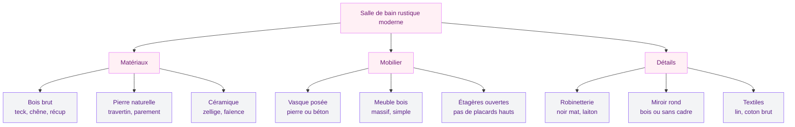
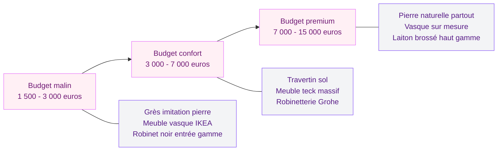

Tu adores le charme brut d'un vieux chalet de montagne, mais tu n'as aucune envie de vivre dans un musée de la ruralité ? Bonne nouvelle : la salle de bain rustique moderne, c'est exactement ce mélange entre la chaleur des matériaux naturels et la simplicité du design contemporain. Bois patiné, pierre calcaire, robinetterie noire mate, et boom - tu obtiens un espace qui a de l'âme sans paraître dépassé.

Dans cet article, je te montre comment créer une salle de bain qui sent la campagne chic sans tomber dans le cliché. Matériaux, couleurs, vasques, rangements, budget : on passe tout en revue.

## Pourquoi le style rustique moderne fonctionne si bien dans la salle de bain

La salle de bain, c'est la pièce où tu commences et termines ta journée. Et entre nous, il n'y a rien de plus apaisant qu'un espace qui mêle textures naturelles et lignes nettes. Le style rustique moderne joue là-dessus : il crée une atmosphère organique tout en restant fonctionnel.

  

Ce qui rend cette approche si séduisante, c'est l'équilibre. Tu gardes l'imperfection assumée du bois brut, l'irrégularité de la pierre naturelle, et tu poses ça à côté d'une vasque géométrique ou d'un miroir sans cadre. Le contraste est doux, jamais forcé.

En pratique, une salle de bain rustique moderne repose sur trois piliers :

- **Des matériaux naturels authentiques** (bois, pierre, céramique artisanale)
- **Des lignes épurées et un mobilier simple** (pas de fioritures)
- **Une palette de couleurs ancrée dans la nature** (tons chauds, neutres, terreux)

> [!NOTE]
> Ce style s'adapte aussi bien aux grandes salles de bain qu'aux petits espaces. Un mur en pierre, un meuble vasque en bois et un robinet noir suffisent à poser l'ambiance dans 5 m2.

## Les matériaux qui définissent le look rustique moderne

  

### Le bois : l'âme de la pièce

Impossible de parler de rustique sans parler de bois. Mais attention, on ne parle pas de lambris vernis des années 80. En 2026, le bois dans la salle de bain se veut brut, naturel, et traité pour résister à l'humidité.

Les essences qui marchent le mieux :

- **Le teck** : résistant à l'eau par nature, idéal pour les meubles vasque et les caillebotis de douche. Comptez 350 a 800 euros pour un meuble vasque en teck massif chez des marques comme Tikamoon ou Koh-I-Noor.
- **Le chêne huilé** : plus accessible, il apporte une couleur blonde dorée très chaleureuse. Un plan vasque en chêne chez Leroy Merlin tourne autour de 120-250 euros.
- **Le bois de récupération** : poutres anciennes, planches de grange, vieux parquet - recyclé et fixé au mur en bardage, l'effet est spectaculaire. Chez des fournisseurs comme BoisChic, les planches murales démarrent à 30 euros le m2.

> [!TIP]
> Pour protéger le bois dans une salle de bain sans perdre l'aspect naturel, utilise une huile dure (type Osmo ou Rubio Monocoat). Elle pénètre les fibres au lieu de créer un film brillant, et le rendu reste mat et authentique.

### La pierre naturelle et ses alternatives

La pierre, c'est le deuxième pilier. Un mur en pierre de parement, un sol en travertin, ou une vasque taillée dans un bloc de marbre vieilli - chaque option apporte ce côté brut et intemporel qui caractérise le style.

Les options concrètes :

- **Pierre de parement** : plaquettes à coller sur un mur existant, entre 25 et 60 euros le m2 chez Castorama ou Leroy Merlin
- **Travertin** : carrelage en pierre naturelle au fini usé, parfait pour le sol (40-80 euros le m2)
- **Grès cérame imitation pierre** : l'alternative budget qui imite la pierre à la perfection, à partir de 15 euros le m2

Pour le sol, le [carrelage de douche italienne](/carrelage-douche-italienne/) en grès cérame effet pierre est un choix solide qui combine esthétique rustique et facilité d'entretien.

### La céramique artisanale

Les carreaux faits main - type zellige marocain ou faïence à bords irréguliers - apportent ce petit grain de folie qui empêche l'espace d'être trop sage. Un crédence en zellige blanc ou vert sauge derrière la vasque, et ta salle de bain prend immédiatement du caractère.

Le zellige, c'est entre 80 et 150 euros le m2 posé. Si le budget coince, les carrelages imitation zellige chez Saint Maclou ou Lapeyre offrent un rendu honnête pour 25-40 euros le m2.

## La palette de couleurs idéale

Le rustique moderne ne crie pas. Il murmure. Les couleurs restent douces, terreuses, et proches de ce qu'on trouverait en balade en forêt ou dans un jardin à la fin de l'été.

  

Quelques combinaisons qui marchent à tous les coups :

- **Blanc cassé + bois naturel + noir mat** : le trio classique du rustique contemporain
- **Beige sable + terracotta + laiton brossé** : plus chaleureux, ambiance méditerranéenne
- **Gris perle + chêne fumé + vert sauge** : subtil et apaisant, idéal pour les petites salles de bain

Pour les murs, la peinture à la chaux donne un fini légèrement texturé qui colle parfaitement au style. La [décoration shabby chic](/decoration-shabby-chic-idees-et-photos-de-style-et-de-decoration/) partage d'ailleurs cet amour des finitions patinées et des teintes poudrées.

## Les éléments clés à choisir

  

### La vasque : entre caractère et sobriété

La vasque donne le ton de toute la salle de bain. En rustique moderne, on préfère les formes organiques ou les matériaux bruts :

- **Vasque en pierre naturelle** (100-400 euros) : ronde, posée sur un plan en bois, elle crée un point focal immédiat
- **Vasque en béton ciré** (150-350 euros) : texture minérale et forme géométrique, l'alliance parfaite entre brut et design. Les [meubles en béton ciré](/meuble-salle-de-bain-beton-cire/) sont d'ailleurs une tendance forte du moment.
- **Vasque en céramique mate** (60-200 euros) : la valeur sure, en finition mate blanche ou colorée

### La robinetterie : le détail qui change tout

Un robinet, ça paraît anodin. Pourtant, c'est lui qui peut faire basculer ta salle de bain du côté moderne ou du côté rustique - ou des deux à la fois.

Les finitions qui collent au style :

- **Noir mat** : le choix le plus populaire en 2026, épuré et graphique
- **Laiton brossé** : apporte de la chaleur et rappelle les anciennes fontaines
- **Bronze vieilli** : pour un côté plus fermement ancré dans le rustique

Chez Grohe, la gamme Essence en noir mat démarre à 180 euros. Pour du laiton, regarde du côté de Paffoni ou Rustik Brass - des modèles entre 120 et 300 euros selon la finition.

### Le miroir : rond ou organique

Oublie le miroir rectangulaire standard. En rustique moderne, on préfère :

- Les miroirs ronds encadrés de bois brut ou de corde
- Les miroirs ovales sans cadre (minimalisme pur)
- Les miroirs avec étagère intégrée en chêne massif

Un miroir rond en bois de manguier chez Maisons du Monde coûte entre 60 et 120 euros.

## Les rangements : visibles et organisés

Dans une salle de bain rustique moderne, on montre plutôt qu'on cache. Les étagères ouvertes en bois massif remplacent les placards fermés. Les paniers en osier ou en jute servent de rangement pour les serviettes. Les pots en grès accueillent brosses et accessoires.

  

Quelques idées concrètes :

- **Échelle porte-serviettes en bois** : posée contre le mur, elle sert de rangement déco (30-70 euros chez IKEA ou Maisons du Monde)
- **Étagères murales en chêne** : 2 ou 3 tablettes fixées avec des équerres en métal noir (DIY pour 40-60 euros)
- **Panier en rotin ou jute** : glissé sous le meuble vasque pour le linge (15-30 euros)

> [!WARNING]
> Les étagères ouvertes dans la salle de bain, c'est beau, mais ça demande de la discipline. Si tu accumules les flacons en vrac, l'effet rustique chic disparaît vite. Limite-toi à 3-4 objets par étagère et range le reste dans des paniers.

## L'éclairage qui sublime l'ambiance

L'éclairage fait ou défait une ambiance rustique. Oublie les spots encastrés froids et les néons : ici, on veut de la lumière douce et chaude.

Les bonnes options :

- **Appliques murales en métal noir ou laiton** avec ampoules apparentes style Edison (2700K pour une lumière chaude dorée)
- **Suspension en rotin ou en corde** au-dessus de la baignoire pour un accent naturel
- **Bandeau LED en température chaude** (2700-3000K) derrière le miroir pour un éclairage fonctionnel discret

Si ta salle de bain a la chance d'avoir une fenêtre, exploite la lumière naturelle au maximum. Un store en lin plutôt qu'un rideau occultant laissera filtrer cette lumière douce qui met en valeur les textures du bois et de la pierre.

Pour aller plus loin sur les stratégies d'éclairage, le guide sur la [baignoire scandinave](/baignoire-scandinave/) aborde aussi l'importance de la lumière dans les salles de bain à ambiance naturelle.

## Budget : combien ça coûte une salle de bain rustique moderne ?

Soyons clairs : le style rustique moderne peut être accessible ou très haut de gamme, tout dépend des matériaux que tu choisis.

**Astuces pour réduire le budget sans sacrifier le style :**

- Choisis un seul mur d'accent en pierre de parement et peins les autres à la chaux
- Opte pour un grès cérame imitation bois au sol (20-35 euros le m2 vs 50-80 euros pour du vrai bois)
- Récupère du bois de palette ou de chantier pour fabriquer un cadre de miroir ou une étagère
- Achète la robinetterie en ligne (les prix en magasin sont souvent 30 à 40 % plus chers)

> [!TIP]
> Le plus gros impact visuel dans une salle de bain rustique, c'est le meuble vasque. Si tu dois concentrer ton budget sur un seul élément, mets-le là. Un beau meuble en bois massif avec une vasque posée transforme immédiatement l'espace.

## Cinq erreurs à éviter

1. **Trop de bois partout** : le bois du sol au plafond donne un effet sauna. Alterne avec la pierre, le béton ciré ou la peinture pour créer du contraste.

2. **Choisir des matériaux non adaptés à l'humidité** : le bois non traité pourrit, la pierre poreuse tache. Vérifie toujours que les matériaux sont adaptés à la salle de bain ou correctement traités.

3. **Négliger la ventilation** : les matériaux naturels absorbent l'humidité. Sans une bonne VMC ou une fenêtre, tu risques des moisissures - et les moisissures sur du bois brut, c'est un cauchemar à traiter.

4. **Surcharger la déco** : le rustique moderne est un style épuré. Trois beaux objets bien placés valent mieux que dix babioles qui encombrent.

5. **Ignorer le confort au sol** : le carrelage en pierre naturelle peut être froid sous les pieds. Prévois un tapis de bain en coton épais ou installe un plancher chauffant si ton budget le permet.

## Sur le meme theme

- [carrelage métro salle de bain](/carrelage-metro-salle-de-bain/)

## FAQ

### Quel bois choisir pour une salle de bain rustique ?

Le teck est le meilleur choix : il résiste naturellement à l'humidité grâce à sa forte teneur en huiles naturelles. Le chêne massif fonctionne aussi, à condition de le traiter avec une huile hydrofuge tous les 1 à 2 ans. Évite le pin ou le sapin qui gonflent et se déforment vite dans un environnement humide.

### Comment protéger la pierre naturelle dans la salle de bain ?

Applique un hydrofuge oléofuge après la pose, puis renouvelle le traitement une fois par an. Le travertin et le marbre sont poreux et tachent facilement au contact du savon ou du calcaire. Un produit comme Lithofin MN Protection ou HG Protecteur coûte entre 15 et 25 euros et protège environ 10 m2.

### Est-ce que le style rustique moderne est adapté à une petite salle de bain ?

Absolument. Dans un petit espace, concentre-toi sur un ou deux éléments forts : un meuble vasque en bois massif avec une vasque posée en pierre, et un miroir rond. Le reste peut rester sobre - murs blancs ou beige clair, robinetterie noire mate, un panier en osier. L'effet est immédiat sans alourdir l'espace.

### Quel carrelage pour une salle de bain rustique moderne ?

Le grès cérame imitation pierre (travertin, ardoise, calcaire) est le meilleur compromis entre esthétique rustique et praticité. Il est imperméable, résistant, facile à nettoyer, et disponible à partir de 15 euros le m2. Pour les murs, les carreaux de zellige ou de faïence à bords irréguliers apportent une touche artisanale très réussie.

### Comment mixer rustique et moderne sans que ça jure ?

La règle simple : 60 % de moderne (lignes droites, surfaces lisses, couleurs neutres) et 40 % de rustique (bois brut, pierre, textiles naturels). Ne mélange jamais plus de deux ou trois matériaux naturels différents dans la même pièce. Et garde une cohérence dans la finition des métaux : tout en noir mat, ou tout en laiton, mais pas les deux.
