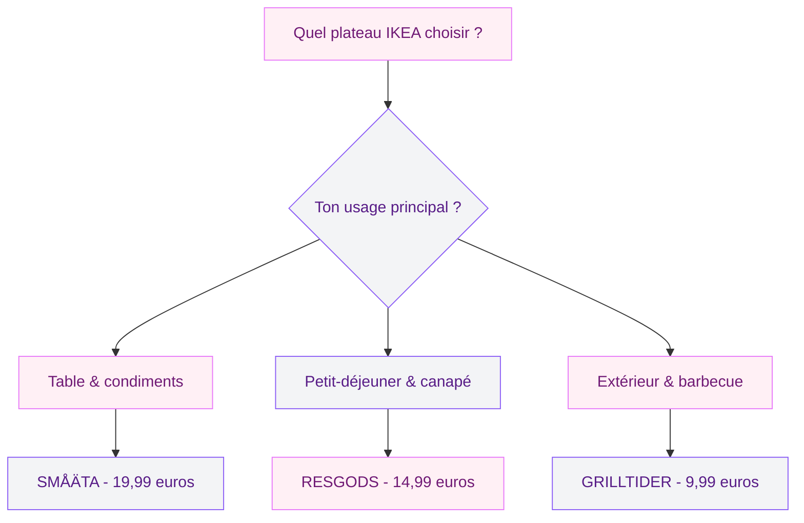
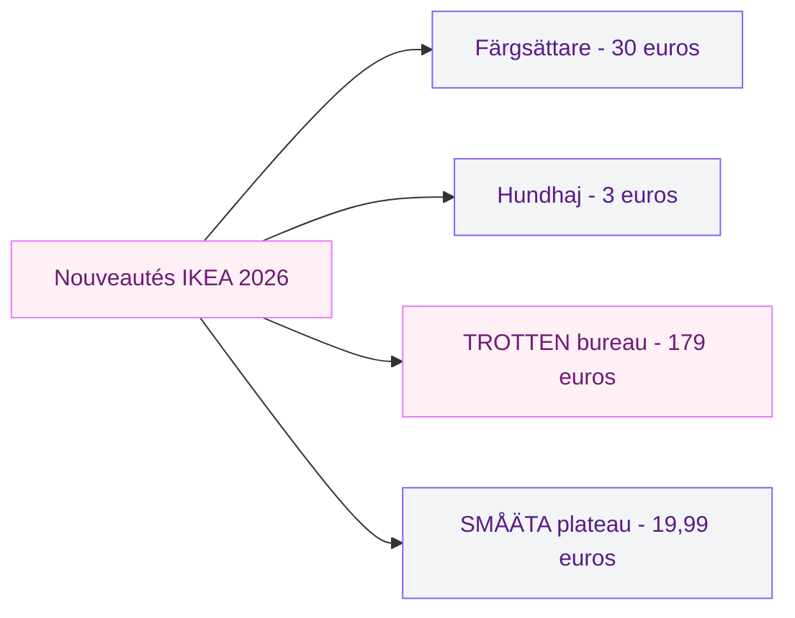

Si tu as mis les pieds dans un IKEA ces dernières semaines, tu as surement remarqué la même chose que moi : les plateaux multifonction partent à une vitesse dingue. Les bacs sont vides, les gens se les arrachent, et sur les réseaux sociaux c'est la déferlante. Alors qu'est-ce qui rend ces plateaux si spéciaux ? Et surtout, lequel choisir selon tes besoins ?

Je me suis penchée sur la question et j'ai testé les trois modèles stars de cette saison. Voici mon verdict complet, avec des prix, des comparatifs et surtout 8 façons concrètes de les utiliser chez toi au quotidien.

## Les 3 plateaux IKEA qui font le buzz

Tous les plateaux IKEA ne se valent pas - loin de là. Cette saison, trois modèles se détachent nettement du lot et concentrent l'essentiel de l'engouement.

### SMÅÄTA - le plateau tournant en acacia

C'est LE modèle dont tout le monde parle. Le SMÅÄTA est un plateau tournant de 42 cm de diamètre en placage d'acacia, monté sur un cadre en métal noir mat. Son look est à la fois brut et raffiné - il a ce côté bistrot parisien qui plait beaucoup en ce moment. Prix : environ 19,99 euros.

Ce qui le rend aussi populaire, c'est sa polyvalence. Il tourne, donc tu peux l'utiliser comme un lazy Susan au centre de ta table pour les condiments et les sauces. Mais il a aussi assez de caractère pour servir de plateau décoratif sur un îlot de cuisine ou même sur une table basse de salon.

Le placage d'acacia lui donne un grain chaud et visible, et le cadre métal noir apporte cette touche moderne qui évite le côté "plateau de mamie". C'est un objet qui fait la transition entre cuisine et déco sans effort.

> [!TIP]
> Le SMÅÄTA tourne mieux quand il n'est pas surchargé. Limite-toi à 4-5 éléments dessus maximum pour que la rotation reste fluide et que l'ensemble garde un aspect soigné.

### RESGODS - le plateau de lit en bambou

Le RESGODS, c'est le classique plateau petit-déjeuner au lit, version IKEA. Fabriqué en bambou, il est léger, solide et il a des pieds dépliables qui le transforment en mini-table. Prix : environ 14,99 euros.

Le bambou est une matière qui plait beaucoup cette année - c'est durable, éco-responsable et ça a un rendu naturel très agréable. Le RESGODS n'est pas le plus design de la gamme, mais il remplit parfaitement sa mission : te permettre de boire ton café au lit sans renverser tout sur la couette.

Et au-delà du petit-déjeuner, il se révèle très utile comme support pour laptop sur le canapé, comme tablette pour un plateau-repas devant un film, ou même comme support pour le dessin ou la lecture en position allongée.

### GRILLTIDER - le plateau extérieur en inox

Celui-là, on en parle moins mais c'est mon coup de coeur. Le GRILLTIDER est un plateau en acier inoxydable de 40x30 cm, conçu à la base pour le barbecue et l'extérieur. Prix : environ 9,99 euros.

L'inox le rend quasi indestructible : il ne craint pas l'eau, pas la chaleur, pas les taches. Tu peux poser un plat brulant dessus sans sourciller. Pour l'été et les repas en terrasse, c'est un outil génial qui sert à la fois de plateau de service et de dessous de plat géant.

Son format 40x30 cm est pile la bonne taille : assez grand pour transporter verres et assiettes en un voyage, assez compact pour ne pas encombrer la table une fois posé.

> [!NOTE]
> L'acier inoxydable du GRILLTIDER peut avoir des micro-rayures avec le temps, surtout si tu poses des plats en fonte dessus. Ça n'affecte pas du tout sa solidité - c'est purement esthétique et ça lui donne même un côté patiné assez sympa.

## Comparatif rapide : quel plateau pour quel usage ?

Pour t'aider à choisir, voici un récapitulatif clair des trois modèles.

| Critère | SMÅÄTA | RESGODS | GRILLTIDER |
|---|---|---|---|
| Prix | 19,99 euros | 14,99 euros | 9,99 euros |
| Matière | Acacia + métal noir | Bambou | Acier inoxydable |
| Dimensions | 42 cm (rond) | environ 52x33 cm | 40x30 cm |
| Poids | Moyen | Léger | Moyen |
| Tournant | Oui | Non | Non |
| Extérieur | Non | Non | Oui |
| Lave-vaisselle | Non | Non | Oui |
| Meilleur pour | Repas, îlot, déco | Lit, canapé, laptop | Terrasse, barbecue, cuisine |

## 8 façons d'utiliser un plateau multifonction au quotidien

Un plateau, ça semble basique. Mais une fois que tu commences à en avoir un bon, tu te demandes comment tu faisais avant. Voici 8 usages concrets testés et approuvés.

### 1. Station condiments au centre de la table

Le SMÅÄTA est parfait pour ça. Tu poses huile d'olive, sel, poivre, moutarde, serviettes et tout le monde se sert en faisant tourner le plateau. Fini les "tu me passes le sel ?" pendant le diner. Si tu cherches des idées pour mieux organiser ta cuisine au passage, regarde notre guide sur [l'organisation des armoires de cuisine](/guides/cuisine/organisation-armoire-cuisine/) - ça va de pair.

### 2. Plateau petit-déjeuner au lit (le classique)

Le RESGODS est fait pour ça. Café, tartines, yaourt, jus d'orange - tout tient sans glisser grâce au rebord léger du plateau. Les pieds dépliables stabilisent le tout sur la couette. Le dimanche matin, c'est un petit bonheur simple qui change la journée.

### 3. Plateau apéritif pour recevoir

Le GRILLTIDER en inox fait un plateau apéritif très chic quand tu reçois. Pose dessus quelques verrines, des tranches de fromage, des olives, des crackers - c'est sobre, propre et moderne. Et comme il passe au lave-vaisselle, le nettoyage après est zéro effort.

### 4. Mini-bureau sur le canapé

Le RESGODS se transforme en mini-bureau improvisé quand tu veux bosser depuis le canapé. Le laptop se pose bien, les pieds gardent le plateau stable sur tes genoux ou sur les coussins. C'est beaucoup plus confortable qu'un ordinateur posé directement sur les jambes (et ça évite la surchauffe du laptop en prime).

### 5. Plateau tournant décoratif sur un îlot

Le SMÅÄTA, quand il n'est pas en service à table, fait un très bel objet déco sur un îlot de cuisine ou un comptoir. Pose dessus une bougie, un petit vase avec une branche d'eucalyptus et un pot à sel en céramique - tu obtiens une vignette déco qui a de l'allure. Ça rappelle ce qu'on fait dans les salons, si ça t'inspire regarde notre article sur la [décoration de petits salons](/guides/decoration/decoration-petit-salon/).

### 6. Dessous de plat géant en terrasse

Le GRILLTIDER en inox supporte la chaleur sans broncher. Tu sors un gratin du four, tu le poses directement sur le plateau au centre de la table du jardin - pas besoin de chercher un dessous de plat. C'est aussi pratique près du barbecue pour poser les viandes en attente ou les accompagnements.

### 7. Organiseur de salle de bain

Un plateau sur une commode de salle de bain, c'est un classique déco qui fonctionne toujours. Le SMÅÄTA (grâce à sa forme ronde) ou le GRILLTIDER (pour son côté minimaliste) regroupent parfums, bijoux, crèmes et bougies en un seul endroit au lieu de les laisser trainer partout.

### 8. Présentoir cuisine ouverte

Si tu as une cuisine ouverte sur le salon, un plateau bien garni fait office de tampon visuel entre l'espace cuisine et l'espace vie. Un SMÅÄTA avec de belles huiles, du vinaigre dans une jolie bouteille et des herbes fraiches dans un petit pot, ça donne un côté authentique et chic. Tu trouveras d'autres inspirations dans notre guide sur la [décoration de cuisine](/guides/cuisine/decoration-cuisine/).

> [!WARNING]
> Les plateaux en bois (SMÅÄTA et RESGODS) ne doivent jamais tremper dans l'eau ou passer au lave-vaisselle. Un coup d'éponge humide suivi d'un séchage immédiat, c'est la méthode qui les conserve le plus longtemps. Si le bois commence à ternir, une goutte d'huile de lin ravive tout en deux minutes.

## Les autres nouveautés IKEA à surveiller cette saison

Tant qu'on parle de shopping IKEA, quelques autres références méritent ton attention cette saison.

Le **Färgsättare**, c'est une étagère murale qui vient de sortir à environ 30 euros. Le design est épuré, plutôt discret, et elle s'intègre bien dans une cuisine ou un bureau. Pratique pour poser de petits objets déco ou des plantes sans percer cinquante trous dans le mur.

Le **Hundhaj** est un range-épices minuscule à 3 euros. Oui, trois euros. Il se fixe à l'intérieur d'une porte de placard ou directement sur le mur, et il organise tes épices verticalement au lieu de les empiler en vrac dans un tiroir. À ce prix, tu en prends trois ou quatre sans culpabiliser.

Et si tu as besoin d'un vrai plateau de bureau, le **TROTTEN** en beige (160x80 cm) à environ 179 euros est un panneau de particules recouvert de mélamine qui fait le job pour un bureau à domicile. C'est sobre, fonctionnel et neutre - parfait si tu veux un espace de travail qui ne prend pas le dessus sur la déco de la pièce.

## Comment bien choisir son plateau selon sa déco

Le plateau que tu choisis en dit plus sur ton style que tu ne le penses. Voici comment matcher avec ton intérieur existant.

**Si tu as une déco naturelle/scandinave** : le RESGODS en bambou s'intègre parfaitement. Sa couleur claire et sa matière brute se fondent dans un univers de bois clair, de lin et de blanc.

**Si tu as une déco moderne/industrielle** : le SMÅÄTA avec son cadre métal noir est le bon choix. Le contraste bois chaud + métal sombre fonctionne très bien dans les intérieurs qui jouent sur les contrastes.

**Si tu as une déco minimaliste** : le GRILLTIDER en inox, sobre et fonctionnel, correspond exactement à l'esprit "moins c'est plus". Pas de fioritures, juste un objet utile et bien dessiné.

**Si tu hésites** : prends le SMÅÄTA. C'est le plus polyvalent des trois, celui qui passe du petit-déjeuner à la déco en un claquement de doigts. Et à moins de 20 euros, le risque est quasiment nul.

> [!TIP]
> Si tu achètes un plateau IKEA en magasin, vérifie toujours le stock en ligne avant de te déplacer. Les modèles populaires comme le SMÅÄTA sont souvent en rupture le week-end. Le site IKEA permet de vérifier la disponibilité en temps réel par magasin - ça t'évitera un aller-retour pour rien.

## Entretien : les gestes qui font durer tes plateaux

L'entretien dépend directement de la matière.

**Pour le bois (SMÅÄTA, RESGODS)** : essuyage immédiat après chaque utilisation, jamais de trempage, jamais de lave-vaisselle. Une fois par mois, tu peux appliquer une fine couche d'huile minérale pour nourrir le bois et empêcher qu'il se dessèche. Évite l'huile d'olive qui rancit.

**Pour l'inox (GRILLTIDER)** : lave-vaisselle sans problème, ou simplement eau chaude + liquide vaisselle. Pour les traces de doigts (le talon d'Achille de l'inox), un peu de vinaigre blanc sur un chiffon doux fait des miracles. Sèche toujours dans le sens du grain pour éviter les traces.

**Réparation express** : si ton plateau en bois a une petite rayure, frotte un demi-noix (le fruit) directement sur la rayure. L'huile naturelle de la noix remplit la micro-entaille et la rend quasi invisible. Ça marche vraiment, je l'ai testé.

## Mon avis : lequel j'ai finalement gardé ?

Honnêtement, j'ai gardé les trois. À moins de 45 euros pour le lot complet, ça serait dommage de se priver. Le SMÅÄTA vit sur mon îlot de cuisine en permanence, le RESGODS est rangé dans la chambre pour les matins tranquilles du week-end, et le GRILLTIDER attend son heure sur la terrasse.

Si tu ne devais en prendre qu'un seul, je dirais le SMÅÄTA. C'est le plus beau, le plus versatile et celui qui apporte le plus de valeur ajoutée au quotidien. Le mécanisme tournant, c'est le genre de détail qui semble anodin mais qui change vraiment la dynamique d'un repas.

Et si tu veux aller plus loin dans l'optimisation de ta cuisine et de ta déco, ces plateaux sont un excellent point de départ. Ils prouvent qu'on n'a pas besoin de casser sa tirelire pour améliorer son intérieur - parfois, un objet bien choisi à moins de 20 euros suffit à tout transformer.

---

## Questions fréquentes

**Quel est le meilleur plateau multifonction IKEA en 2026 ?**
Le SMÅÄTA est le plus populaire et le plus polyvalent. Son plateau tournant en acacia avec cadre métal noir convient aussi bien pour la table que pour la déco. Il coute 19,99 euros et offre le meilleur rapport qualité-prix de la gamme.

**Le plateau RESGODS peut-il supporter un ordinateur portable ?**
Oui, le RESGODS en bambou est assez solide pour supporter un laptop standard. Ses pieds dépliables le stabilisent bien sur un canapé ou un lit. Évite les modèles de plus de 2 kg quand même, le bambou a ses limites.

**Les plateaux IKEA en bois passent-ils au lave-vaisselle ?**
Non, jamais. Le SMÅÄTA et le RESGODS sont en bois et ne supportent pas le lave-vaisselle. Seul le GRILLTIDER en acier inoxydable peut y passer sans problème. Pour les plateaux en bois, un essuyage à l'éponge humide suivi d'un séchage immédiat est la méthode recommandée.

**Où trouver le plateau SMÅÄTA s'il est en rupture de stock ?**
Vérifie régulièrement le site IKEA - les réapprovisionnements ont lieu plusieurs fois par semaine. Tu peux aussi activer l'alerte de disponibilité sur la fiche produit pour être prévenue dès qu'il revient en stock dans ton magasin. Évite les revendeurs tiers qui gonflent les prix.

**Comment nettoyer un plateau en acier inoxydable sans le rayer ?**
Utilise de l'eau chaude avec du liquide vaisselle classique et un chiffon doux (pas d'éponge abrasive). Pour les traces de doigts, le vinaigre blanc dilué est très efficace. Sèche toujours dans le sens du grain de l'inox pour un fini impeccable.
