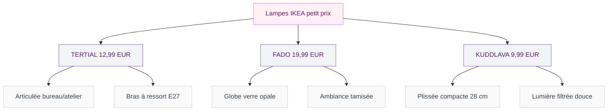
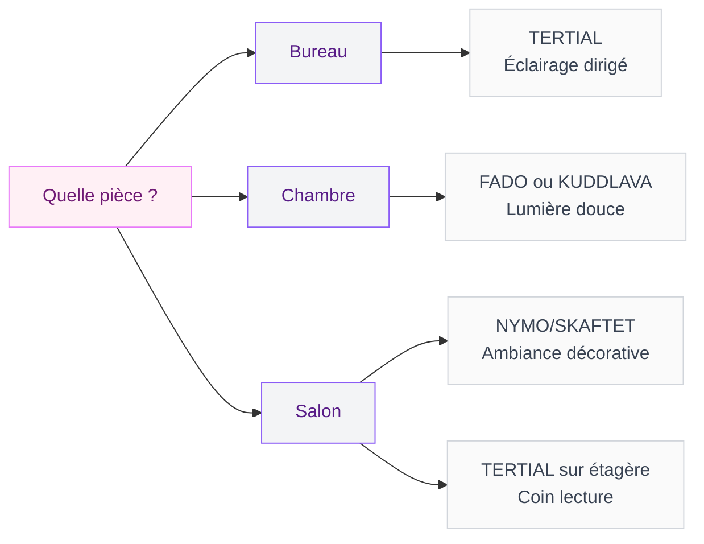

Si tu passes dans un magasin IKEA en ce moment, tu as peut-être remarqué un truc : les lampes articulées partent comme des petits pains. Le rayon luminaires est pris d'assaut, et pour une bonne raison - certains modèles affichent un look d'atelier vraiment canon pour un prix qui tient dans une poche. On parle de lampes à moins de 13 euros qui donnent un cachet dingue à un bureau, une table de nuit ou un coin lecture. Je t'explique tout sur ces modèles qui font craquer tout le monde, avec un comparatif clair pour t'aider à choisir.

## Pourquoi les lampes articulées IKEA affolent les réseaux

Le buzz a commencé sur TikTok et Instagram. Des créateurs déco ont filmé leurs trouvailles IKEA en montrant des ambiances hyper soignées réalisées avec des lampes à petit prix. Le contraste entre le rendu "design d'architecte" et l'étiquette à moins de 15 euros a fait le reste. Les publications ont cumulé des millions de vues et les ruptures de stock ont suivi dans la foulée.

Ce qui plaît, c'est la combinaison de trois choses : un style industriel/atelier qui colle parfaitement aux tendances actuelles, un bras articulable qui permet de diriger la lumière exactement où tu veux, et un prix ridicule par rapport aux lampes équivalentes en boutique déco. Chez Maisons du Monde ou AM.PM, une lampe articulée comparable tourne entre 45 et 90 euros. Chez IKEA, tu repars avec un modèle solide pour une fraction de ce tarif.

> [!TIP]
> Avant de te déplacer, vérifie la disponibilité en ligne sur ikea.fr. Les lampes les plus virales partent vite en magasin, mais le site te dit en temps réel si ton magasin a du stock.

## Les 3 modèles stars à moins de 15 euros

Rentrons dans le vif du sujet. Voici les trois lampes qui concentrent l'essentiel de l'engouement, avec leurs forces et leurs limites.

### TERTIAL - la lampe d'atelier à 12,99 euros

C'est LE modèle qui a lancé la tendance. La TERTIAL est une lampe de bureau articulée avec un bras à ressort qui permet de régler la hauteur et l'angle. Son look brut, presque industriel, rappelle les lampes d'architecte vintage qu'on trouve en brocante à 40 ou 50 euros.

**Ses points forts :**

- Prix imbattable : 12,99 euros
- Bras articulable en acier avec ressort, réglable en hauteur
- Compatible avec toutes les ampoules E27 (jusqu'à 40W ou LED équivalente)
- Se fixe avec une pince de bureau (incluse) - pas besoin de percer
- Disponible en blanc, gris foncé et bleu-vert

**Ses limites :**

- Le plastique de la pince est un peu léger - sur un plateau épais, ça peut être un peu juste
- Pas de variateur intégré (mais tu peux ajouter une ampoule LED dimmable)
- Le design est volontairement brut, ce qui ne plaira pas à tout le monde

La TERTIAL marche très bien sur un bureau, un plan de travail en cuisine, ou même fixée à une étagère au-dessus d'un fauteuil de lecture. Si tu cherches des idées pour aménager un espace bureau avec un style [industriel-scandinave](/guides/decoration/industriel-scandinave/), elle s'intègre à merveille.

### FADO - la lampe globe à 19,99 euros

La FADO, c'est l'autre coup de coeur viral. Pas articulée celle-ci, mais elle mérite sa place dans ce comparatif parce qu'elle coche toutes les cases du "design bluffant à prix mini". C'est un globe en verre opale blanc qui diffuse une lumière douce et tamisée. En photo, on dirait un luminaire design italien à 150 euros.

**Ses points forts :**

- Design épuré et intemporel, forme sphère parfaite
- Lumière d'ambiance diffuse et apaisante
- Verre opale de bonne qualité, pas du plastique
- Fonctionne en lampe de chevet, de salon ou d'appoint

**Ses limites :**

- 19,99 euros, donc un peu au-dessus du budget "moins de 15 euros"
- Pas de variateur non plus (même astuce : ampoule dimmable)
- Assez fragile à cause du verre - attention si tu as des enfants en bas âge

La FADO est parfaite pour créer une ambiance cosy dans un [petit salon](/guides/decoration/decoration-petit-salon/) ou une chambre. Posée sur un meuble bas ou une console d'entrée, elle donne immédiatement un air sophistiqué à l'espace.

### KUDDLAVA - la petite plissée à 9,99 euros

Moins connue que les deux autres, la KUDDLAVA est une lampe de table avec un abat-jour plissé en blanc. Elle mesure 28 cm de haut et dégage une lumière douce et filtrée grâce à son diffuseur textile. C'est la moins chère du trio et elle a un charme un peu rétro très actuel.

**Ses points forts :**

- Seulement 9,99 euros
- Abat-jour plissé tendance (le plissé revient en force en 2026)
- Compacte (28 cm), parfaite pour les petits espaces
- Lumière filtrée très agréable le soir

**Ses limites :**

- Pas articulée - c'est une lampe d'ambiance pure
- L'abat-jour textile peut prendre la poussière
- Un seul coloris disponible (blanc)

> [!NOTE]
> La KUDDLAVA se combine très bien avec une ampoule LED à filament visible (type Edison). Le rendu à travers le plissé est superbe et donne un aspect vintage chic.

## Comparatif rapide des 3 modèles

| Modèle | Prix | Type | Articulée | Ambiance | Idéal pour |
|---|---|---|---|---|---|
| TERTIAL | 12,99 EUR | Bureau à pince | Oui | Éclairage dirigé | Bureau, atelier, lecture |
| FADO | 19,99 EUR | Globe à poser | Non | Lumière diffuse | Chevet, salon, entrée |
| KUDDLAVA | 9,99 EUR | Table plissée | Non | Lumière filtrée | Chevet, meuble d'appoint |

## Au-delà de 15 euros : les modèles qui valent le détour

Si ton budget monte un peu, IKEA propose des luminaires qui gardent ce rapport qualité-design-prix assez bluffant. En voici trois qui méritent un coup d'oeil.

### SINNERLIG - la suspension en bambou à 24,99 euros

Cette suspension de 27 cm de diamètre en bambou tressé diffuse une lumière chaleureuse à travers les interstices du tressage. C'est un best-seller discret du catalogue IKEA qui fonctionne au-dessus d'une table à manger, dans un couloir ou au-dessus d'un îlot de cuisine. Le bambou donne un côté naturel et artisanal très recherché en ce moment.

### NYMO/SKAFTET - le lampadaire noir et laiton

Celui-là, c'est la bonne surprise. Le lampadaire NYMO/SKAFTET combine un abat-jour noir perforé avec un pied laiton qui lui donne un air de lampe vintage haut de gamme. La perforation de l'abat-jour crée des motifs lumineux au plafond quand la lampe est allumée - un détail sympa qui enrichit l'ambiance. Le prix varie selon la combinaison choisie, en général entre 30 et 45 euros pour l'ensemble pied + abat-jour.

### KINNAHULT - le lampadaire en frêne

Pour les fans de bois naturel, le KINNAHULT est un lampadaire avec une tige torsadée en frêne clair. Le design est épuré, presque sculptural. C'est le genre de pièce qui attire l'oeil et qui fait "meuble" autant que luminaire. Son prix tourne autour de 50 euros, ce qui reste très correct pour un lampadaire en bois massif.

> [!WARNING]
> Les lampadaires IKEA sont vendus sans ampoule. Pense à prendre une ampoule LED adaptée en même temps (entre 3 et 7 euros). Vérifie le culot (E27 ou E14 selon le modèle) avant de passer en caisse.

## Comment bien choisir ta lampe IKEA selon ta pièce

Le choix de la bonne lampe dépend surtout de l'usage que tu en fais. Voici un guide pièce par pièce pour t'aider à viser juste.

### Pour le bureau ou l'espace de travail

La TERTIAL est le choix évident. Son bras articulable te permet de diriger le faisceau exactement sur ta zone de travail. Ajoute une ampoule LED blanc neutre (4000K) pour un éclairage qui ne fatigue pas les yeux. Si tu veux un setup plus abouti, tu peux fixer deux TERTIAL de chaque côté d'un écran pour un éclairage équilibré - total : 26 euros pour une installation digne d'un studio créatif.

### Pour la chambre et le chevet

La FADO ou la KUDDLAVA sont parfaites ici. La FADO donne une lumière enveloppante et douce, idéale pour lire quelques pages avant de dormir. La KUDDLAVA, plus petite, se glisse facilement sur une table de nuit étroite. Dans les deux cas, opte pour une ampoule blanc chaud (2700K) et si possible dimmable.

### Pour le salon

Tout dépend de l'effet recherché. Si tu veux un point lumineux d'ambiance, la FADO posée sur un meuble bas ou une console crée un bel îlot de lumière. Pour un éclairage de lecture à côté du canapé, la TERTIAL fixée sur une étagère fait le job. Et pour un éclairage général d'ambiance, le lampadaire NYMO/SKAFTET apporte une vraie présence décorative. Pour aller plus loin sur l'éclairage de ton salon, tu peux aussi découvrir comment [bien choisir un tableau lumineux](/guides/decoration/choisir-tableau-lumineux/) qui comblera les zones d'ombre de manière originale.

## Astuces pour un rendu haut de gamme avec une lampe IKEA

Avoir une lampe à petit prix, c'est bien. La rendre magnifique, c'est mieux. Voici quelques tours de passe-passe que j'utilise régulièrement.

### Peindre ou customiser la lampe

La TERTIAL en blanc basique peut devenir spectaculaire avec une bombe de peinture. Un noir mat, un vert kaki ou un terracotta donnent un rendu complètement différent. Une couche de primer pour métal, deux couches de peinture spray, et tu obtiens une lampe qui ne ressemble plus du tout à du IKEA. Coût total : 8 à 12 euros de peinture. Donc pour moins de 25 euros, tu as une lampe personnalisée unique.

### Jouer avec les ampoules

L'ampoule change tout. Une ampoule LED à filament apparent (type Edison, entre 5 et 9 euros) dans la TERTIAL transforme cette lampe de bureau en objet déco à part entière. Pour la FADO, une ampoule LED avec des nuances chaudes (2200K ambre) donne un effet bougie absolument magnifique.

### Grouper les lampes

Deux ou trois FADO de tailles différentes (si IKEA sort des variantes) ou posées à des hauteurs différentes créent un ensemble très sculptural. Trois KUDDLAVA alignées sur un buffet, c'est simple et hyper graphique. Cette technique du "groupement" est utilisée par les décorateurs pro pour donner de l'impact sans dépenser une fortune.

> [!IMPORTANT]
> Ne dépasse jamais la puissance maximale indiquée sur la douille de la lampe. Pour la TERTIAL, c'est 40W maximum en ampoule classique. En LED, une ampoule de 7 à 10W donne un éclairage équivalent à 40-60W sans risque de surchauffe.

## Carte IKEA Family : les économies en plus

Si tu n'as pas encore la carte IKEA Family (gratuite), c'est le moment de la prendre. Les avantages sur les luminaires sont réguliers :

- **Remises membres** : 10 à 15% sur certaines gammes de luminaires plusieurs fois par an
- **Prix membres exclusifs** : certains modèles ont un prix réduit réservé aux détenteurs de la carte
- **Offres saisonnières** : pendant les opérations spéciales (rentrée, Black Friday, soldes), les lampes font souvent partie des bons plans ciblés
- **Café et thé gratuits** : bon, ça n'a rien à voir avec les lampes, mais c'est toujours agréable quand tu fais la queue au rayon luminaires

Avec la carte, la TERTIAL à 12,99 euros peut descendre à 10 ou 11 euros en période promo. La FADO bénéficie aussi régulièrement de prix membres. Sur un achat de plusieurs lampes pour équiper un appartement, l'économie devient significative.

## Les erreurs à éviter quand tu achètes des lampes IKEA

J'ai fait quelques bourdes au fil des années, alors autant que tu en profites.

**Oublier l'ampoule.** IKEA vend la plupart de ses lampes sans ampoule. C'est écrit en petit sur l'emballage. Prévois entre 3 et 9 euros de plus par lampe.

**Choisir la mauvaise température de couleur.** Un blanc froid (5000K+) dans une chambre, c'est l'ambiance salle d'attente garantie. Blanc chaud (2700K) pour les espaces de vie, blanc neutre (4000K) pour le bureau.

**Négliger le câble.** Les câbles des lampes IKEA sont souvent gris ou blancs. Si tu veux un rendu soigné, pense aux cache-câbles adhésifs (2 à 4 euros le lot chez IKEA même) ou aux gaines textiles tressées qu'on trouve en ligne pour 5 à 8 euros.

**Prendre sans vérifier les dimensions.** La FADO, par exemple, fait 25 cm de diamètre. C'est plus gros qu'on ne le pense sur une petite table de nuit. Mesure avant d'acheter.

## Sur le meme theme

- [tables de nuit ikea à petit prix](/guides/shopping/ikea-frappe-fort-sa-nouvelle-table-de-nuit-a-9-e-en-edition-limitee/)
- [support casque ikea gaming](/guides/shopping/ikea-lance-son-nouveau-support-pour-casque-design-a-un-prix-totalement-fou/)

## FAQ - Lampes articulées IKEA

### La TERTIAL est-elle vraiment solide pour un usage quotidien ?

Oui, malgré son prix de 12,99 euros, la TERTIAL est construite en acier avec un ressort de tension. Des milliers d'utilisateurs la gardent plusieurs années sans problème. Le seul point faible, c'est la pince en plastique - si tu la fixes sur un plateau très épais (plus de 4 cm), elle peut forcer. Pour un bureau standard, elle tient parfaitement.

### Peut-on mettre une ampoule connectée dans ces lampes IKEA ?

Tout à fait. La TERTIAL et la FADO acceptent les ampoules E27, y compris les ampoules connectées IKEA TRADFRI (à partir de 9,99 euros). Tu peux alors piloter la lumière via l'application IKEA Home Smart ou un assistant vocal. C'est un moyen malin de transformer une lampe à 13 euros en luminaire connecté.

### La FADO chauffe-t-elle avec une ampoule allumée longtemps ?

Avec une ampoule LED (recommandée), la FADO ne chauffe quasiment pas, même après plusieurs heures. Évite les ampoules à incandescence ou halogènes qui dégagent beaucoup de chaleur et pourraient endommager le verre opale à la longue.

### Quelle est la différence entre la TERTIAL et la lampe HEKTAR de bureau ?

La HEKTAR est un cran au-dessus en termes de finition. Elle a un abat-jour en métal plus épais, un bras également articulable et un design un peu plus raffiné. Son prix tourne autour de 20 à 30 euros selon le modèle. Si tu cherches un look plus "déco" et moins "atelier brut", la HEKTAR peut valoir le supplément.

### Les lampes IKEA sont-elles disponibles en ligne avec livraison ?

Oui, toutes les lampes mentionnées sont disponibles sur ikea.fr avec livraison à domicile (à partir de 5,90 euros pour les petits colis). Tu peux aussi opter pour le Click & Collect gratuit si tu as un magasin IKEA à proximité. Pour les modèles très demandés comme la FADO, la livraison est parfois plus fiable que le déplacement en magasin où le stock peut être épuisé.
