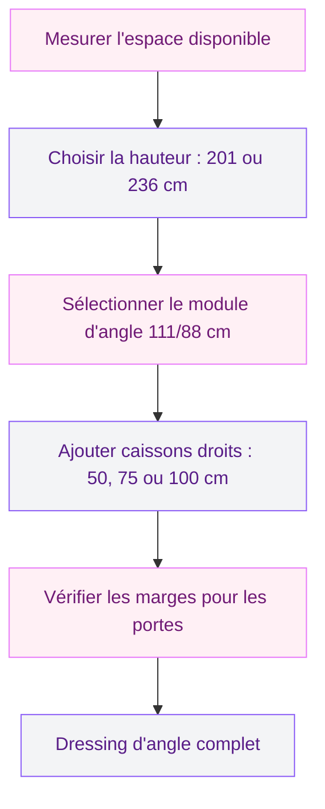
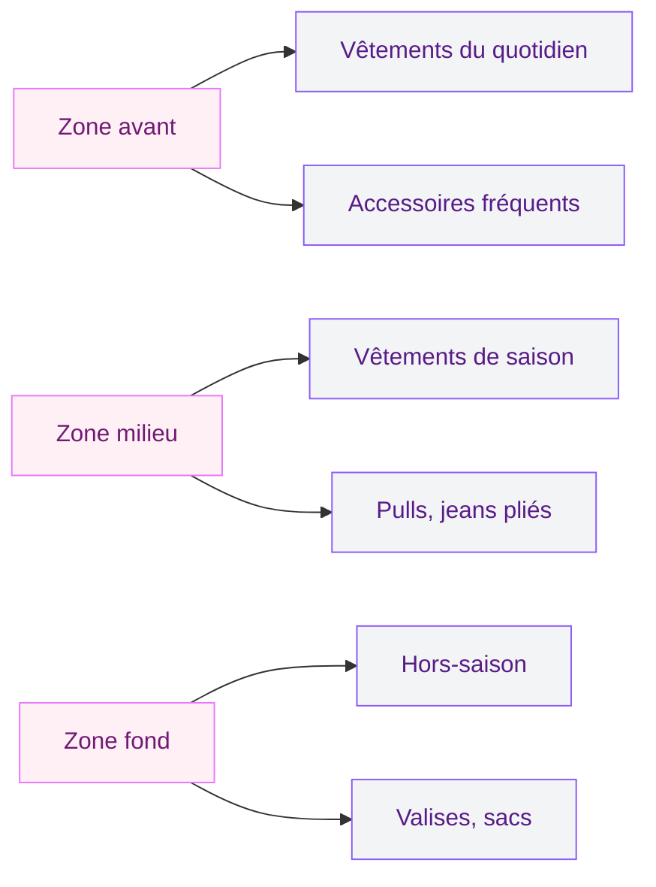
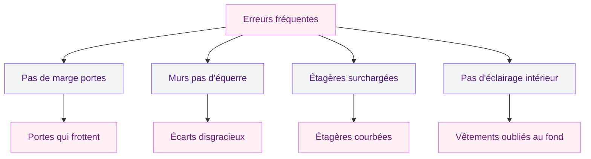

Tu as un coin de chambre qui ne sert à rien, à part collecter la poussière et un vieux sac de sport ? L'armoire d'angle IKEA PAX est probablement la solution la plus maline pour récupérer cet espace perdu et le transformer en vrai dressing fonctionnel. J'ai passé pas mal de temps à décortiquer le système PAX pour toi, et je vais te guider pas à pas pour configurer une armoire d'angle qui correspond pile à tes besoins - et à ton budget.

## Pourquoi l'armoire d'angle PAX cartonne autant

Le système PAX d'IKEA, c'est un peu le LEGO du dressing. Tu choisis tes caissons, tes portes, ton aménagement intérieur, et tu assembles le tout selon ta configuration. L'armoire d'angle, c'est la pièce maîtresse quand tu veux exploiter un coin de pièce que les meubles classiques ignorent complètement.

Ce qui fait la différence avec un dressing sur mesure à 3 000 EUR :

- **Un prix accessible** : entre 400 et 800 EUR tout compris (caissons + portes + aménagement intérieur), contre 2 000 à 5 000 EUR pour du sur mesure
- **Des pieds réglables** : le sol n'est jamais parfaitement plat, surtout dans les vieux appartements. Les pieds compensent jusqu'à 2 cm de différence
- **Des charnières silencieuses** : plus de claquement de porte à 6h du matin quand tu te prépares dans le noir
- **Une personnalisation quasi infinie** : étagères, tringles, tiroirs, paniers, boîtes... tu configures exactement ce dont tu as besoin

> [!TIP]
> Si tu hésites entre du sur mesure et le système PAX, commence par le PAX. Tu peux toujours ajouter des modules plus tard, et le rapport qualité-prix est difficile à battre pour un premier dressing. J'en parle aussi dans mon guide sur le [dressing optimisé](/dressing-optimise-solutions-rangement-garde-robe/).

## Les dimensions à connaître avant d'acheter

C'est la partie technique, mais elle est indispensable. Une erreur de mesure, et ton armoire ne rentre pas ou laisse un écart disgracieux contre le mur.

### Hauteurs de caissons

IKEA propose deux hauteurs pour les caissons PAX :

- **201 cm** : la taille standard, qui passe sous la plupart des plafonds avec une marge confortable
- **236 cm** : pour les pièces avec de la hauteur sous plafond (au moins 240 cm sous plafond recommandé)

### Largeurs de caissons

Trois largeurs disponibles pour les caissons droits qui viennent se raccorder au module d'angle :

- **50 cm** : idéal pour les petits espaces ou en complément
- **75 cm** : le format polyvalent, celui que je recommande le plus souvent
- **100 cm** : quand tu as de la place et beaucoup de vêtements à ranger

### Le module d'angle PAX

Le caisson d'angle en lui-même fait **111/88 cm** de côté. C'est un module en forme de L qui vient s'encastrer dans le coin de la pièce. Il s'associe ensuite avec les caissons droits de chaque côté pour créer ton dressing complet.

> [!WARNING]
> Attention aux marges pour les portes ! Prévois **+1 cm** de chaque côté si tu choisis des portes à charnières, et **+4 cm** pour des portes coulissantes. Sans cette marge, les portes frottent contre les murs ou ne s'ouvrent pas correctement.

## Les 5 étapes pour configurer ton armoire d'angle

IKEA a bien fait les choses avec un guide en 5 étapes. Je te les détaille avec mes retours d'expérience.

### Étape 1 : mesurer ton espace

Prends un mètre et note trois mesures :

- La **largeur du mur gauche** (du coin au premier obstacle : porte, fenêtre, prise)
- La **largeur du mur droit** (idem)
- La **hauteur sous plafond** (mesure à trois endroits différents si ton sol n'est pas droit)

Laisse toujours 5 cm de marge par rapport à la hauteur sous plafond. Si tu as 245 cm de hauteur, prends les caissons de 236 cm. Si tu as 210 cm, les caissons de 201 cm passent sans problème.

### Étape 2 : choisir tes caissons

Le caisson d'angle est la base. À partir de là, tu ajoutes des caissons droits selon l'espace mesuré. Voici une configuration classique qui fonctionne bien :

- 1 caisson d'angle PAX (111/88 cm) au centre : environ **150 à 190 EUR**
- 1 caisson droit 75 cm à gauche : environ **90 à 120 EUR**
- 1 caisson droit 50 cm à droite : environ **70 à 90 EUR**

Total caissons pour cette config : **310 à 400 EUR**.

### Étape 3 : choisir tes portes

C'est là que le style entre en jeu. Les gammes les plus populaires pour les portes :

- **FARDAL** (brillant blanc) : look moderne et lumineux, environ **80 à 150 EUR** par porte selon la taille
- **AHEIM** (miroir) : génial pour agrandir visuellement la pièce et se checker le matin, environ **100 à 200 EUR** par porte
- **BERGSBO** (blanc mat) : sobre et discret, environ **50 à 80 EUR** par porte
- **FORSAND** (blanc classique) : le plus accessible, environ **40 à 60 EUR** par porte

Pour une configuration complète avec 4 à 5 portes, compte entre **200 et 500 EUR** selon la gamme choisie.

> [!NOTE]
> La combinaison PAX/FARDAL/AHEIM (blanc brillant + miroir) en 111/88x201 cm est l'une des plus vendues. Elle allie look épuré et côté pratique avec le miroir intégré. Pas besoin d'un miroir en pied supplémentaire dans la chambre.

### Étape 4 : aménager l'intérieur

C'est là que ça devient vraiment fun. L'intérieur de ton armoire d'angle, tu le composes comme tu veux :

**Pour les vêtements suspendus :**
- Tringle standard KOMPLEMENT : **10 à 15 EUR**
- Tringle extractible (géniale dans le module d'angle, où la profondeur rend l'accès difficile) : **20 à 25 EUR**

**Pour le plié et les accessoires :**
- Étagères KOMPLEMENT : **8 à 12 EUR** l'unité
- Tiroirs KOMPLEMENT : **25 à 40 EUR** l'unité
- Paniers en grillage : **15 à 20 EUR**

**Pour les petites affaires :**
- Boîtes SKUBB (lot de 6) : **10 EUR** - parfaites pour les sous-vêtements, chaussettes, ceintures
- Range-chaussures : **15 à 25 EUR**
- Crochet à sacs ou foulards : **5 à 8 EUR**

Si tu galères avec l'organisation de ta lingerie, j'ai aussi un guide dédié au [rangement des sous-vêtements](/guides/rangement/rangement-soutien-gorge/) qui complète bien ce que je te raconte ici.

### Étape 5 : les accessoires qui changent tout

Quelques ajouts à petit prix qui font une grosse différence :

- **Éclairage LED NORRFLY** (à poser dans l'armoire) : environ **15 EUR** la bande. Ça change la vie quand tu cherches un vêtement le matin
- **Amortisseurs de portes** : déjà intégrés dans les charnières PAX, mais vérifie que tu as bien les charnières UTRUSTA à fermeture douce
- **Pieds réglables** : inclus avec les caissons, mais pense à les régler proprement avec un niveau à bulle

## Comment organiser l'intérieur de ton module d'angle

Le module d'angle est profond, et c'est à la fois son atout et son piège. Si tu le remplis n'importe comment, les vêtements du fond deviennent invisibles et tu ne les portes plus jamais.

**Ma méthode en 3 zones :**

1. **Zone avant** (les 30 premiers centimètres) : tes vêtements du quotidien, ceux que tu portes chaque semaine. Accroche-les sur la tringle ou pose-les sur les étagères les plus accessibles.

2. **Zone milieu** : les vêtements de saison que tu portes régulièrement mais pas tous les jours. Pulls en hiver, tee-shirts en été.

3. **Zone fond** : les affaires hors saison, les valises, les sacs à main que tu sors une fois par mois. La tringle extractible est ton alliée ici - elle te permet de tirer les vêtements vers toi sans plonger le bras au fond de l'armoire.

Pour un système de rangement chambre encore plus poussé, tu peux aussi regarder mes conseils pour [ranger ta chambre efficacement](/guides/chambre/ranger-chambre/).

## Le budget complet : combien ça coûte vraiment

Je te fais le calcul pour trois configurations types, du plus économique au plus complet.

### Configuration mini (petit budget)

- 1 caisson d'angle 201 cm : **160 EUR**
- 2 caissons droits 50 cm : **140 EUR**
- 4 portes FORSAND : **200 EUR**
- Aménagement intérieur de base (2 tringles, 4 étagères) : **60 EUR**
- **Total : environ 560 EUR**

### Configuration standard (meilleur rapport qualité-prix)

- 1 caisson d'angle 201 cm : **180 EUR**
- 1 caisson droit 75 cm + 1 caisson droit 50 cm : **180 EUR**
- 5 portes BERGSBO : **325 EUR**
- Aménagement intérieur complet (tringles, étagères, 2 tiroirs, boîtes SKUBB) : **120 EUR**
- **Total : environ 805 EUR**

### Configuration premium (le dressing de tes rêves)

- 1 caisson d'angle 236 cm : **220 EUR**
- 2 caissons droits 100 cm : **240 EUR**
- 5 portes FARDAL/AHEIM (mix brillant et miroir) : **550 EUR**
- Aménagement intérieur haut de gamme (tringles extractibles, tiroirs, paniers, éclairage LED) : **200 EUR**
- **Total : environ 1 210 EUR**

Même la configuration premium reste très en dessous d'un dressing sur mesure qui démarre rarement sous les 2 500 EUR.

> [!TIP]
> Guette les promotions IKEA Family (gratuites et sans engagement). Deux à trois fois par an, les caissons PAX sont en promotion à -15 ou -20%. Ça peut représenter 80 à 150 EUR d'économie sur un dressing complet.

## Le montage : à quoi t'attendre

Soyons honnêtes : le montage d'un dressing PAX d'angle, c'est un projet de week-end. Prévois entre 3 et 5 heures à deux personnes. Seul, c'est faisable mais plus long et plus pénible, surtout pour redresser les grands caissons de 236 cm.

**Ce qu'il te faut :**
- Un tournevis cruciforme (ou mieux, une visseuse électrique)
- Un niveau à bulle
- Un mètre ruban
- Un marteau pour les goupilles en bois
- De la patience (et un bon podcast)

**Mes conseils montage :**

1. Commence par le module d'angle, c'est lui qui donne l'alignement à tout le reste
2. Fixe le caisson d'angle au mur avec les équerres fournies avant d'ajouter les caissons latéraux
3. Utilise les pieds réglables pour mettre le tout de niveau - c'est la clé d'un dressing qui ferme bien
4. Monte les portes en dernier, et règle les charnières après. IKEA fournit un système de réglage en 3 axes (hauteur, profondeur, latérale) qui permet un ajustement au millimètre

> [!IMPORTANT]
> Fixe toujours ton armoire PAX au mur avec les sangles anti-basculement fournies. C'est obligatoire pour la sécurité, surtout si tu as des enfants. Un caisson de 236 cm chargé de vêtements pèse facilement 80 kg.

## Les erreurs à éviter absolument

Après avoir aidé plusieurs amies à monter leur dressing PAX, voici les erreurs que je vois revenir le plus souvent :

1. **Oublier les marges pour les portes** : sans les +1 cm (charnières) ou +4 cm (coulissantes), tu es bloquée
2. **Ne pas vérifier l'équerrage des murs** : les coins ne sont presque jamais à 90 degrés parfaits. Mesure avec une équerre de menuisier avant d'acheter
3. **Surcharger les étagères du haut** : les étagères PAX supportent 13 kg chacune. Au-delà, elles se courbent
4. **Oublier l'éclairage intérieur** : dans un module d'angle profond, sans lumière, le fond reste un trou noir où les vêtements disparaissent

## FAQ

### Quelle est la taille du module d'angle PAX IKEA ?

Le module d'angle PAX mesure 111/88 cm de côté, avec une profondeur de 58 cm. Il est disponible en deux hauteurs : 201 cm (standard) et 236 cm (grande hauteur). Prévois au minimum 5 cm de marge sous le plafond.

### Combien coûte un dressing d'angle PAX complet ?

Compte entre 400 et 800 EUR pour une configuration standard avec caisson d'angle, deux caissons droits, portes et aménagement intérieur de base. La configuration premium avec portes miroir et éclairage LED peut monter à 1 200 EUR.

### Peut-on monter l'armoire d'angle PAX seul ?

C'est possible mais déconseillé, surtout pour les caissons de 236 cm. À deux, le montage prend entre 3 et 5 heures. Seul, prévois plutôt une journée complète. La partie la plus délicate est le redressement du caisson d'angle une fois assemblé au sol.

### Quelles portes choisir pour l'armoire d'angle PAX ?

Le choix dépend de ton budget et de ton style. FORSAND (blanc classique, 40-60 EUR/porte) pour le plus économique, BERGSBO (blanc mat, 50-80 EUR/porte) pour un rendu sobre, FARDAL (brillant blanc, 80-150 EUR/porte) pour un look moderne, ou AHEIM (miroir, 100-200 EUR/porte) pour agrandir visuellement la pièce.

### Les promotions IKEA PAX, c'est quand ?

IKEA organise deux à trois promotions PAX par an, souvent en janvier, en avril et en septembre. Les réductions vont de 15% à 20% sur les caissons. Inscris-toi au programme IKEA Family (gratuit) pour recevoir les alertes. L'outil de planification en ligne te permet de préparer ta configuration en avance pour acheter dès l'ouverture de la promo.
