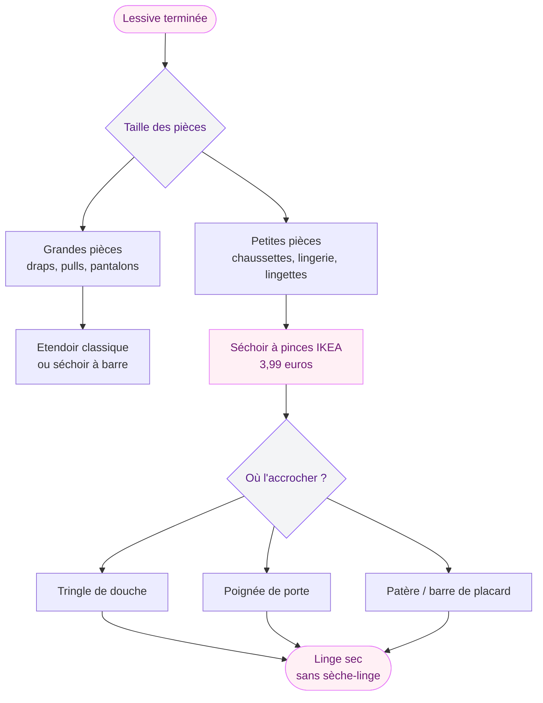
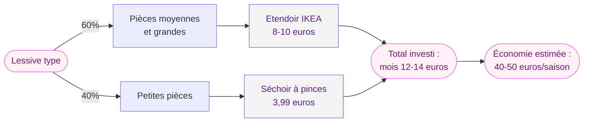

Dès que les températures baissent et que les journées raccourcissent, la question du linge qui sèche revient sur la table. Pas de balcon, un appartement sans sèche-linge, un étendoir qui prend la moitié du salon - et là tu te demandes comment t'en sortir sans transformer ta chambre en buanderie ouverte.

J'ai trouvé la réponse dans le rayon organisation d'IKEA, à 3,99 euros. Oui, tu lis bien. Un accessoire que je n'aurais pas cru si utile, et qui a changé ma routine linge depuis que je l'ai adopté il y a deux automnes. Si tu ne l'as pas encore, voilà pourquoi tu devrais y jeter un oeil.

## Le séchoir à pinces IKEA : c'est quoi exactement ?

On parle d'un séchoir à pinces format "pieuvre" - ce type d'accessoire circulaire ou allongé avec des pinces qui pendent et sur lequel tu accroches les petites pièces de linge. Chaussettes, sous-vêtements, cols, mouchoirs, lingettes lavables, bodies de bébé... tout ce qui est petit et qu'on regroupe toujours en bout d'étendoir sans vraiment de logique.

  

Le modèle IKEA disponible à moins de 4 euros intègre 16 pinces robustes. La structure est légère mais solide, avec un crochet en haut qui te permet de l'accrocher absolument partout : tringle de douche, poignée de fenêtre, barre de placard, séchoir principal, trépied... Tu l'accroches, tu clips tes affaires, et tu le décroches une fois sec. Deux secondes.

> [!TIP]
> Si tu séches tes chaussettes en les accrochant chacune avec une pince, elles sèchent mieux que si tu les poses à plat sur une barre. L'air circule tout autour, le résultat est plus rapide et plus uniforme.

Ce qui le distingue d'un étendoir classique, c'est son encombrement quasi nul. Replié, il fait à peu près la taille d'une raquette de badminton. Tu le ranges derrière une porte, dans un tiroir de placard, sous l'évier. Il ne prend pas de place au sol, ne s'effondre pas au milieu du couloir, et ne crée pas cette impression de "chantier linge" dans le salon.

## Pourquoi c'est une vraie solution pour l'automne-hiver

L'été, ça roule. Tu mets ton linge sur le balcon, le soleil fait le travail, et tout est sec en deux heures. En automne et en hiver, c'est une autre histoire. Humidité ambiante élevée, peu de lumière, températures qui tombent - ton linge met une éternité à sécher, et dans un appartement, ça finit souvent par créer de la condensation sur les fenêtres ou une légère odeur de moisi si le séchage traîne trop longtemps.

  

La solution classique, c'est le sèche-linge. Mais tout le monde n'en a pas, et ceux qui en ont savent combien ça coûte à l'usage. Un cycle de sèche-linge consomme en moyenne entre 2 et 3,5 kWh selon les modèles - soit entre 0,50 et 0,90 euro par cycle au tarif actuel de l'électricité en France. Sur une saison entière, ça chiffre vite.

> [!NOTE]
> Un séchoir à pinces bien positionné près d'un radiateur ou d'une source de chaleur douce (jamais directement dessus pour les textiles fragiles) réduit le temps de séchage de façon notable. L'air chaud monte, il passe entre les vêtements et évacue l'humidité. Pas besoin de machine.

Le séchoir à pinces IKEA ne remplace pas un étendoir complet pour tes draps ou tes pulls, bien sûr. Mais pour tout ce qui est petite pièce - et c'est souvent la moitié du volume d'une lessive - il est parfait. Tu libères ton grand étendoir pour les pièces de taille normale, et tu gardes le séchoir à pinces pour le reste. Organisation maximale, espace optimisé.

## Comment l'intégrer dans ton quotidien sans changer toute ton organisation

Le truc avec cet accessoire, c'est qu'il s'intègre sans frottement dans une routine déjà en place. Tu n'as pas à réorganiser ton appartement ni à changer tes habitudes de lessive. Il s'accroche là où tu as de la place, et c'est tout.

  

Quelques configurations qui marchent bien :

**Dans la salle de bain** : La tringle de douche est l'emplacement parfait. Après la lessive, tu accroches le séchoir sur la tringle, tu clips tes petites pièces, et la chaleur naturelle de la salle de bain (surtout si tu prends ta douche le matin) aide au séchage. Si tu as une fenêtre que tu ouvres un peu pour aérer, c'est encore mieux - le renouvellement d'air fait toute la différence.

**Dans la chambre** : Accroche le séchoir à la poignée d'une porte, à une patère murale, ou sur un séchoir classique déjà déployé. Il pend, il prend peu de place en largeur, et il sèche tranquillement pendant la nuit.

**Dans le couloir** : Si tu as un couloir avec des patères ou un porte-manteau, c'est aussi un bon endroit. Loin du salon principal, discret, et avec souvent un peu plus de passage d'air que dans une chambre fermée.

> [!WARNING]
> Évite d'accrocher le séchoir directement sur un radiateur chaud - les variations de température brutales abîment certains textiles délicats (soie, microfibres). Mieux vaut le placer à 30-40 cm de la source de chaleur pour un séchage progressif et doux.

## Ce que ça change vraiment : quelques chiffres concrets

Je sais que les comparaisons chiffrées, ça aide à se décider. Voilà ce que ça donne dans la vraie vie.

  

Un sèche-linge consomme en moyenne **2,5 kWh par cycle**. Au prix de l'électricité autour de 0,25 euro/kWh (tarif réglementé en 2025-2026), ça fait environ **0,62 euro par cycle**. Si tu fais 3 lessives par semaine d'octobre à mars (soit environ 26 semaines), tu arrives à **78 cycles** et presque **50 euros** sur la saison juste pour le séchage.

Avec le séchoir à pinces IKEA à 3,99 euros, tu rentabilises l'accessoire dès... le septième cycle environ, même si tu utilises encore le sèche-linge pour le gros linge. Et les 16 pinces permettent de retirer facilement 15 à 20 pièces par fournée de lessive du chargement du sèche-linge.

Ce n'est pas une révolution en soi, mais c'est ce genre de petit ajustement cumulé sur plusieurs mois qui fait une vraie différence sur la facture électrique sans effort particulier.

> [!TIP]
> Pour accélérer encore le séchage, place le séchoir à pinces près d'une fenêtre entrouverte même en hiver - quelques centimètres suffisent. Le renouvellement d'air est le facteur numéro un du temps de séchage, devant la chaleur.

## Et l'étendoir classique IKEA, comment il s'articule avec ?

IKEA propose depuis longtemps des étendoirs basiques qui font le travail sans chichi. Le JÄLL (ou ses variantes proches selon les gammes actuelles) se trouve autour de 8 à 10 euros en magasin. C'est un étendoir pliable, relativement compact une fois replié, qui convient pour les pièces de format moyen.

  

La combinaison séchoir à pinces + étendoir IKEA classique couvre à peu près 80% des besoins d'une personne seule ou d'un couple sans sèche-linge. Tu gardes le grand pour les pantalons, les pulls, les t-shirts. Tu réserves les pinces pour tout ce qui est petit et qui avait tendance à s'entasser en bout de barre.

Si tu cherches d'autres façons d'optimiser ton espace de rangement au quotidien sans exploser ton budget, j'ai pas mal de pistes dans l'article sur le [rangement créatif et l'optimisation des petits espaces](https://www.cristallina.fr/guides/rangement-creatif-optimisation) - tu y trouveras des idées qui s'associent bien avec ce type d'accessoires malins.

## Les petits défauts à connaître avant d'acheter

Je préfère être honnête plutôt que de te vendre du rêve, donc voilà ce qui peut te faire tiquer :

**Les pinces ont une résistance variable selon les modèles.** Certaines versions IKEA ont des pinces en plastique qui s'ouvrent bien au début mais qui finissent par perdre leur tension après quelques mois d'utilisation intensive. Si tu charges des pièces lourdes (jeans épais, serviettes), mieux vaut aller vers des modèles avec des pinces en métal ou des ressorts plus costauds.

**La capacité reste limitée.** 16 pinces, ça semble beaucoup, mais dans une lessive de famille, ça peut ne pas suffire si tout le monde a beaucoup de chaussettes. Dans ce cas, deux séchoirs à pinces en parallèle - soit 8 euros au total - restent une option très économique.

**Le crochet d'accroche mérite qu'on y fasse attention.** Selon l'endroit où tu l'accroches, il peut glisser si la surface est lisse (poignée de porte arrondie, tringle en inox). Un tour de caoutchouc ou un crochet en S légèrement plus grand peut résoudre ça facilement.

## Quelques idées d'usage auxquelles on ne pense pas forcément

Au-delà du linge à proprement parler, le séchoir à pinces est polyvalent :

- **Herbes aromatiques fraîches** : tu veux faire sécher du romarin, du thym ou de la lavande cueilli dans ton balcon ou ton jardin ? Le séchoir à pinces dans un coin sec et aéré, c'est parfait. Les tiges s'accrochent, tout sèche sans s'entasser.

- **Articles de linge mouillé après sport** : collants de sport, bandeau, chaussettes de yoga - au lieu de les balancer en boule dans un coin, tu les accroches directement. Ils sèchent avant le lendemain et restent en bon état plus longtemps.

- **Écharpes et foulards légers** : après un lavage à la main, ils sèchent en pinces sans se déformer si tu les accroches par le bord avec douceur.

Si tu t'intéresses à une déco de salle de bain bien pensée où tout a sa place sans surcharger l'espace, jette un oeil à mes articles sur la [salle de bain zen façon spa à la maison](https://www.cristallina.fr/salle-de-bain-zen-spa-maison) et les [solutions de rangement pour la salle de bain](https://www.cristallina.fr/guides/rangement-creatif-optimisation) - l'idée d'un espace fonctionnel sans désordre, c'est exactement dans cet esprit-là.

## Où l'acheter et quoi vérifier en magasin

En magasin IKEA, le séchoir à pinces se trouve généralement dans la section textile / organisation - pas toujours dans le rayon buanderie, parfois dans la zone "accessoires salle de bain" ou "organisation maison". Si tu ne trouves pas, demande directement en caisse ou au rayon organisation, le personnel IKEA est plutôt efficace pour localiser les petits articles.

En ligne sur ikea.com, la recherche "séchoir" ou "pieuvre à linge" devrait faire remonter les modèles disponibles. Le prix tourne autour de 3,99 euros mais peut varier légèrement selon les réassorts.

Une petite vérification utile en magasin : teste l'ouverture et la fermeture de quelques pinces avant d'acheter. Les pinces doivent s'ouvrir facilement d'une main mais se refermer avec une tension suffisante pour tenir une chaussette mouillée sans qu'elle glisse. Si tu sens que ça accroche peu, passe ton chemin ou prends deux accessoires en prévision d'usure.

> [!NOTE]
> Certains magasins IKEA ont des stocks irréguliers sur les petits accessoires. Si tu ne le trouves pas en magasin, le site permet la livraison à domicile ou le retrait en point relais. Pour 3,99 euros, les frais de livraison peuvent dépasser le prix du produit - mieux vaut combiner avec d'autres achats ou passer en magasin.

## Ce que j'en retiens après deux automnes d'utilisation

Je l'utilise depuis deux hivers maintenant, et honnêtement, c'est l'un de ces petits achats qu'on ne remarque plus parce qu'il fait partie du quotidien naturellement. Mon étendoir principal est dédié aux grandes pièces. Le séchoir à pinces prend les chaussettes et la lingerie. Résultat : je n'utilise plus le sèche-linge que pour les grosses pièces en urgence, soit peut-être une fois par semaine au lieu de trois ou quatre.

Je ne peux pas te promettre que tu vas économiser 100 euros par an sur ta facture EDF - c'est trop lié à ta situation. Mais pour moins de 4 euros, tu mets la main sur un accessoire qui dure, qui prend zéro place rangé, et qui résout un vrai problème concret de l'automne en appartement. C'est le genre de trouvaille IKEA qu'on est content de ne pas avoir raté.

Si tu cherches à aller plus loin dans l'optimisation de ton espace et de tes habitudes à la maison, l'article sur les [astuces rangement créatif pour petits espaces](https://www.cristallina.fr/rangement-creatif-optimisation) regorge d'idées dans cet esprit - faire mieux avec moins de place et moins de budget.

---

## Sur le meme theme

- [armoire d'angle ikea pax](/guides/shopping/ikea-cartonne-avec-son-armoire-dangle/)
- [plateau multifonction ikea](/guides/shopping/cohue-chez-ikea-avec-ce-plateau-multifonction-de-la-saison/)
- [étagères murales ikea](/guides/shopping/cohue-chez-ikea-avec-letagere-murale-prisee-a-prix-imbattable/)
- [étagère murale ikea](/guides/shopping/ikea-frappe-fort-avec-cette-etagere-design-et-tres-pratique-qui-saccroche-au-mur-tres-facilement/)
- [tables de nuit ikea à petit prix](/guides/shopping/ikea-frappe-fort-sa-nouvelle-table-de-nuit-a-9-e-en-edition-limitee/)

## Questions fréquentes

**Le séchoir à pinces IKEA est-il solide sur la durée ?**
La structure principale (cadre et crochet) tient bien sur le long terme. Les pinces en plastique peuvent s'user après 12 à 18 mois d'usage quotidien intensif. À 3,99 euros, le remplacer reste très accessible, mais si tu veux prolonger la durée de vie, évite de surcharger les pinces avec des pièces trop lourdes.

**Peut-on l'utiliser dans une salle de bain sans fenêtre ?**
Oui, mais le séchage sera plus lent. Dans une salle de bain sans aération naturelle, active la ventilation mécanique (VMC) ou laisse la porte entrouverte après la douche pour renouveler l'air. Sans circulation d'air, le linge peut mettre deux fois plus de temps à sécher et favoriser les odeurs.

**Combien de chaussettes peut-on sécher à la fois ?**
Avec 16 pinces, tu peux accrocher 16 chaussettes individuelles (soit 8 paires) ou 8 pièces de lingerie légère. Si tu fais des lessives en famille, compte deux séchoirs à pinces pour couvrir les besoins d'un foyer de 3-4 personnes sur une seule session.

**Y a-t-il un risque d'humidité dans l'appartement ?**
Sécher du linge en intérieur augmente toujours un peu le taux d'humidité ambiant, séchoir à pinces ou pas. Pour limiter cela, aère ton logement 10 minutes par jour même en hiver, et évite de concentrer tout ton linge dans une seule pièce fermée. Un déshumidificateur compact dans la pièce principale peut aussi aider si ton appartement est naturellement humide.

**Le séchoir fonctionne-t-il pour les habits de bébé ?**
Oui, et c'est même un usage particulièrement pratique. Les bodies, grenouillères et chaussettes de bébé sont petits, nombreux, et nécessitent souvent un séchage séparé du reste du linge. Le séchoir à pinces est bien adapté à ces petites pièces légères.
