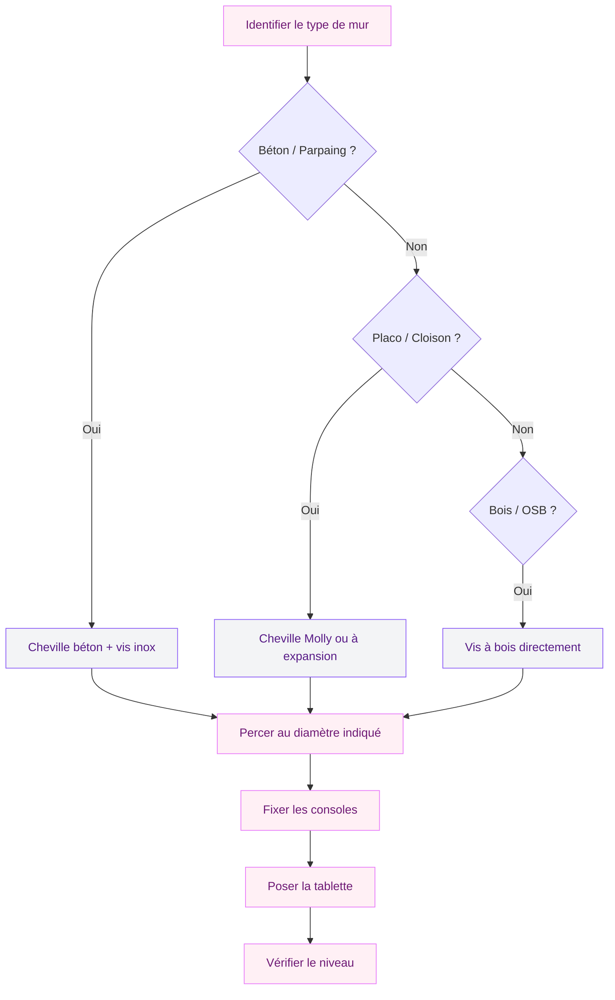
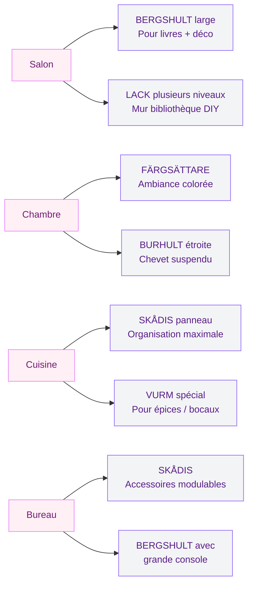

En quelques vis, un mur vide se transforme en un coin de vie organisé et décoratif. Chez IKEA, la gamme est assez large pour trouver exactement ce qu'on cherche - que tu veuilles exposer tes plantes, ranger des livres ou créer une ambiance particulière dans une pièce. Après avoir testé plusieurs modèles et fouillé les collections 2025-2026 en détail : les étagères murales IKEA sont parmi les meilleures options du marché à leur prix. Pas parfaites, mais vraiment bien.

## Pourquoi une étagère murale change tout dans une pièce

Une étagère murale, c'est du rangement qui ne prend pas de place au sol - dans un studio ou une petite chambre, ça change vraiment la vie. C'est aussi un élément décoratif à part entière : une belle tablette en bois clair avec quelques objets bien choisis donne du caractère à un mur vide. Et l'aspect pratique joue à fond : épices au-dessus du plan de travail en cuisine, produits de soin en salle de bain, tablette dans l'entrée pour poser les affaires. IKEA a pensé à tous ces usages.

  

> [!TIP]
> Avant d'acheter, mesure bien l'espace disponible - largeur ET hauteur sous le plafond si tu empiles plusieurs tablettes. Laisse au moins 25 à 30 cm entre deux tablettes pour que ce soit pratique à utiliser.

## Les modèles phares à connaître

  

### BERGSHULT + PERSHULT : le duo gagnant

C'est probablement la combinaison la plus vendue chez IKEA et pour de bonnes raisons. La tablette BERGSHULT est disponible en plusieurs largeurs (40, 60 et 80 cm) et dans des finitions qui vont du blanc mat au chêne naturel. Elle est solide, bien finie, et s'intègre facilement dans des intérieurs scandinaves ou contemporains.

Les consoles PERSHULT viennent en plusieurs hauteurs pour jouer sur les proportions. Tu peux opter pour une console courte et discrète si tu veux un effet tablette "flottante", ou une console plus haute pour un look industriel assumé.

Prix indicatif : la tablette BERGSHULT 80 cm tourne autour de 15-20 euros, les consoles PERSHULT autour de 5 euros la paire. Pour moins de 30 euros, tu as une étagère qui fait le boulot avec style.

### FÄRGSÄTTARE : la gamme colorée qui fait craquer

La collection FÄRGSÄTTARE (oui, le nom est imprononçable, mais l'objet est beau) propose des tablettes dans des teintes douces et tendance : rose poudré, vert sauge, terracotta... C'est clairement la gamme pour ceux qui veulent un peu de couleur dans leur déco sans prendre de risque.

Ces tablettes viennent avec des consoles assorties de couleur, ce qui donne un effet très cohérent. Idéal pour une chambre d'enfant, une chambre ado, ou une pièce où tu veux injecter une touche de personnalité.

Le format est plus petit (autour de 40 cm de large en général), ce qui les rend parfaites pour des objets déco, des petites plantes ou des livres de chevet.

> [!NOTE]
> La collection FÄRGSÄTTARE change régulièrement de coloris selon les saisons. Si tu as un coup de coeur pour une teinte particulière, ne tarde pas trop - IKEA retire parfois certaines couleurs sans prévenir.

### SKÅDIS : le panneau perforé pour les créatifs

Celui-là, c'est un peu à part. Le panneau perforé SKÅDIS n'est pas une tablette à proprement parler, mais un système mural très modulable. Tu accroches le panneau au mur, puis tu y fixes toute une série d'accessoires : crochets, petites tablettes, bacs, porte-revues, porte-crayons...

C'est parfait pour un bureau à la maison, une cuisine, ou une entrée. L'idée c'est de créer exactement l'organisation dont tu as besoin, et de la faire évoluer au fil du temps sans changer le support.

Le panneau SKÅDIS existe en blanc et en noir, en plusieurs tailles. Les accessoires sont vendus séparément et s'achètent à l'unité, ce qui te permet de commencer petit et de compléter progressivement.

Prix : le panneau 56 x 56 cm est autour de 15 euros, les accessoires de 2 à 8 euros selon le modèle.

### Les tablettes simples : LACK, BURHULT, SANDSHULT

Pour du rangement fonctionnel et discret, les tablettes simples type LACK ou BURHULT sont des valeurs sûres. Pas de fioritures, mais une finition propre et un prix très doux.

La LACK (oui, comme les tables basses) existe aussi en version tablette murale, dans les mêmes coloris que le reste de la gamme. Si tu as déjà des meubles LACK chez toi, ça s'intègre parfaitement.

La SANDSHULT est plus récente et légèrement plus travaillée, avec un chant biseauté qui lui donne un aspect plus premium. Elle vient en blanc et en teintes boisées.

> [!TIP]
> Si tu veux créer un "mur d'étagères" avec plusieurs tablettes à différentes hauteurs, choisis des modèles de la même gamme pour que l'ensemble soit cohérent. Mélanger LACK et BERGSHULT, ça peut fonctionner, mais il faut que les finitions soient proches.

## Comment bien fixer une étagère IKEA au mur

C'est souvent là que les gens bloquent. La pose en elle-même n'est pas difficile, mais il y a quelques points à ne pas rater.

  

**Identifier ton type de mur en premier.** Béton, brique, placo, cloison légère - ça change tout pour les chevilles et la charge maximale supportée.

**Les vis ne sont pas fournies** dans les boites IKEA. Prévoir 3 à 8 euros de quincaillerie adaptée à ton mur. Pour le béton, des chevilles à frapper standard font l'affaire (pour des charges lourdes, passe aux chevilles à expansion). Pour le placo, les chevilles Molly ou à bascule sont recommandées - les chevilles standard peuvent arracher avec le temps.

**Utilise un niveau à bulle.** Ça prend 30 secondes et ça évite l'étagère penchée pour les dix prochaines années. La plupart des smartphones ont une app niveau intégrée.

**Respecte la charge maximale** indiquée dans la notice - un mètre linéaire de livres, c'est lourd.

> [!WARNING]
> Ne fixe jamais une étagère lourde (chargée de livres, d'une TV, d'objets encombrants) sur une cloison légère en placo sans vérifier qu'il y a un montant derrière, ou sans utiliser des chevilles spéciales haute résistance. Une étagère qui tombe, c'est dangereux.

## L'étagère adaptée à chaque pièce

Chaque pièce a ses besoins spécifiques. Voici comment choisir selon l'espace.

  

**Au salon**, tu peux te permettre quelque chose de plus grand et de plus visible. Une belle tablette BERGSHULT en 80 cm avec une console haute pour exposer des plantes ou une collection de beaux livres, c'est très efficace. Tu peux aussi multiplier les tablettes à différentes hauteurs pour créer un effet bibliothèque modulable.

**Dans la chambre**, l'étagère murale peut remplacer avantageusement la table de chevet classique. Une tablette étroite (type BURHULT, 15-20 cm de profondeur) fixée à la bonne hauteur, et tu as ton bouquin, ton verre d'eau et ton chargeur à portée sans encombrer le sol. C'est un gain de place non négligeable dans une petite chambre.

**En cuisine**, le panneau SKÅDIS est probablement le plus polyvalent. Il te permet de garder tes ustensiles, tes épices et tes petits équipements à portée de main sans occuper du plan de travail. Et comme le système est modulable, tu peux le réorganiser aussi souvent que tu veux.

Pour la déco d'une [cuisine avec style](/guides/decoration/cuisine-moderne), ce genre de système mural fait vraiment la différence entre un espace fonctionnel et un espace qui a du caractère.

**Dans le bureau**, combiner un panneau SKÅDIS pour l'organisation et une tablette BERGSHULT pour les livres et les objets de référence, c'est une combinaison gagnante. L'un gère le quotidien (post-its, câbles, ciseaux), l'autre pose l'ambiance.

**Dans l'entrée**, une petite tablette avec un ou deux crochets en dessous, c'est la solution anti-chaos. IKEA propose des modèles avec crochets intégrés (regarder du côté de la gamme ENUDDEN et TJUSIG) ou tu peux combiner une tablette standard avec des crochets muraux séparés.

## Customiser et personnaliser ses étagères IKEA

Une des choses que j'aime dans les étagères IKEA, c'est leur potentiel de customisation. La base est simple et bien faite, ce qui laisse plein de place pour les adapter à son style.

  

**Peindre les tablettes** : les modèles en blanc ou en finition claire se peignent bien avec une peinture acrylique satinée. Tu peux matcher avec une couleur de mur existante ou créer un contraste. Il faut juste poncer légèrement et dégraisser avant.

**Changer les consoles** : IKEA propose ses propres consoles, mais tu peux aussi trouver des consoles plus travaillées (en métal forgé, en bois massif sculpté) dans d'autres enseignes ou sur des marketplaces type Etsy. La plupart des tablettes IKEA ont des encoches standard qui s'adaptent à des consoles tierces.

**Habiller le bord** : un ruban de bord en liège, un adhésif décoratif, ou même juste un marqueur doré pour souligner le chant de la tablette - ça change l'aspect global.

**Jouer sur l'accrochage** : poser des crochets sur la tablette pour y suspendre des objets par dessous (petites plantes en pot, bougies, accessoires de cuisine), ça donne un effet bistrot vraiment sympa.

Si tu aimes ce genre d'approche DIY pour personnaliser tes espaces, tu trouveras d'autres idées du même genre dans nos articles sur la [décoration récup et upcycling](/guides/decoration/decoration-recup-upcycling-maison-unique) - même philosophie : partir d'une base accessible et lui donner de la personnalité.

## Ce qu'il faut savoir avant d'acheter

Quelques points pratiques avant de te lancer.

**Vérifie la disponibilité en magasin** : les étagères IKEA partent vite, surtout les nouvelles collections. Réserve en ligne ou consulte le stock avant de faire le déplacement. Pense aussi à anticiper le niveau à bulle, le crayon pour marquer les emplacements, et un détecteur de montants si tu fixes sur du placo.

**Pour les livres, compte 15-20 kg par mètre linéaire** - vérifie que la charge maximale de ta tablette le permet. Pour des objets déco légers, tu as bien plus de souplesse.

**Les retours IKEA sont faciles** : produits non montés repris sans problème, produits montés sous conditions. Rassurant pour tester sans trop de risque.

> [!NOTE]
> Pour les appartements en location, vérifie avec ton bailleur avant de faire des trous dans les murs. Il existe des alternatives sans perçage (crochets adhesifs haute résistance, systèmes de tension) mais elles ont des limites de charge plus faibles.

## Le meilleur rapport qualité-prix du marché ?

Honnêtement, oui. À budget équivalent, difficile de trouver mieux qu'IKEA pour des étagères murales. Finitions propres, bois solide (pour les gammes non-LACK), design sobre qui s'intègre partout. Ce n'est pas du mobilier de 30 ans, mais du 10-15 ans si tu l'installes correctement. Et la praticité d'achat compte : IKEA est partout, les pièces sont disponibles en ligne, et si tu casses une console en l'installant tu peux en racheter une seule à quelques euros.

Pour ceux qui veulent aller plus loin dans l'aménagement de petits espaces, nos guides sur l'[organisation et le rangement créatif](/guides/decoration/rangement-creatif-optimisation) donnent plein d'idées complémentaires pour maximiser chaque mètre carré.

## Sur le meme theme

- [changer les portes d'une cuisine ikea faktum](/guides/cuisine/changer-portes-cuisines-ikea-faktum/)
- [plateau multifonction ikea](/guides/shopping/cohue-chez-ikea-avec-ce-plateau-multifonction-de-la-saison/)

## Le mot de la fin

L'étagère murale IKEA, c'est l'un de ces achats qu'on ne regrette jamais. Mon conseil : commence par une ou deux tablettes pour tester l'effet avant d'en commander dix, et prends le temps de choisir le bon emplacement - une étagère bien placée fait plus d'effet qu'un mur entier mal positionné.

En priorité : BERGSHULT + consoles PERSHULT pour du classique solide, FÄRGSÄTTARE pour de la couleur, SKÅDIS pour l'organisation modulable. Dans les trois cas, tu en as pour ton argent.

---

**FAQ**

**Quelle étagère IKEA est la plus solide ?**
Pour la charge maximale, les tablettes BERGSHULT avec des consoles PERSHULT sont parmi les plus robustes de la gamme. Elles supportent jusqu'à 10 kg selon la largeur, ce qui est suffisant pour la plupart des usages domestiques.

**Les vis sont-elles fournies avec les étagères IKEA ?**
Non. IKEA fournit généralement les consoles et la tablette, mais pas les vis ni les chevilles de fixation murale. Tu dois prévoir environ 3 à 8 euros de quincaillerie adaptée à ton type de mur.

**Peut-on installer une étagère IKEA sans faire de trou dans le mur ?**
Pour les charges légères (objets déco, quelques livres légers), les crochets adhesifs haute résistance type Command peuvent fonctionner. Pour des charges plus importantes, la fixation par vis et chevilles reste recommandée.

**Comment choisir entre tablette large et tablette étroite ?**
Une tablette profonde (25-30 cm) convient pour les livres et les objets en volume. Une tablette étroite (15-20 cm) est parfaite comme chevet suspendu ou pour des objets fins (cadres, bougies, petites plantes). La profondeur influence aussi l'espace occupé visuellement - plus c'est profond, plus ça "avance" dans la pièce.

**La collection FÄRGSÄTTARE est-elle disponible toute l'année ?**
Non, certains coloris tournent selon les saisons. Si tu as un coup de coeur pour une teinte spécifique, mieux vaut ne pas trop attendre avant de l'acheter.
