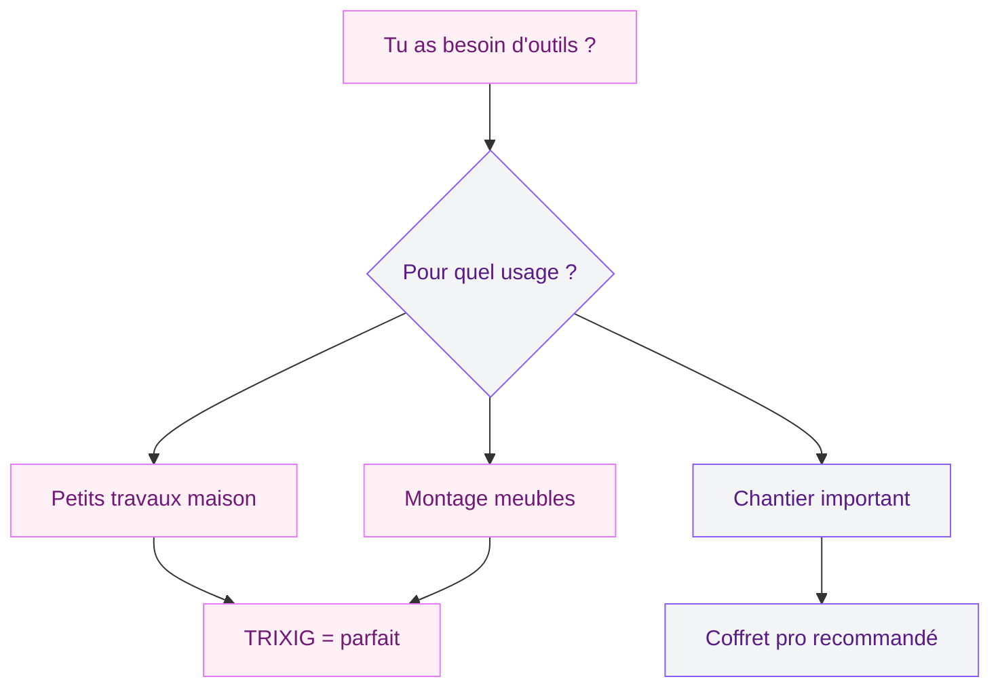
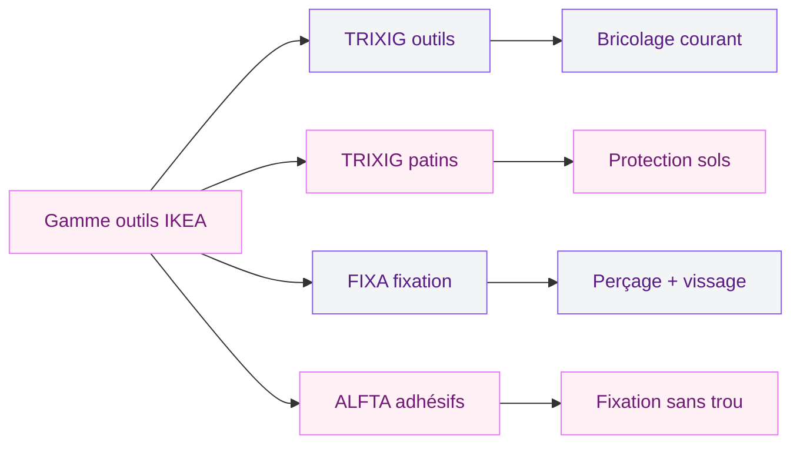

Tu viens d'emménager, tu dois fixer une étagère, resserrer une poignée de porte ou accrocher un cadre, et tu réalises que tu n'as absolument rien sous la main pour bricoler ? Le kit TRIXIG d'IKEA a été pensé pile pour cette situation. Pour 12,99 euros, tu repars avec un set de 15 pièces qui couvre 90 % des petits travaux du quotidien. Marteau, clé à molette, pince, tournevis et 12 embouts - le tout rangé dans une boîte compacte avec couvercle transparent. Je l'ai testé, décortiqué et comparé à la concurrence pour te donner un avis honnête.

## Ce que contient le kit TRIXIG 15 pièces

Quand tu ouvres la boîte, voilà ce que tu trouves à l'intérieur :

- **1 marteau** avec embout caoutchouc interchangeable (pour taper sans abîmer les surfaces fragiles)
- **1 clé à molette** réglable (pour serrer écrous et boulons de tailles variées)
- **1 pince universelle** (pour maintenir, tordre ou couper du fil fin)
- **1 tournevis** avec porte-embout magnétique
- **12 embouts** de vissage : cruciformes (Phillips), plats, Torx et Allen

La boîte elle-même mérite qu'on en parle. Son couvercle transparent te permet de voir le contenu sans tout ouvrir, et les compartiments moulés maintiennent chaque outil à sa place. Fini le tiroir fourre-tout où le marteau écrase les embouts.

> [!TIP]
> Garde la boîte TRIXIG dans ton entrée ou ton placard technique. Elle est assez compacte pour se glisser sur une étagère sans gêner, et tu la retrouves en 5 secondes quand tu en as besoin.

## Prise en main : ça vaut quoi pour 12,99 euros ?

Soyons clairs dès le départ : à ce prix, tu n'achètes pas de l'outillage professionnel. Le marteau ne rivalisera pas avec un Facom à 35 euros, et la clé à molette ne remplacera pas un coffret de clés Bahco. Mais ce n'est pas le but.

### Le marteau

Il pèse environ 300 grammes, ce qui le place dans la catégorie "léger". Pour planter des clous de fixation, accrocher des cadres, ou enfoncer des chevilles, il fait très bien le travail. L'embout en caoutchouc qui se clipse sur la tête est un vrai bon point : tu peux taper sur des surfaces délicates (meubles en bois, sols stratifiés) sans les marquer. Pour un gros chantier de démolition, par contre, il faudra passer à autre chose.

### La clé à molette

Réglable, avec une mâchoire qui s'ouvre sur environ 20 mm. Assez pour serrer la plupart des écrous qu'on rencontre dans une maison : plomberie sous l'évier, raccords de radiateur, vis de fixation de meubles. La molette tourne de manière fluide et la mâchoire ne glisse pas - bonne surprise pour cette gamme de prix.

### La pince

Une pince combinée classique. Elle coupe du fil électrique fin, maintient des pièces, et sert de troisième main quand tu as besoin de tenir un écrou pendant que tu visses de l'autre côté. Les mâchoires s'alignent correctement et la charnière ne montre pas de jeu.

### Le tournevis et ses 12 embouts

C'est le gros point fort du kit. Le manche du tournevis accueille un porte-embout magnétique, et les 12 embouts couvrent la grande majorité des vis qu'on croise en bricolage domestique :

- Phillips (cruciforme) : PH1 et PH2
- Plats : plusieurs tailles
- Torx : T15, T20, T25
- Allen (hexagonal) : les tailles courantes pour le montage de meubles

En gros, tu peux monter un meuble IKEA avec ce seul tournevis. Logique, quand on y pense.

> [!NOTE]
> Les embouts Torx et Allen sont les mêmes qu'IKEA fournit dans ses packs de montage, mais en version réutilisable et avec un vrai manche ergonomique. Plus besoin de te tordre les doigts avec la petite clé Allen en L livrée dans le carton.

## A qui s'adresse ce kit (et à qui il ne convient pas)

**Le TRIXIG est fait pour toi si :**

- Tu viens d'emménager et tu pars de zéro côté outils
- Tu vis en appartement et tu fais du bricolage léger (cadres, étagères, petites réparations)
- Tu montes régulièrement des meubles en kit
- Tu veux un kit compact qui ne prend pas de place
- Tu cherches un cadeau utile pour un étudiant ou un jeune actif qui s'installe

**Passe ton chemin si :**

- Tu fais des travaux de rénovation lourds (là il te faut une vraie caisse à outils)
- Tu as besoin d'un marteau de charpentier ou d'une pince coupante costaud
- Tu es artisan et tu cherches de l'outillage qui encaisse des heures d'utilisation intensive

## Comparatif : TRIXIG vs la concurrence

Le créneau du "kit outils premier prix" est assez disputé. Voici comment le TRIXIG se positionne face à ses principaux rivaux.

| Critère | **IKEA TRIXIG** | **Lidl Parkside** | **Amazon Basics** | **Leroy Merlin Dexter** |
|---|---|---|---|---|
| Prix | 12,99 EUR | 9,99 - 14,99 EUR | 15 - 20 EUR | 19,99 EUR |
| Nombre de pièces | 15 | 25 - 40 | 32 | 24 |
| Qualité perçue | Correcte | Variable | Moyenne | Bonne |
| Rangement | Boîte couvercle transparent | Mallette plastique | Pochette tissu | Mallette rigide |
| Disponibilité | Magasin IKEA + site | Stock limité (arrivages) | Livraison rapide | Magasin + site |
| Garantie | 1 an | 3 ans | 1 an | 2 ans |

Le gros avantage des kits Lidl ou Dexter, c'est le nombre de pièces. Mais la disponibilité chez Lidl dépend des arrivages (pas de réassort garanti), et le kit Dexter coûte presque le double. Le TRIXIG tire son épingle du jeu grâce à son accessibilité : tu le trouves en permanence en magasin IKEA et sur le site, et il tient dans un tiroir.

> [!WARNING]
> Attention aux kits "100 pièces à 15 euros" qu'on voit sur certaines marketplaces. Le décompte inclut souvent chaque embout, chaque clé Allen et chaque vis comme "une pièce". Au final, tu as trois outils et 97 accessoires de qualité douteuse.

## Les autres outils IKEA à connaître

IKEA ne se limite pas au TRIXIG. Le géant suédois a développé toute une gamme d'outils et d'accessoires pour la maison qui mérite le détour.

### TRIXIG patins protège-sol

Même nom, autre produit. Les patins TRIXIG, ce sont des pastilles adhésives à coller sous les pieds de tes meubles pour protéger le parquet. Disponibles en plusieurs diamètres, ils évitent les rayures quand tu déplaces une chaise ou un canapé. Un complément logique du kit outils, surtout si tu viens de monter un nouveau meuble.

### FIXA : la gamme de fixation complète

Perceuses sans fil, kits de chevilles, vis assorties, niveaux à bulle... La gamme FIXA couvre tout ce qui touche à la fixation murale. Si tu as un mur en placo et que tu veux accrocher une étagère lourde, le kit de chevilles FIXA (environ 5 euros) contient tout le nécessaire avec un guide de choix selon le type de mur.

### ALFTA : les crochets adhésifs

Pour ceux qui ne veulent pas percer du tout, les crochets ALFTA se collent directement au mur. Ils supportent entre 2 et 5 kg selon le modèle, parfait pour des cadres légers, des torchons de cuisine ou des clés dans l'entrée. Zéro outil requis, zéro trou dans le mur, et ils se retirent sans laisser de trace. Si tu es locataire, c'est une option en or - j'en parle aussi dans mon article sur l'[artisanat recyclé et la déco créative](/guides/decoration/artisanat-recycle-objets-maison/).

## Mes conseils pour bien utiliser le kit TRIXIG

Quelques astuces tirées de mon expérience pour tirer le maximum de ce petit kit.

**Stocke tes embouts dans l'ordre.** La boîte a des emplacements dédiés, mais rien n'empêche les embouts de se mélanger si tu la secoues. Un petit coup d'oeil après chaque utilisation pour tout remettre en place, et tu ne perdras jamais de temps à chercher le bon embout.

**Utilise l'embout caoutchouc du marteau plus souvent que tu ne le penses.** Quand tu assembles un meuble, les derniers coups pour emboîter les pièces en bois doivent se faire avec le côté caoutchouc. Le côté métal laisse des marques sur le bois, même à travers un chiffon.

**La clé à molette remplace plusieurs clés plates.** Plutôt que d'acheter un jeu de clés plates de 8 à 19 mm, la clé à molette du TRIXIG couvre toutes ces tailles. Pour un usage domestique, c'est un gain de place et d'argent.

**Complète le kit avec le temps.** Le TRIXIG est un excellent point de départ, mais au fil des projets, tu sentiras le besoin d'ajouter un mètre ruban, un niveau à bulle, et peut-être une perceuse. La gamme FIXA d'IKEA ou un modèle d'entrée de gamme chez Leroy Merlin feront très bien l'affaire. D'ailleurs, si tu te lances dans des projets d'aménagement plus ambitieux, mon guide sur l'[armoire d'angle IKEA PAX](/guides/shopping/ikea-cartonne-avec-son-armoire-dangle/) te sera utile.

> [!IMPORTANT]
> Si tu perds un embout (ça arrive), tu peux acheter des embouts de tournevis standard au format 1/4 de pouce dans n'importe quelle quincaillerie. Le porte-embout du TRIXIG accepte tous les embouts de ce format, pas seulement ceux d'IKEA.

## Où acheter et comment optimiser son passage en magasin

Le kit TRIXIG est disponible en magasin IKEA (rayon "Rangement et organisation" ou "Bricolage", selon les enseignes) et sur ikea.fr avec livraison à domicile ou en point relais. En magasin, il se trouve généralement juste avant les caisses, dans la zone du marché où IKEA regroupe les petits accessoires et objets malins du quotidien.

Si tu prévois un passage chez IKEA pour le TRIXIG, profites-en pour jeter un oeil à la [lampe articulée TERTIAL](/guides/shopping/cohue-chez-ikea-avec-cette-lampe-articulee-super-design-a-moins-de-5-euros/) dans le même rayon - à 12,99 euros aussi, c'est le duo parfait pour équiper un bureau ou un atelier à petit budget.

**Astuce commande en ligne :** les frais de livraison IKEA démarrent autour de 5 euros pour un point relais. Pour un kit à 12,99 euros, ça représente presque 40 % du prix en plus. Essaie de grouper ta commande avec d'autres articles pour rentabiliser les frais de port, ou opte pour le click & collect gratuit si ton magasin le propose.

> [!TIP]
> La carte IKEA Family (gratuite) te donne accès à des offres membres et parfois des réductions sur les accessoires. Inscris-toi avant de passer commande, ça ne prend que deux minutes et tu cumules des avantages dès le premier achat.

## Mon verdict final

Le kit TRIXIG d'IKEA n'est pas un gadget. C'est un vrai set d'outils fonctionnel qui remplit sa mission : te permettre de gérer les petits travaux du quotidien sans vider ton portefeuille. Pour 12,99 euros, tu obtiens quatre outils de qualité correcte et 12 embouts qui couvrent la quasi-totalité des vis qu'on rencontre à la maison. Le rangement est bien pensé, la prise en main est agréable, et l'embout caoutchouc du marteau est un vrai plus que beaucoup de kits concurrents ne proposent pas.

Si tu démarres ta vie en solo, si tu équipes un premier appartement, ou si tu veux juste avoir le minimum vital sous la main pour ne pas appeler un voisin à chaque vis qui se desserre, le TRIXIG mérite clairement sa place dans ton placard.

## Sur le meme theme

- [plateau multifonction ikea](/guides/shopping/cohue-chez-ikea-avec-ce-plateau-multifonction-de-la-saison/)
- [étagères murales ikea](/guides/shopping/cohue-chez-ikea-avec-letagere-murale-prisee-a-prix-imbattable/)

## FAQ

### Le kit TRIXIG est-il suffisant pour monter un meuble IKEA ?

Oui, dans la grande majorité des cas. Le tournevis avec ses embouts Allen et cruciformes couvre les types de vis utilisés dans les meubles IKEA. Le marteau sert pour les tourillons en bois et les fonds en panneau. Tu n'auras besoin d'une perceuse que pour les fixations murales (anti-basculement par exemple).

### Quelle est la différence entre TRIXIG outils et TRIXIG patins ?

Ce sont deux produits différents qui portent le même nom. Le kit TRIXIG outils (15 pièces, 12,99 euros) contient marteau, tournevis, pince et clé à molette. Les TRIXIG patins sont des pastilles adhésives protège-sol à coller sous les pieds de meubles pour éviter les rayures sur le parquet ou le carrelage.

### Les embouts du tournevis TRIXIG sont-ils remplaçables ?

Oui. Le porte-embout magnétique accepte tous les embouts au format standard 1/4 de pouce (6,35 mm). Tu peux acheter des embouts de remplacement dans n'importe quelle quincaillerie, grande surface de bricolage, ou même en ligne pour quelques euros le lot.

### Le kit TRIXIG convient-il pour des travaux de plomberie ?

Pour des interventions simples comme resserrer un raccord sous un évier ou changer un flexible de douche, la clé à molette du kit fait le travail. Pour des travaux de plomberie plus poussés (soudure, découpe de tuyaux, remplacement de siphon), il te faudra des outils spécialisés qu'on ne trouve pas dans ce type de kit.

### Peut-on trouver le kit TRIXIG en dehors d'IKEA ?

Non, TRIXIG est une marque propre IKEA. Tu ne la trouveras ni en grande surface ni en quincaillerie. L'achat se fait uniquement en magasin IKEA ou sur ikea.fr. Si tu n'as pas de magasin IKEA à proximité, la livraison en point relais reste une option, moyennant des frais de port d'environ 5 euros.
