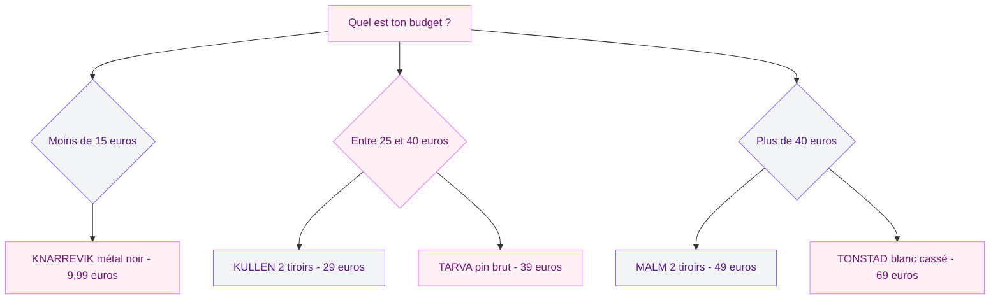
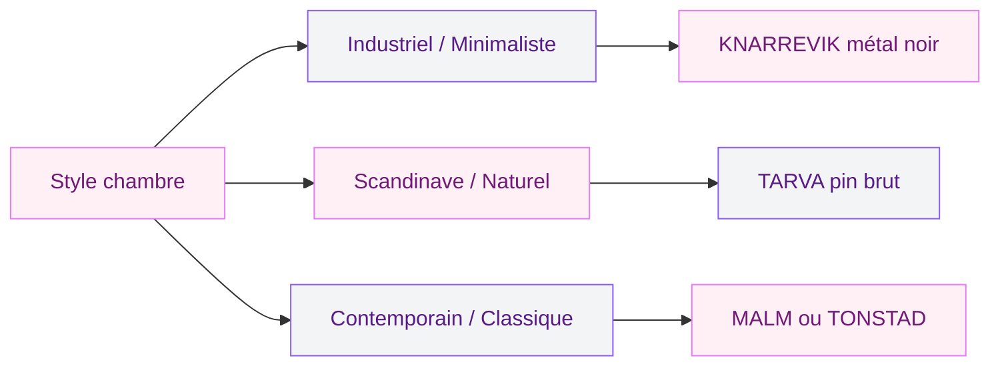

Tu cherches une table de nuit pas chère qui ne ressemble pas à un meuble de chambre d'étudiant ? IKEA a quelques pépites dans son catalogue 2026 qui méritent qu'on s'y arrête. Entre la KNARREVIK à 9,99 euros, la KULLEN à 29 euros et des éditions limitées qui partent en quelques semaines, il y a de quoi trouver son bonheur sans exploser son budget. Je te fais le tour complet des modèles à connaître, avec mes conseils pour bien choisir et quelques hacks déco pour personnaliser tout ça.

## KNARREVIK : la table de chevet à moins de 10 euros

C'est le modèle qui fait parler de lui sur les réseaux. La KNARREVIK est une petite table de chevet en métal noir avec un plateau ajouré et un espace de rangement en dessous. Son prix : 9,99 euros. À ce tarif, certains en achètent deux sans réfléchir.

  

**Ce qui la rend intéressante :**

- Un look industriel-minimaliste qui passe partout
- Une structure en métal solide, plus résistante qu'on pourrait le croire à ce prix
- Un format compact (37x28 cm, hauteur 45 cm) parfait pour les petites chambres
- Un plateau ajouré qui laisse passer le câble du chargeur de téléphone

**Ce qu'il faut savoir :**

- Pas de tiroir - tes affaires restent visibles
- Le métal peut être froid au toucher si ta chambre n'est pas bien chauffée
- La capacité de charge est limitée : pas de pile de livres lourds dessus

> [!TIP]
> Pose un petit plateau rond en bois ou en rotin sur le dessus de la KNARREVIK pour adoucir son côté industriel. Ça crée un joli contraste de matières et ça empêche les petits objets de glisser à travers le plateau ajouré.

## KULLEN : le best-seller avec tiroirs

Si tu as besoin de ranger des trucs (et soyons honnêtes, qui n'en a pas besoin sur sa table de nuit ?), la KULLEN est probablement le meilleur rapport qualité-prix du catalogue IKEA. La version 2 tiroirs en blanc fait 35x49 cm et coûte 29 euros.

  

**Ses atouts principaux :**

- **Deux tiroirs** qui glissent bien et offrent un vrai espace de rangement
- **Un dessus plat et stable** pour ta lampe, ton verre d'eau, ton livre
- **Un design ultra simple** en blanc qui se fond dans n'importe quel décor
- **Un montage rapide** : 20 à 30 minutes max, même pour les débutants

La KULLEN existe aussi en version commode (3, 5 ou 6 tiroirs) si tu veux garder une cohérence visuelle dans ta chambre. Perso, j'aime bien associer la table de nuit 2 tiroirs avec la commode 5 tiroirs du même modèle - ça crée un ensemble harmonieux sans se ruiner.

> [!NOTE]
> La KULLEN n'a pas de système de fermeture progressive sur les tiroirs. Ils se ferment d'un coup sec. Si ça te dérange, la MALM (à partir de 49 euros) propose des glissières plus douces.

## TARVA : le charme du bois brut à customiser

La TARVA, c'est un peu la toile blanche du catalogue IKEA. Fabriquée en pin massif non traité, cette table de chevet (48x62 cm) attend que tu lui donnes ta touche perso. Brute, teintée, peinte, cirée - tout est possible.

  

**Pourquoi j'adore la TARVA :**

- Du **pin massif** à un prix correct (environ 39 euros pour la table de chevet)
- Un grain de bois naturel, chaque pièce est légèrement différente
- Un tiroir et un compartiment ouvert en dessous
- Compatible avec toutes les teintes et peintures pour bois

Le gros avantage de la TARVA par rapport à la KULLEN, c'est la matière. Le pin massif vieillit mieux que le panneau de particules, et tu peux le poncer et le re-teinter quand tu veux changer de style. Si tu t'intéresses aux [tendances chambre 2026](/decoration-de-la-chambre-a-coucher-2026-tendances-et-photos/), le bois naturel est clairement dans la liste des valeurs sûres.

## MALM et TONSTAD : monter en gamme sans se ruiner

Pour celles et ceux qui veulent quelque chose d'un peu plus fini, deux modèles méritent le détour.

  

### MALM 2 tiroirs - 49 euros

La MALM est le grand classique d'IKEA. La version table de chevet (40x55 cm) en blanc propose deux tiroirs avec des glissières plus fluides que la KULLEN. Le design est épuré, les angles sont nets, et la finition est un cran au-dessus. C'est le modèle que je recommande si tu as un budget entre 40 et 60 euros et que tu veux un truc solide qui dure.

### TONSTAD blanc cassé - 69 euros

La TONSTAD est apparue dans le catalogue 2025 et elle s'est vite imposée comme une favorite. Son coloris blanc cassé (presque crème) lui donne un côté chaleureux que le blanc pur de la KULLEN ou de la MALM n'a pas. Les dimensions sont généreuses (42x51 cm), les tiroirs ferment en douceur, et le plateau est assez large pour accueillir une lampe et quelques objets déco. C'est la table de nuit IKEA qui ressemble le moins à du IKEA.

## Les éditions limitées 2026 à surveiller

IKEA lance régulièrement des collections en édition limitée, et 2026 ne fait pas exception. Voici ce qu'il faut garder dans ton radar.

  

### STORKLINTA - le gris-vert qui fait craquer

La STORKLINTA est sortie en édition limitée avec un coloris gris-vert qui a immédiatement buzzé sur Instagram. Ce ton doux, entre le sauge et le kaki clair, s'intègre à merveille dans les chambres aux ambiances naturelles. Le modèle est une table de chevet compacte avec un tiroir et des pieds fins en bois. Son prix tourne autour de 45 euros, et les stocks s'écoulent vite à chaque réapprovisionnement.

### Collections SOLVINDEN et STRANDON

Ces deux collections limitées 2026 apportent surtout des accessoires et de la petite déco, mais elles incluent aussi des éléments qui peuvent transformer une simple table de nuit :

- **SOLVINDEN** : guirlandes solaires et photophores pour créer une ambiance douce sur ta table de chevet
- **STRANDON** : textiles et petits plateaux déco aux teintes douces

> [!WARNING]
> Les éditions limitées IKEA ne sont pas restockées une fois épuisées. Si un modèle te plaît, n'attends pas trop. La STORKLINTA en gris-vert a connu des ruptures de stock à répétition au printemps 2026.

## Comment choisir la bonne table de nuit IKEA

Le choix dépend de trois critères simples : ton budget, la taille de ta chambre, et ce que tu poses dessus.

### Critère 1 : la place disponible

Si ta chambre fait moins de 10 m2, privilégie les modèles compacts comme la KNARREVIK (37x28 cm) ou la KULLEN (35x49 cm). Dans une chambre spacieuse, tu peux te permettre la TONSTAD (42x51 cm) ou même empiler deux petits meubles pour créer un ensemble original.

### Critère 2 : tes besoins en rangement

Sois honnête avec toi-même. Si ta table de nuit accumule les livres, les câbles, les crèmes, les lunettes et un paquet de mouchoirs, tu as besoin de tiroirs. La KNARREVIK sans tiroir sera vite débordée. La KULLEN ou la MALM avec leurs deux tiroirs sont plus adaptées.

### Critère 3 : le style de ta chambre

Pour une chambre minimaliste ou industrielle, la KNARREVIK en métal noir est parfaite. Pour un style scandinave ou naturel, la TARVA en pin brut s'impose. Pour un look plus classique ou contemporain, la MALM ou la TONSTAD en blanc cassé feront le job. Si tu as besoin d'inspiration pour [décorer ta chambre avec un petit budget](/decorer-la-chambre-a-coucher-avec-peu-dargent/), les tables de nuit IKEA sont un excellent point de départ.

## 5 hacks déco pour personnaliser ta table de nuit IKEA

Une table de nuit IKEA basique peut devenir un vrai élément de décoration avec quelques astuces simples. Voici mes techniques préférées :

**1. Changer les boutons de tiroir.** Les poignées d'origine de la KULLEN et de la MALM sont fonctionnelles mais fades. Remplace-les par des boutons en laiton, en céramique ou en cuir - ça prend 5 minutes et ça change tout. Tu trouves des boutons sympas pour 3 à 8 euros la pièce sur des sites comme Etsy ou directement chez IKEA.

**2. Ajouter des pieds.** La KULLEN est posée directement au sol. En ajoutant des pieds en bois ou en métal (les BESTA de chez IKEA fonctionnent bien), tu lui donnes un look plus aérien et tu facilites le passage de l'aspirateur en dessous.

**3. Peindre la TARVA.** Teinte noyer, peinture blanc mat, couleur terracotta - le pin brut de la TARVA absorbe tout. Deux couches de peinture et ta table de chevet ne ressemble plus du tout à un meuble standard.

**4. Superposer les matières.** Un petit plateau en marbre ou en bois sur le dessus, un panier tressé en dessous, une plante verte à côté - la superposition de textures donne du caractère à n'importe quelle table de nuit basique.

**5. Créer un duo asymétrique.** Qui a dit que les deux tables de nuit devaient être identiques ? Essaie une KNARREVIK d'un côté du lit et une TARVA de l'autre. Le contraste métal-bois crée une ambiance déco bien plus intéressante qu'un duo parfaitement assorti. Pour d'autres idées d'association, jette un oeil à mon article sur l'[armoire d'angle IKEA](/ikea-cartonne-avec-son-armoire-dangle/) qui aborde aussi la question de la cohérence dans une chambre.

> [!TIP]
> Pour la TARVA, applique une couche de fond bloqueur (type Zinsser BIN) avant de peindre. Le pin brut est poreux et absorbe beaucoup de peinture. Sans fond bloqueur, tu vas utiliser trois fois plus de peinture et le résultat sera moins uniforme.

## Tableau comparatif rapide

| Modèle | Prix | Dimensions | Tiroirs | Matière | Idéal pour |
|--------|------|-----------|---------|---------|------------|
| KNARREVIK | 9,99 euros | 37x28 cm | 0 | Métal | Petits budgets, style indus |
| KULLEN | 29 euros | 35x49 cm | 2 | Panneau particules | Rapport qualité-prix |
| TARVA | 39 euros | 48x62 cm | 1 | Pin massif | Customisation, style naturel |
| MALM | 49 euros | 40x55 cm | 2 | Panneau particules | Qualité des tiroirs |
| TONSTAD | 69 euros | 42x51 cm | 2 | Panneau particules | Finition premium |
| STORKLINTA | 45 euros | Édition limitée | 1 | Bois + métal | Couleur tendance |

> [!IMPORTANT]
> Les prix indiqués sont ceux du catalogue IKEA France en 2026. Ils peuvent varier légèrement selon les magasins et les périodes. Vérifie toujours le prix en ligne avant de te déplacer.

## Sur le meme theme

- [lampe articulée ikea à petit prix](/cohue-chez-ikea-avec-cette-lampe-articulee-super-design-a-moins-de-5-euros/)
- [plateau multifonction ikea](/cohue-chez-ikea-avec-ce-plateau-multifonction-de-la-saison/)

## FAQ

### Quelle est la table de nuit IKEA la moins chère en 2026 ?

La KNARREVIK est le modèle le moins cher du catalogue à 9,99 euros. C'est une table de chevet en métal noir sans tiroir, au design compact et épuré. Pour un modèle avec tiroirs, la KULLEN à 29 euros est l'option la plus accessible.

### La KULLEN est-elle solide pour un usage quotidien ?

Oui, la KULLEN en panneau de particules supporte bien un usage normal (lampe, livres, téléphone, réveil). Elle n'est pas faite pour porter des charges lourdes, mais pour une table de nuit standard, elle fait très bien le travail. Le montage est simple et les tiroirs fonctionnent correctement même après plusieurs années.

### Peut-on peindre la TARVA sans poncer ?

Techniquement oui, avec un fond accrocheur (primaire d'accroche universelle). Le pin brut de la TARVA absorbe bien la peinture. Un léger ponçage au grain 120 donne un meilleur résultat, surtout pour les finitions mates. Compte une demi-journée pour le projet complet (ponçage + primaire + deux couches).

### Les éditions limitées IKEA sont-elles disponibles en ligne ?

La plupart des éditions limitées IKEA sont vendues en magasin et en ligne, mais les stocks en ligne s'écoulent souvent plus vite. La STORKLINTA en gris-vert a été en rupture en ligne pendant plusieurs semaines au printemps 2026 alors qu'elle restait disponible dans certains magasins. Active les alertes de disponibilité sur ikea.fr pour ne rien rater.

### MALM ou KULLEN : laquelle choisir ?

La MALM coûte 20 euros de plus que la KULLEN, et la différence se voit surtout dans la qualité des glissières de tiroirs (plus fluides et silencieuses) et dans la finition générale (bords mieux finis, surface plus lisse). Si ton budget le permet, la MALM est un meilleur investissement sur le long terme. Si tu as besoin de deux tables de nuit et que ton budget est serré, deux KULLEN à 58 euros valent mieux qu'une seule MALM à 49 euros.
