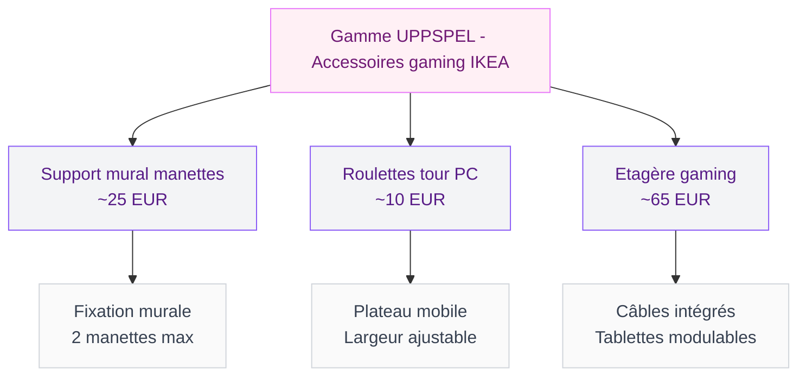
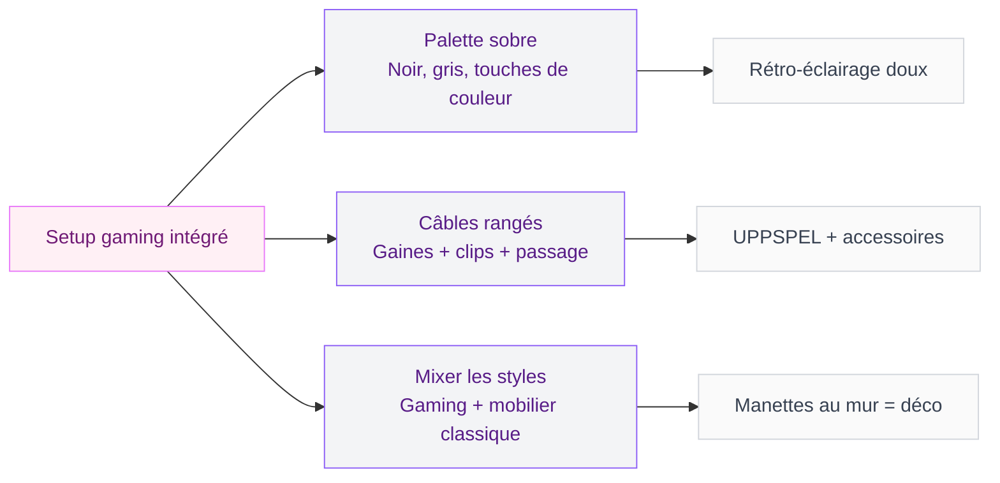

Tu cherches un support pour ton casque gaming qui ne fasse pas "plastique cheap" et qui s'intègre vraiment dans ta déco ? IKEA a lancé toute une gamme d'accessoires gaming avec la collection UPPSPEL, née de la collaboration entre le géant suédois et Asus ROG (Republic of Gamers). Le résultat, c'est une série de supports, range-manettes et meubles pensés pour les gamers, mais avec le design épuré qu'on attend d'IKEA. Et les prix sont franchement agressifs. Je t'emmène faire le tour de cette gamme qui change la donne pour les setups gaming, mais aussi pour tous ceux qui veulent ranger un casque audio proprement sans sacrifier l'esthétique.

## La collab IKEA x Asus ROG : du gaming avec du style

Quand IKEA a annoncé son partenariat avec Asus ROG, beaucoup s'attendaient à des meubles bardés de LED criardes et de formes agressives. Le résultat est à l'opposé. La gamme UPPSPEL privilégie des lignes sobres, des coloris neutres (noir, gris, blanc) et des matériaux qui tiennent la route. L'idée d'IKEA, c'est que ton coin gaming doit pouvoir exister dans un salon, une chambre ou un bureau sans jurer avec le reste de la pièce.

  

Cette approche plaît autant aux gamers qu'aux amateurs de déco qui possèdent un casque audio (pour la musique, le télétravail, les podcasts) et qui en ont marre de le poser en vrac sur le bureau. Un support de casque bien conçu, c'est un petit détail qui range et qui décore en même temps.

> [!TIP]
> Si tu hésites entre plusieurs accessoires UPPSPEL, la gamme est conçue pour fonctionner ensemble. Les couleurs et les finitions sont coordonnées, donc tu peux mixer étagère, support casque et range-manettes sans faute de goût.

## Les accessoires UPPSPEL qui valent le coup

Rentrons dans le concret. Voici les pièces les plus intéressantes de la gamme, avec leurs prix et mes impressions après les avoir testées en magasin.

  

### Le support mural pour manettes - environ 25 euros

C'est le produit qui m'a le plus surprise. Ce support mural permet d'accrocher une ou deux manettes (PlayStation, Xbox, Switch Pro) au mur, comme des petits objets déco. Le design est minimaliste : un rail en acier noir mat avec des encoches adaptées à la forme des manettes. Le montage est simple, deux vis et c'est réglé.

**Ce qui est bien :**

- Les manettes sont accessibles en un geste, plus besoin de fouiller dans un tiroir
- Le look "galerie" donne un côté soigné au setup
- Compatible avec la plupart des manettes du marché
- Matériau solide, pas de flexion même avec des manettes lourdes

**Ce qui est moins bien :**

- Il faut percer le mur (pas idéal en location)
- Deux manettes maximum par support
- Pas de système de charge intégré

Ce support fonctionne très bien au-dessus d'un bureau gaming, mais aussi dans un salon où tu veux garder tes manettes à portée de main sans qu'elles traînent sur la table basse. Si ton espace a un esprit [industriel-scandinave](/industriel-scandinave/), l'acier noir mat se fond parfaitement dans le décor.

### L'accessoire roulettes pour tour PC - environ 10 euros

Pour 10 euros, tu transformes ta tour PC en meuble mobile. Cet accessoire est un plateau à roulettes qui se glisse sous l'unité centrale. Plus besoin de te contorsionner pour accéder aux ports arrière ou pour passer l'aspirateur derrière. C'est bête comme chou, mais c'est le genre de truc qui change la vie quand tu réorganises ton bureau.

**Points forts :**

- Prix dérisoire pour le confort gagné
- Roulettes silencieuses avec frein
- Largeur ajustable pour s'adapter à différentes tailles de tours
- Capacité de charge largement suffisante

> [!NOTE]
> Le plateau à roulettes protège aussi ton sol (parquet, moquette) des rayures et de la chaleur dégagée par la tour. Un bénéfice auquel on ne pense pas toujours.

### L'étagère gaming UPPSPEL - environ 65 euros

L'étagère UPPSPEL, c'est la pièce centrale de la gamme. Elle sert à organiser tout l'écosystème gaming : casque, manettes, jeux, figurines, enceintes. La structure en acier avec des tablettes perforées permet de faire passer les câbles proprement. Plusieurs configurations sont possibles grâce aux tablettes amovibles.

**Ce que j'aime :**

- Le passage de câbles intégré - enfin une étagère qui pense aux fils
- La modularité : tu peux ajuster la hauteur des tablettes
- Le design sobre qui ne crie pas "gamer" à 100 mètres
- La solidité de l'ensemble (acier, pas d'aggloméré cheap)

**Ce que j'aime moins :**

- 65 euros reste un budget pour une étagère d'appoint
- Le montage demande une bonne heure
- Les tablettes perforées accumulent un peu la poussière

## Le support casque : la star discrète du catalogue

Revenons au sujet principal. Le support pour casque de la gamme UPPSPEL est un crochet de bureau ou un support sur pied qui accueille ton casque quand tu ne l'utilises pas. Il existe en version clip (se fixe au bord du bureau) et en version adhésive (se colle sous le plateau).

  

Le modèle clip est mon préféré. Il se fixe en deux secondes, ne bouge pas, et donne un côté rangé au bureau. Le casque est visible, accessible, et ne traîne plus entre le clavier et la tasse de café. Le prix tourne autour de 5 à 10 euros selon le modèle, ce qui est dérisoire vu le gain en organisation.

Pour ceux qui préfèrent un support sur pied, IKEA propose aussi une variante en forme de T inversé qui se pose directement sur le bureau. Le design est sobre (noir mat, courbes douces) et l'emprise au sol est minime. Ce modèle coûte entre 10 et 15 euros.

### Comparer avec la concurrence

Un support casque Razer ou HyperX tourne entre 15 et 30 euros, avec souvent un look très "gamer" (RGB, angles agressifs, logo visible). Le support UPPSPEL d'IKEA mise sur la discrétion. Pas de LED, pas de logo géant, juste une forme fonctionnelle qui s'adapte à tous les intérieurs. Si tu veux que ton setup reste élégant, c'est un avantage sérieux.

> [!WARNING]
> Vérifie la largeur de ton plateau de bureau avant de prendre la version clip. Les modèles fonctionnent sur des épaisseurs de plateau entre 1,5 et 3,5 cm. Au-delà, le clip ne tiendra pas.

## La collection Teklan : éclairage et son pour gamers

En parallèle de la gamme UPPSPEL, IKEA développe la collection Teklan, centrée sur l'éclairage d'ambiance et le son pour les espaces gaming. On y trouve des barres LED pour l'arrière de l'écran, des panneaux lumineux muraux et des enceintes compactes.

  

Les barres LED Teklan se placent derrière le moniteur et diffusent une lumière d'ambiance qui réduit la fatigue oculaire pendant les sessions longues. Le prix tourne entre 15 et 30 euros selon la longueur, avec un contrôle via l'appli IKEA Home Smart. Pour un éclairage d'appoint dans ton espace, tu peux aussi voir comment [choisir un tableau lumineux](/choisir-tableau-lumineux/) qui apporte de la personnalité au mur.

Les enceintes Teklan sont conçues pour se poser sur les étagères UPPSPEL, avec un design compact et une connectique pensée pour le gaming (Bluetooth 5.0, prise jack 3,5 mm). Le son est correct pour du gaming casual, sans prétendre remplacer un vrai système hi-fi.

## Nouveautés IKEA 2026 : la cimaise DAGGKAPRIFOL à 8 euros

En dehors du gaming, IKEA sort la cimaise DAGGKAPRIFOL à 8 euros, une solution murale ultra simple pour accrocher cadres, photos et petits objets sans percer de trous partout. Cette cimaise adhésive se présente comme un rail fin et discret qui court le long du mur. Tu y fixes ensuite des crochets mobiles pour suspendre ce que tu veux.

  

Je la mentionne ici parce qu'elle peut compléter un setup gaming : accroche des photos de tes jeux préférés, des prints d'artistes ou même un petit casque léger. Le style guide 2026 d'IKEA pousse d'ailleurs vers ce genre de solutions modulables qui permettent de changer la déco sans abîmer les murs. Si tu cherches d'autres inspirations murales, j'ai aussi testé [une lampe articulée IKEA à moins de 5 euros](/cohue-chez-ikea-avec-cette-lampe-articulee-super-design-a-moins-de-5-euros/) qui peut se fixer au-dessus du bureau.

## Comment intégrer un setup gaming dans ta déco

Le plus gros défi quand tu es gamer et que tu aimes la déco, c'est de faire cohabiter les deux sans que l'un écrase l'autre. Voici ma méthode.

### Choisis une palette de couleurs cohérente

Le noir et le gris de la gamme UPPSPEL s'intègrent partout. Si tu veux ajouter de la couleur, fais-le par touches : un tapis, un coussin, un mur accent. Evite d'empiler les LED multicolores - un rétro-éclairage en blanc chaud ou en violet doux suffit pour marquer le coin gaming sans transformer ton salon en boîte de nuit.

### Range les câbles

C'est LE point qui fait la différence entre un setup qui a de l'allure et un bureau chaotique. Utilise des gaines spirales (3 euros chez IKEA), des clips adhésifs et le passage de câbles de l'étagère UPPSPEL. Cinq minutes de travail, et le résultat est immédiat.

### Mélange gaming et "vrai" mobilier

Un fauteuil gaming au milieu d'un salon, ça peut gêner. La solution, c'est de mixer les genres : étagère UPPSPEL à côté d'une bibliothèque en bois, casque sur un support discret, manettes accrochées au mur comme des objets d'art. La clé, c'est de traiter les accessoires gaming comme des éléments de déco à part entière, pas comme des trucs à planquer.

> [!IMPORTANT]
> Pense à l'aération de ta tour PC. Si tu utilises le plateau à roulettes, ne la coince pas contre un mur ou dans un meuble fermé. Laisse au moins 10 cm d'espace autour pour que l'air circule bien.

## Sur le meme theme

- [plateau multifonction ikea](/cohue-chez-ikea-avec-ce-plateau-multifonction-de-la-saison/)
- [étagères murales ikea](/cohue-chez-ikea-avec-letagere-murale-prisee-a-prix-imbattable/)

## FAQ - Accessoires gaming IKEA UPPSPEL

### Le support casque UPPSPEL est-il compatible avec tous les casques gaming ?

Oui, les supports UPPSPEL (clip et sur pied) acceptent tous les formats de casques gaming standard : circum-auraux (qui englobent l'oreille) et supra-auraux (qui se posent dessus). L'arceau se pose naturellement sur le support. Les modèles très larges type SteelSeries Arctis Pro ou HyperX Cloud Alpha passent sans souci.

### La gamme UPPSPEL est-elle disponible dans tous les magasins IKEA en France ?

La gamme est vendue dans la plupart des magasins IKEA en France et sur ikea.fr. Certains petits points de vente ou IKEA City peuvent avoir un assortiment réduit. Je te conseille de vérifier la disponibilité en ligne avant de te déplacer, en renseignant ton magasin sur la fiche produit.

### Est-ce que les meubles UPPSPEL sont solides dans le temps ?

La structure principale est en acier, donc très résistante. Les tablettes et plateaux sont en acier perforé ou en panneau de particules renforcé selon le modèle. Après un an d'usage régulier, mon étagère UPPSPEL n'a pas bougé d'un millimètre. Le seul point d'attention, c'est de bien serrer les vis au montage et de vérifier le serrage après quelques semaines.

### Peut-on combiner les accessoires UPPSPEL avec d'autres meubles IKEA ?

Absolument. C'est d'ailleurs tout l'intérêt de la gamme : elle utilise les standards IKEA classiques (vis, fixations, dimensions). Tu peux fixer le support mural pour manettes au-dessus d'un bureau MALM ou BEKANT, poser l'étagère UPPSPEL à côté d'une bibliothèque KALLAX, ou glisser le plateau à roulettes sous un bureau LINNMON. Tout est pensé pour s'intégrer dans l'écosystème IKEA existant.

### La collection Teklan est-elle compatible avec les systèmes domotiques ?

Les éclairages Teklan fonctionnent avec l'application IKEA Home Smart et sont compatibles avec le protocole Zigbee. Tu peux les intégrer dans un système domotique existant (Home Assistant, Apple HomeKit via le hub IKEA DIRIGERA). Les enceintes se connectent en Bluetooth 5.0 et ne sont pas pilotables via domotique pour le moment, mais ça pourrait changer avec les mises à jour firmware.
